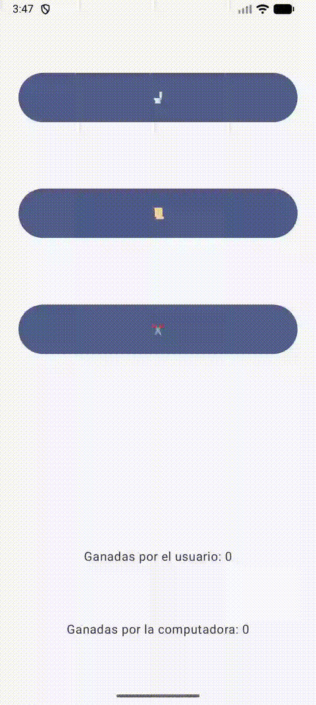

# 🚽✂️📄 Laboratorio: Piedra, Papel o Tijera con GUI

¿Os acordáis del laboratorio donde hicimos el juego de Piedra, papel o tijera?

Pues bien, hoy vamos a desarrollar una versión gráfica. Este proyecto lo iremos creando por versiones, cada una con nuevas funcionalidades para mejorar poco a poco nuestra app.

Y para terminar, ejecutaremos nuestra aplicación en un teléfono Android físico.


En la siguiente imagen se muestra el comportamiento de nuestra aplicación:

<div align="center">
    
</div>


¡Manos a la obra! 👷‍♂️👷‍♀️

# Tabla de contenidos 📋

- [🚽✂️📄 Laboratorio: Piedra, Papel o Tijera con GUI](#️-laboratorio-piedra-papel-o-tijera-con-gui)
- [Tabla de contenidos 📋](#tabla-de-contenidos-)
  - [Versión 1: La Base de la App 🎲](#versión-1-la-base-de-la-app-)
  - [Versión 2: Añadiendo Estadísticas 📊](#versión-2-añadiendo-estadísticas-)
  - [Versión 3: Mostrando el resultado en un Diálogo 🗨️](#versión-3-mostrando-el-resultado-en-un-diálogo-️)
  - [Versión 4: Barra de Progreso ⏳](#versión-4-barra-de-progreso-)
  - [Versión 5: Añadiendo Sonidos 🎶](#versión-5-añadiendo-sonidos-)
- [Es hora de probar nuestra aplicación en un dispositivo físico Android 📱](#es-hora-de-probar-nuestra-aplicación-en-un-dispositivo-físico-android-)
  - [¿Necesitas ayuda? 🆘](#necesitas-ayuda-)

## Versión 1: La Base de la App 🎲

### Objetivo

Esta primera versión deberías poder hacerla sin problemas, ya que en otros laboratorios ya hemos visto cómo crear interfaces gráficas y manejar eventos de botones. Así que en esta versión te guiaré un poco menos.

La app debe hacer lo siguiente:
- Mostrar una interfaz gráfica con tres botones: Piedra, Papel y Tijera.
- El usuario elige una opción al pulsar uno de los botones.
- Inmediatamente después, deben aparecer textos que muestren la elección del usuario, la elección de la computadora y el resultado del juego.


### Requisitos
1. **Crea tu `MainActivity`**
   Creamos un proyecto nuevo con el nombre `PiedraPapelTijeraGUI` eligiendo la opción "Empty Activity". Se creará una clase `MainActivity`. Aquí deberás inicializar el tema y utilizar `Scaffold` para estructurar la app. 
   Un `Scaffold` es un contenedor que proporciona una estructura básica para tu aplicación. Normalmente, el parámetro `paddingValues` nos da problemas, ya que es un objeto que contiene los valores de padding para los bordes de la pantalla. La forma de solucionar este problema es la siguiente:
   
  ```kotlin
    Scaffold(
        modifier = Modifier.fillMaxSize()
    ) { paddingValues ->
        PiedraPapelTijeraApp(modifier = Modifier.padding(paddingValues))
    }
   
   ```

   Y a la hora de definir la función `PiedraPapelTijeraApp` deberás hacerlo de la siguiente forma:

   ```kotlin

    fun PiedraPapelTijeraApp(modifier: Modifier) {
        // Aquí va el código de la app
    }
   ```
 
    De esta forma, el `Scaffold` se encarga de proporcionar el padding necesario para que la app se vea bien en cualquier dispositivo.
  
    ¡OJO! En las siguientes versiones, tendremos que modificar la signatura de la función `PiedraPapelTijeraApp` para que acepte un parámetro adicional: una función lambda que se encargará de reproducir los sonidos. Esto lo veremos más adelante.


2. **Diseña la UI de `PiedraPapelTijeraApp`**
   
   Tienes total libertad para diseñarlo como prefieras, pero te recomiendo hacer un primer diseño en papel. Esto ayuda a estructurar las ideas y planificar mejor.
   
   Te sugiero utilizar una columna (`Column`) para organizar los botones de forma vertical, permitiendo al usuario seleccionar una opción de manera clara y sencilla.

3. **Lógica del Juego**
   Para implementar la lógica básica, puedes seguir estos pasos. Primero, crearemos los botones para que el usuario elija "Piedra", "Papel" o "Tijera". Luego, generaremos la elección de la computadora de manera aleatoria y determinaremos el resultado. Finalmente, mostraremos el resultado debajo de los botones.
   
### Código de ayuda

<details>
  <summary>Aquí encontrarás código que te ayudará a avanzar. Pero antes, intenta hacerlo por tu cuenta. ¡Seguro que eres capaz de lograrlo!</summary>
<br>


```kotlin
@Composable
fun PiedraPapelTijeraApp(modifier: Modifier) {
    var userChoice by remember { mutableStateOf("") }
    var computerChoice by remember { mutableStateOf("") }
    var result by remember { mutableStateOf("") }

    val options = listOf("Piedra", "Papel", "Tijera")

    Column(
        modifier = Modifier
            .fillMaxSize()
            .padding(16.dp),
        verticalArrangement = Arrangement.SpaceEvenly,
        horizontalAlignment = Alignment.CenterHorizontally
    ) {
        options.forEach { choice ->
            Button(onClick = { userChoice = choice }) {
                Text(text = choice)
            }
        }
        // Aquí muestra el resultado
        Text(text = "Tu elección: $userChoice, Elección de la computadora: $computerChoice, Resultado: $result")
    }
}
```
</details>
<br>


## Versión 2: Añadiendo Estadísticas 📊

### Objetivo
En esta versión, vamos a añadir estadísticas para llevar la cuenta de cuántas veces ha ganado el usuario y cuántas veces ha ganado la computadora.

### Requisitos
- Añade variables para almacenar las victorias del usuario y de la computadora.
- Actualiza estas variables cada vez que haya un resultado.
- Actualiza las estadísticas al final de la columna en la UI.

### Código de ayuda

<details>
  <summary>Por si necesitas ayuda.</summary>
<br>

Definir las variables

```kotlin
var userWins by remember { mutableStateOf(0) }
var computerWins by remember { mutableStateOf(0) }
```

La parte de la GUI.
```kotlin
// Muestra las estadísticas
Text(text = "Ganadas por el usuario: $userWins")
Text(text = "Ganadas por la computadora: $computerWins")
```

En algún punto tendrás que sumar uno a la variable. ¿no? ¿Sabrías dónde hacerlo?

</details>
<br>

## Versión 3: Mostrando el resultado en un Diálogo 🗨️

### Objetivo
En esta versión, vamos a mostrar el resultado del juego en un `AlertDialog` en lugar de mostrarlo en la interfaz principal.

### Explicación
El `AlertDialog` es un componente que se utiliza para mostrar mensajes emergentes. Lo usaremos para mostrar el resultado del juego después de cada partida. La lógica será la siguiente:
- Cuando se termine la partida (el usuario haga una elección), se activará el diálogo para mostrar el resultado.
- Usa el composable `AlertDialog` para implementar esta funcionalidad.

### Requisitos
- Añade una variable `showDialog` que controle cuándo mostrar el diálogo (`true` o `false`). Esta variable se actualiza a `true` al finalizar una partida. Y se actualiza a `false` al hacer clic en el botón de aceptar del diálogo y también cuando ocurre el evento `onDismissRequest` del própio diálogo, es decir, pinchan fuera del dialogo. De esta forma, el diálogo se cerrará si hacen clic fuera de él.
- Al terminar una partida, muestra el diálogo con el resultado dependiendo del valor `showDialog`

### Documentación
Puedes revisar la documentación oficial de `AlertDialog` aquí: [AlertDialog - Jetpack Compose](https://developer.android.com/develop/ui/compose/components/dialog#alert)

En este enlace se pueden revisar todos los `Dialogs` que se pueden hacer con Jetpack Compose, ya que sugerimos usar el `AlertDialog` pero hay otros tipos de dialogos que se pueden usar.

### Código Sugerido para la creación de un `AlertDialog`
```kotlin
var showDialog by remember { mutableStateOf(false) }

if (showDialog) {
    AlertDialog(
        onDismissRequest = { showDialog = false },
        title = { Text(text = "Resultado") },
        text = { Text(text = "Tu elección: $userChoice\nElección de la computadora: $computerChoice\nResultado: $result") },
        confirmButton = {
            Button(onClick = { showDialog = false }) {
                Text("Aceptar")
            }
        }
    )
}
```

## Versión 4: Barra de Progreso ⏳

Esta versión, aunque puede parecer algo muy simple, en realidad es más complicada de lo que parece. Para ello, necesitamos un componente nuevo que será un `LinearProgressIndicator`, que nos permitirá mostrar una barra de progreso mientras se "simula" que se calcula el resultado.

Por otro lado, también necesitaremos usar otro composable llamado `LaunchedEffect`, que nos permitirá realizar llamadas asíncronas que no afecten a la GUI. La llamada asíncrona es una espera aleatoria que simula el cálculo del resultado.

Por lo tanto, tenemos dos objetivos en esta versión:

### Objetivo 1: Añadir una Barra de Progreso `LinearProgressIndicator`
Añadiremos una barra de progreso para indicar que el resultado está siendo calculado. En realidad, mientras se muestra esta barra de progreso, **¡NO SE ESTÁ CALCULANDO EL RESULTADO!** Esto ayudará a mejorar la experiencia del usuario, ya que añade un pequeño retraso que hace más interesante el juego.

Vamos a usar `LinearProgressIndicator` para simular un tiempo de espera antes de mostrar el resultado. Colocaremos esta barra justo debajo de los botones para que el usuario sepa que el resultado está siendo procesado.

### Documentación
Puedes encontrar más detalles sobre los [`Progress Indicators`](https://developer.android.com/develop/ui/compose/components/progress). Existen varios tipos de indicadores de progreso, pero en este caso sugerimos usar el `LinearProgressIndicator`.

Para más información específica sobre [`LinearProgressIndicator`](https://developer.android.com/reference/com/google/android/material/progressindicator/LinearProgressIndicator).

### Requisitos
- Añade una barra de progreso (`LinearProgressIndicator`) que se muestre mientras se calcula el resultado, en la parte de la GUI donde quieras que se vea.
- Crearemos otra variable `isPlaying` que controlará cuándo mostrar la barra de progreso. Esta variable tomará los valores `true` o `false` dependiendo de si se está **simulando** el cálculo del resultado, y la utilizaremos también en el objetivo 2, que es añadir `LaunchedEffect` para simular el cálculo del resultado.
- Debemos mostrar la barra de progreso mientras se está **jugando** (`isPlaying`) y ocultarla cuando ya se haya terminado de jugar. Por lo tanto, `isPlaying` debe ser `true` cuando estamos en el estado de "simulación" de que se está pensando el resultado, y `false` cuando ya se ha terminado.

### Código Sugerido
```kotlin
if (isPlaying) {
    LinearProgressIndicator(modifier = Modifier.fillMaxWidth())
}
```

### Objetivo 2: Añadir una llamada asíncrona con `LaunchedEffect`
En algún momento del código, vamos a querer simular un tiempo aleatorio de espera antes de mostrar el resultado. Para ello, usaremos `LaunchedEffect` para realizar una llamada asíncrona que no bloquee la interfaz de usuario y para evitar que se hagan llamadas infinitas para renderizar la GUI, ya que en Jetpack Compose la GUI es reactiva y se renderiza cada vez que hay un cambio en el estado. No queremos que esto ocurra de manera infinita.

Este mismo efecto (`LaunchedEffect`) lo utilizaremos cuando hagamos llamadas a una API o a una base de datos, para asegurarnos de que no bloqueamos la interfaz de usuario.

### Documentación
Puedes encontrar más detalles sobre los [`Efectos laterales en Jetpack Compose`](https://developer.android.com/develop/ui/compose/side-effects).

### Requisitos
- Añade una llamada a la función `LaunchedEffect`, que será una función composable que en nuestro caso recibirá un parámetro que indica si estamos en la fase de "juego" (`isPlaying`) y que contendrá la lógica del juego. Te sugiero que sea la primera función composable que se ejecute en la función `PiedraPapelTijeraApp`, después de la declaración de variables, listas y otras funciones auxiliares.
- Esta función tendrá las siguientes instrucciones:
  - Se ejecutará si `isPlaying` es `true`.
  - Realizará una espera aleatoria con la instrucción `delay((1000L..5000L).random()) // Tiempo aleatorio entre 1 y 5 segundos`.
  - Se calculará la elección de la computadora.
  - Se calculará el resultado del juego.
  - Se actualizarán las variables de las estadísticas.
  - Al finalizar, debemos actualizar las variables:
    - `isPlaying = false` para no volver a entrar en esta función y para ocultar la barra de progreso.
    - `showDialog = true` para mostrar el cuadro de diálogo con el resultado.

### Código Sugerido
```kotlin
LaunchedEffect(isPlaying) {
    if (isPlaying) {
        delay((1000L..5000L).random()) // Tiempo aleatorio entre 1 y 5 segundos
        // Calcular la elección de la computadora
        
        // Calcular el resultado del juego

        // Actualizar las variables de las estadísticas

        isPlaying = false
        showDialog = true
    }
}
```

En resumen, esta versión nos ayuda a gestionar el retraso antes de calcular el resultado y a mostrar visualmente que el juego está "pensando" el resultado, proporcionando una mejor experiencia de usuario. `LaunchedEffect(isPlaying)` es fundamental para garantizar que las operaciones asíncronas no interfieran con la renderización de la interfaz de usuario y para mantener el flujo lógico del juego de una manera limpia y segura.


## Versión 5: Añadiendo Sonidos 🎶

### Objetivo
En la versión final, vamos a añadir sonidos para cuando el usuario gane o pierda, dándole un toque más entretenido a nuestra app.

### Explicación
Para reproducir sonidos, usaremos `MediaPlayer`. Vamos a añadir archivos de sonido (`win_sound.mp3` y `lose_sound.mp3`) en la carpeta `res/raw` de nuestro proyecto. `MediaPlayer` es una clase que nos permite reproducir audio en Android y es ideal para este propósito.

### Qué es `MediaPlayer`
`MediaPlayer` es una clase en Android que se utiliza para la reproducción de archivos de audio y video. Proporciona métodos para controlar la reproducción, pausar, detener y liberar recursos cuando ya no se necesitan. Es especialmente útil para reproducir sonidos cortos

[Descripción general ](https://developer.android.com/media/platform/mediaplayer?hl=es-419)

[Documentación](https://developer.android.com/reference/android/media/MediaPlayer)

### Cómo Usar `MediaPlayer`
1. **Añadir los Archivos de Sonido**  
   Primero, asegúrate de tener los archivos de sonido (`win_sound.mp3` y `lose_sound.mp3`) en la carpeta `app/res/raw` de tu proyecto. Si la carpeta `raw` no existe, deberás crearla dentro del directorio `res` de tu proyecto. Para crear esta carpeta en Android Studio:
   - Haz clic derecho en la carpeta `res`.
   - Selecciona **New > Android Resource Directory**.
   - En **Resource type**, selecciona `raw` y presiona **OK**.
   - Ahora puedes añadir los archivos de sonido (`wav`, `mp3`, `ogg`) en esta carpeta. OJO!! no puedes tener dos ficheros que se llamen igual pero con distinta extensión. Es decir, no puedes tener `win_sound.mp3` y `win_sound.wav` en la misma carpeta. Bueno, puedes tenerlo pero Android Studio no te dejará compilar el proyecto.
   
   Puedes buscar y descargar los sonidos en cualquier página de stock de sonidos y samples, o te los puedes descargar aquí:
   - Sonido de victoria: 
  
    <audio controls>
      <source src="res/win_sound.mp3" type="audio/mpeg">
      Tu navegador no soporta reproducción de audio.
    </audio>
  
    - [Descargar el sonido win_sound.mp3](res/win_sound.mp3)
    - Cuidado al descargar, te abrirá el archivo en el repositorio, deberás después pulsar el botón de descarga que está arriba a la derecha y que es un icono de una flecha hacia abajo. Y ojo!! poner el nombre correcto del fichero `win_sound.mp3`
 
   - Sonido de derrota: 
  
    <audio controls>
      <source src="res/lose_sound.mp3" type="audio/mpeg">
      Tu navegador no soporta reproducción de audio.
    </audio>
  
    - [Descargar el sonido lose_sound.mp3](res/lose_sound.mp3)
    - Cuidado al descargar, te abrirá el archivo en el repositorio, deberás después pulsar el botón de descarga que está arriba a la derecha y que es un icono de una flecha hacia abajo. Y ojo!! poner el nombre correcto del fichero `lose_sound.mp3`

1. **Crear y Configurar `MediaPlayer`**  
   `MediaPlayer` se debe crear dentro del contexto en el que se vaya a reproducir el sonido. En nuestro caso cuando llamamos a la función que ejecuta nuestra GUI le pasamos una función lambda para el evento `onPlaySound` que recibe un recurso de sonido y ahí creamos un `MediaPlayer` para reproducir el sonido y le mandamos reproducir el sonido que recibe por el parámetro `soundRes`. 

   Por lo tanto, cuando llamamos a nuestra función con la interfaz gráfica deberíamos configurar el `MediaPlayer` en el evento `onPlaySound` para que reproduzca el sonido adecuado.

    Esto nos va a obligar a cambiar eel código de nuestra función `PiedraPapelTijeraApp` para que acepte un parámetro adicional que será una función lambda que se encargará de reproducir los sonidos.

   Código sugerido:
   
   ```kotlin
   PiedraPapelTijeraVisualTheme {
                Scaffold(
                    modifier = Modifier.fillMaxSize()
                ) { paddingValues -> 
                    // Renombramos `it` a `paddingValues` para mayor claridad
                    // Aplicamos el padding en el contenedor o componente hijo
                    PiedraPapelTijeraApp(modifier = Modifier.padding(paddingValues), onPlaySound = { soundRes ->
                        val mediaPlayer = MediaPlayer.create(this, soundRes)
                        mediaPlayer.setOnCompletionListener { it.release() }
                        mediaPlayer.start()
                    })
                }
            }
   ```
    Código de la función `PiedraPapelTijeraApp`:

    ¿Cómo funciona?

   - **`MediaPlayer.create(context, resId)`**: Esta función se utiliza para inicializar `MediaPlayer` con el contexto actual y el recurso de audio. Es importante pasar el contexto adecuado para que el `MediaPlayer` pueda acceder a los recursos.
   - **`setOnCompletionListener`**: Configura un listener para liberar el `MediaPlayer` una vez que el sonido ha terminado de reproducirse. Esto es crucial para evitar fugas de memoria.
   - **`start()`**: Inicia la reproducción del sonido.

    ```kotlin
    fun PiedraPapelTijeraApp(modifier: Modifier, onPlaySound: (Int) -> Unit) {
        // Aquí va el código de la app
    }
    ```

    Ahora veremos como reproducir un sonido.

### Requisitos
   

1. **Reproducir Sonidos**
   
   Ahora lo único que queda es reproducir el sonido adecuado cuando el usuario gane o pierda. Debes colocar la lógica de reproducción del sonido justo después de determinar el resultado de la partida. Por ejemplo, si el resultado es "Ganaste", reproducimos un sonido de victoria, y si es "Perdiste", reproducimos un sonido de derrota.
   
   ### Código Sugerido
   
    Estas llamadas deberían ir en la función que determina el resultado del juego. Que debe ser en la función `LaunchedEffect` que hemos creado en la versión anterior.

    ```kotlin
    if (result == "Ganaste") {
                userWins++
                onPlaySound(R.raw.win_sound) // Reproduce sonido alegre si gana el usuario
            } else if (result == "Perdiste") {
                computerWins++
                onPlaySound(R.raw.lose_sound) // Reproduce sonido triste si pierde el usuario
            }
    ```

    **¿Qué significa `R.raw.win_sound` o `R.raw.lose_sound`?**  
   
   `R.raw.win_sound` hace referencia al recurso de audio que está ubicado en la carpeta `res/raw` de tu proyecto. `R` es una clase generada automáticamente por Android que contiene referencias (Resources) a todos los recursos del proyecto. `raw` es la subcarpeta que creamos al inicio y donde se encuentran los archivos de sonido, y `win_sound` `lose_sound` es el nombre del archivo sin su extensión.


# Es hora de probar nuestra aplicación en un dispositivo físico Android 📱

Para ello recomiendo seguir la documentación oficial de Android Studio para [ejecutar aplicaciones en un dispositivo físico](https://developer.android.com/studio/run/device?hl=es-419).


## ¿Necesitas ayuda? 🆘

Aquí os dejaré la solución completa del laboratorio cuando todo el mundo haya entregado su laboratorio.
 

> [!WARNING]
> Recuerda: **Nadie ganó un Roland Garros viendo jugar a Rafa Nadal por la TV.**
 

<br>

<div align="center">
    
</div>

<br>
<br>
