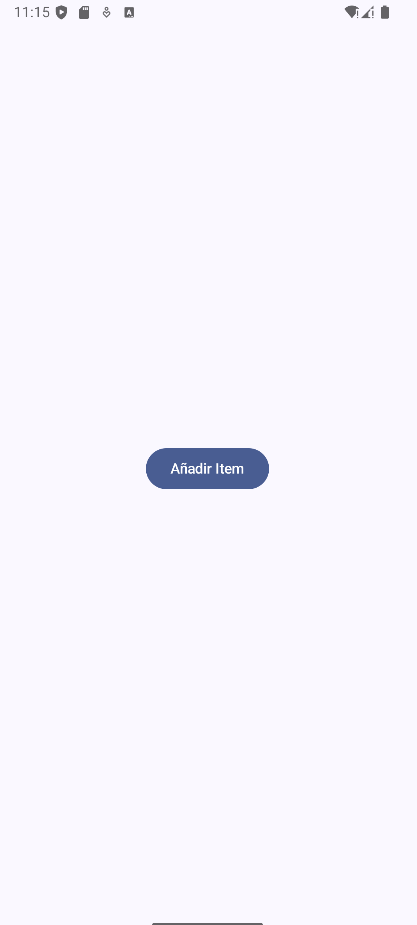
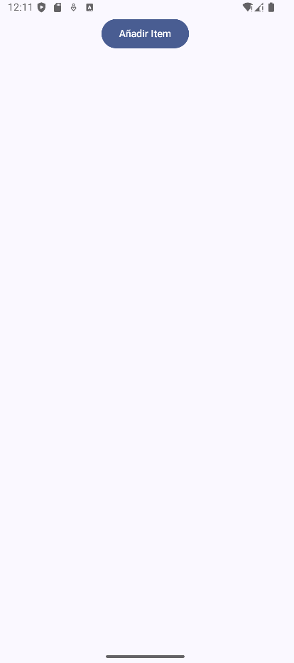
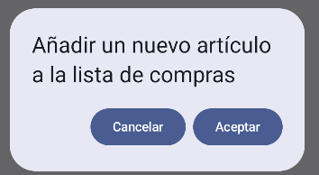
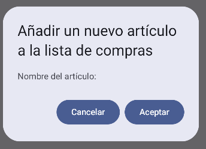
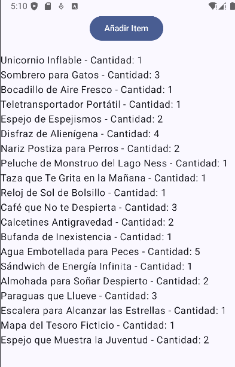
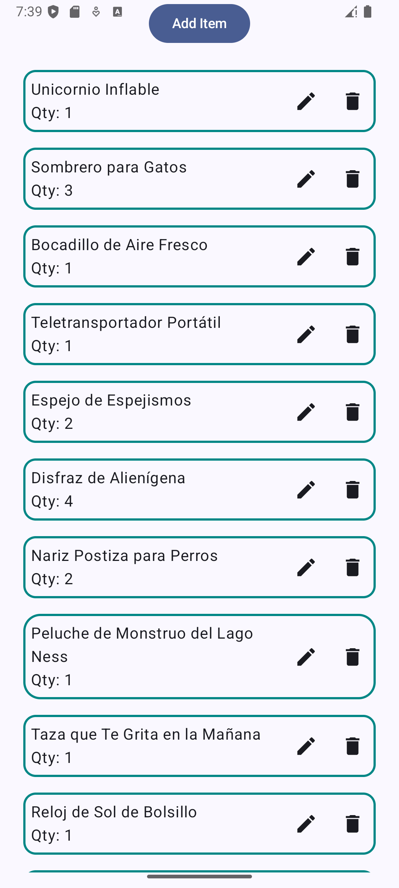
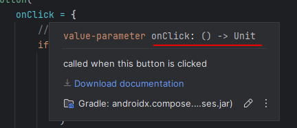
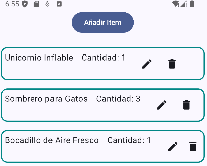

# 📱 Descripción general de la aplicación

La aplicación que construiremos en este laboratorio es una **lista de compras interactiva**, en la que el usuario podrá añadir, eliminar y marcar elementos como comprados. Además, la interfaz se hará completamente con **Jetpack Compose**, aprovechando todas las capacidades modernas para construir aplicaciones atractivas y eficientes en Android.

La aplicación que queremos construir en este laboratorio tendrá el siguiente aspecto y la siguientes funcionalidades:

<div align="center">
    
</div>

## 🏗️ Creación del proyecto y configuración inicial

Lo primero que necesitamos es crear un nuevo proyecto en **Android Studio** utilizando **Kotlin** como lenguaje principal y **Jetpack Compose** como framework de UI. Para esto, sigue estos pasos:

1. Abre Android Studio y selecciona **Nuevo Proyecto**.
2. Selecciona la plantilla **Empty Compose Activity**.
3. Asegúrate de escoger **Kotlin** como el lenguaje de programación.
4. Configura el nombre del proyecto y la ubicación.
5. Recuerda que el `namespace` debe ser: `es.uva.inf5g.psm.lab07` (o el que prefieras, puedes llamarlo `shoppinglistapp` pero el prefijo siempre de ser igual).

Una vez creado el proyecto, Android Studio generará una estructura básica con una actividad (`MainActivity.kt`) que, como ya sabes, ya incluye un ejemplo simple de Jetpack Compose.

### Explorando el proyecto generado

Al crear el proyecto, verás que la estructura de archivos incluye el siguiente contenido:

- **MainActivity.kt**: La actividad principal que contiene el método `onCreate`, donde se define el contenido de la UI utilizando `setContent`. Esta es la base de nuestra aplicación.
- **AndroidManifest.xml**: Archivo de configuración donde se define la actividad principal y los permisos que puede requerir la aplicación.
- **build.gradle**: Archivos que contienen las dependencias y configuraciones necesarias para compilar el proyecto.

## 🛒 Creación de los composables principales

En Jetpack Compose, la UI se compone utilizando funciones llamadas **composables**. Un composable representa una pequeña parte de la interfaz de usuario, y se puede combinar con otros composables para crear interfaces complejas.

### Creación de un botón para añadir un elemento.

Para comenzar, vamos a crear un composable que represente un botón para añadir un nuevo elemento a la lista de compras.

Nuestro objetivo será tratar de crear la siguiente interfaz: tener un botón centrado. Tal y como se muestra en la imagen.

<div align="center">
    
</div>

#### 1. Creación del `Scaffold`
Empezamos con la estructura base de la pantalla, que se crea con el composable `Scaffold`. Este componente viene creado por defecto cuando creamos un `Empty Compose Activity`. Este componente nos permite organizar la interfaz con elementos comunes como la barra superior, la barra inferior, y el contenido principal.

En este caso, no hemos definido una barra superior ni inferior, simplemente definimos el `content` que contiene el resto de elementos, como una columna con un botón:

Como siempre, en nuestra **MainActivity**, llamaremos a nuestra función `@Composable` que se encargará de dibujar la GUI, en este guía lo llamaremos `ShoppingListGUI`, pero puedes llamarlo como prefieras.

De tal manera que la clase `MainActivity` quede de la siguiente manera:

```kotlin
class MainActivity : ComponentActivity() {
    override fun onCreate(savedInstanceState: Bundle?) {
        super.onCreate(savedInstanceState)
        enableEdgeToEdge()

        setContent {
            ShoppingListTheme {
                Scaffold(
                    modifier = Modifier.fillMaxSize()
                ) { paddingValues ->
                    ShoppingListGUI(paddingValues)
                }
            }
        }
    }
}
```

El `modifier = Modifier.fillMaxSize()` asegura que `Scaffold` ocupe todo el espacio disponible en la pantalla.

#### 3. Creación de la Función `ShoppingListGUI`

Creamos una función `@Composable` `ShoppingListGUI` y configuraremos un contenedor **Column** 

```kotlin

fun ShoppingListGUI(paddingValues: PaddingValues) {

    Column(
        // Modificador para rellenar toda la pantalla
    ) {
        // Contenido de la columna
    }
}

```

#### 2. Creación de la Columna (`Column`)
El siguiente paso es crear un componente `Column` dentro del `content` de `Scaffold`. La columna nos permite colocar los elementos uno debajo del otro, organizándolos verticalmente.

La columna se crea con los siguientes parámetros:

```kotlin
Column(
    modifier = Modifier
        .fillMaxSize()
        .padding(innerPadding),
    verticalArrangement = Arrangement.Center,
    horizontalAlignment = Alignment.CenterHorizontally
) {
    // Contenido dentro de la columna
}
```

- **`modifier = Modifier.fillMaxSize()`**: Este modificador asegura que la columna ocupe todo el espacio disponible en la pantalla.
- **`.padding(innerPadding)`**: Se aplica un `padding` usando `innerPadding` para asegurar que la columna respete los espacios que deja el `Scaffold`, como las barras superior o inferior (si estuvieran presentes).
- **`verticalArrangement = Arrangement.Center`**: Este parámetro especifica la disposición vertical de los elementos dentro de la columna, centrándolos en el eje vertical.
- **`horizontalAlignment = Alignment.CenterHorizontally`**: Con este parámetro, alineamos todos los elementos de la columna horizontalmente al centro.

#### 3. Añadir un Botón (`Button`)
Dentro de la columna, hemos añadido un `Button`. Este botón será el único elemento en la columna, y gracias a la alineación configurada previamente, aparecerá centrado tanto vertical como horizontalmente.

```kotlin
Button(
    onClick = { /* Acción para añadir ítem */ },
    modifier = Modifier.align(Alignment.CenterHorizontally)
) {
    Text(text = "Añadir Item")
}
```

- **`onClick`**: Define la acción que se llevará a cabo cuando el usuario presione el botón. En este ejemplo, la acción está vacía, pero podrías implementar lógica para añadir un elemento a una lista.
- **`modifier = Modifier.align(Alignment.CenterHorizontally)`**: Alinea el botón horizontalmente en el centro de la columna.
- **`Text(text = "Añadir Item")`**: Este es el contenido del botón, un texto que indica la acción al usuario.


<details>
  <summary>¿Puedes hacerlo sin ayuda?</summary>
<br>

```kotlin
class MainActivity : ComponentActivity() {
    override fun onCreate(savedInstanceState: Bundle?) {
        super.onCreate(savedInstanceState)
        enableEdgeToEdge()
        setContent {
            ShoppingListTheme {
                Scaffold(
                    modifier = Modifier.fillMaxSize()
                ) { paddingValues ->
                    ShoppingListGUI(paddingValues)
                }
            }
        }
    }
}

@Composable
fun ShoppingListGUI(paddingValues: PaddingValues) {
    Column(
        modifier = Modifier
            .fillMaxSize()
            .padding(paddingValues),
        verticalArrangement = Arrangement.Center,
        horizontalAlignment = Alignment.CenterHorizontally
    ) {
        Button(
            onClick = {
            },
            modifier = Modifier.align(Alignment.CenterHorizontally)
        ) {
            Text(text = "Añadir Item")
        }        
    }
}
```

</details>
<br>


## 📚 ¿Qué es LazyColumn?

**LazyColumn** es un composable en Jetpack Compose que se utiliza para mostrar listas de elementos de manera eficiente. Su propósito principal es permitir la representación de listas largas sin comprometer el rendimiento del dispositivo. La clave está en que **LazyColumn** solo carga los elementos que son visibles en la pantalla en un momento dado y descarta aquellos que ya no están visibles. Esto permite ahorrar memoria y mejorar la velocidad de la aplicación, sobre todo cuando se trabaja con listas grandes.

### 🤔 ¿Por qué se llama "Lazy" (Perezosa)?
El nombre "lazy" se debe a la forma en que **LazyColumn** maneja los elementos de la lista. En lugar de cargar todos los elementos de la lista al mismo tiempo (lo cual sería ineficiente y consumiría demasiados recursos), **LazyColumn** solo renderiza los elementos que realmente necesita mostrar en la pantalla en ese momento. A medida que el usuario se desplaza, **LazyColumn** va "perezosamente" añadiendo los elementos necesarios y eliminando los que ya no se ven, optimizando el uso de memoria y el rendimiento.

### 🛠️ Ejemplo de Uso
Imagina una aplicación de redes sociales, como **Instagram** o **X** (la antigüa **Twitter**), donde puedes desplazarte indefinidamente para ver nuevas publicaciones. Si todos los elementos se cargaran en memoria de golpe, gastaríamos muchos datos para traernos toda la información que quizá no lleguemos a mirar, o si se mantuvieran en la memoria, el dispositivo rápidamente se quedaría sin recursos. En cambio, al usar **LazyColumn**, solo se renderizan las publicaciones que están actualmente visibles, mientras que las anteriores o siguientes se descartan automáticamente. Esto permite una experiencia fluida y eficiente para el usuario.

### 📝 Ejemplo de Código

```kotlin
LazyColumn(
    modifier = Modifier.fillMaxSize()
) {
    items(itemsList) { item ->
        Text(text = item)
    }
}
```

**OJO!!! 👀** este no es código para el proyecto solo es un ejemplo.

En este ejemplo, utilizamos **LazyColumn** para mostrar una lista llamada `itemsList`. Cada elemento se representa mediante un composable **Text**. **LazyColumn** se encarga de cargar los elementos visibles y descartar los que ya no están en pantalla, optimizando así el rendimiento de la aplicación.

## 📚 Añadiendo una LazyColumn

El siguiente paso en nuestra aplicación es añadir una **LazyColumn** justo debajo del botón. Esta **LazyColumn** nos permitirá mostrar una lista de elementos de manera eficiente, tomando solo el espacio necesario y desplazando el botón "Añadir elemento" hacia la parte superior de la pantalla.

### Configurando LazyColumn
Para añadir la **LazyColumn**, primero la colocaremos debajo del botón en la columna principal.

```kotlin
LazyColumn(
    modifier = Modifier
        .fillMaxSize()
        .padding(top = 16.dp)
) {
    // Aquí se añadirán los elementos de la lista
}
```

En este caso, estamos añadiendo el modificador **fillMaxSize()** para que la **LazyColumn** ocupe todo el espacio disponible en la pantalla, y un **padding** de 16dp en la parte superior para dar algo de separación con el botón.

### Definiendo los Elementos de la Lista
Para mostrar los elementos en la **LazyColumn**, primero debemos definir cómo se verán estos elementos. Vamos a crear una **data class** llamada `ShoppingItem` que representará los elementos de la lista de compras.

Esta clase se tiene que definir fuera de la clase `MainActivity` para que pueda ser accesible desde cualquier parte de la aplicación.

```kotlin
data class ShoppingItem(
    val id: Int,
    val name: String,
    var quantity: Int,
    var isEditing: Boolean = false
)
```

Esta clase `ShoppingItem` define cada elemento de nuestra lista con los siguientes atributos:
- **id**: Un identificador único para cada elemento.
- **name**: El nombre del artículo.
- **quantity**: La cantidad del artículo que queremos comprar.
- **isEditing**: Un indicador para saber si el artículo está siendo editado.

### Almacenando los Elementos de la Lista
Ahora necesitamos una lista para almacenar estos elementos. Vamos a crear una lista mutable que mantendrá el estado de nuestros elementos.
Esto lo hacemos justo antes de definir nuestra GUI.

```kotlin
var shoppingItems by remember { mutableStateOf(listOf<ShoppingItem>()) }
```
**OJO!!! 👀** no es lo mismo `shoppingItems` que `ShoppingItems`. Se diferencian por la primera letra en mayúscula. El primero es la lista y la segunda hacemos referencia a la clase.

Con `remember` y `mutableStateOf`, estamos creando una lista que puede ser modificada y cuyo estado se actualizará automáticamente en la interfaz de usuario cuando se añadan o eliminen elementos.

### Mostrando los Elementos en LazyColumn
Finalmente, vamos a mostrar los elementos en la **LazyColumn**. Usaremos la función `items` para recorrer la lista `shoppingItems` y mostrar cada elemento.

```kotlin
LazyColumn(
    modifier = Modifier
        .fillMaxSize()
        .padding(top = 16.dp)
) {
    items(shoppingItems) { item ->
        Text(text = "${item.name} - Cantidad: ${item.quantity}")
    }
}
```

Con esto, estamos mostrando cada artículo de nuestra lista con su nombre y cantidad. A medida que vayamos añadiendo más funcionalidades, estos elementos serán interactivos y podrán ser editados o eliminados.

### Ejecutando la Aplicación
Al ejecutar la aplicación ahora, notarás que el botón "Añadir elemento" se ha desplazado hacia la parte superior de la pantalla, ya que la **LazyColumn** está ocupando todo el espacio disponible debajo del botón. Aunque la **LazyColumn** todavía no tiene elementos, ya está reservando el espacio necesario.

Si lo hemos hecho bien, deberíamos ver algo similar a esto:

<div align="center">
    
</div>

## 🗨️ Añadiendo un AlertDialog
El siguiente paso es añadir un **AlertDialog** para que los usuarios puedan introducir la información de los elementos que desean añadir a la lista. Utilizaremos **AlertDialog** para crear una ventana emergente que permitirá al usuario agregar nuevos artículos.

### Configurando el Estado del AlertDialog
Primero, necesitamos una variable para mantener el estado de visibilidad del **AlertDialog**. Es decir, si el diálogo debe mostrarse o no.

```kotlin
var showDialog by remember { mutableStateOf(false) }
```

Esta variable `showDialog` controlará si el **AlertDialog** está visible (`true`) o no (`false`). Cuando el usuario haga clic en el botón "Añadir elemento", esta variable cambiará a `true` para mostrar el diálogo.

### Añadiendo el AlertDialog
A continuación, agregaremos el **AlertDialog** justo debajo de nuestra columna principal para que sea visible cuando `showDialog` sea `true`.

```kotlin
if (showDialog) {
    AlertDialog(
        onDismissRequest = { showDialog = false },
        confirmButton = {
            Button(onClick = { showDialog = false }) {
                Text("Aceptar")
            }
        },
        dismissButton = {
            Button(onClick = { showDialog = false }) {
                Text("Cancelar")
            }
        },
        title = {
            Text("Añadir un nuevo artículo a la lista de compras")
        }
    )
}
```

En este código, hemos definido un **AlertDialog** con dos botones: **Aceptar** y **Cancelar**. Cuando se hace clic en cualquiera de estos botones, el diálogo se cierra estableciendo `showDialog` a `false`.

### Activando el AlertDialog con el Botón "Añadir elemento"
Ahora, necesitamos modificar el evento **onClick** del botón "Añadir elemento" para que muestre el **AlertDialog** cuando el usuario haga clic en él.

```kotlin
Button(
    onClick = { showDialog = true },
    modifier = Modifier.align(Alignment.CenterHorizontally)
) {
    Text(text = "Añadir elemento")
}
```

Con este cambio, cuando el usuario haga clic en el botón, el **AlertDialog** aparecerá en la pantalla, permitiendo al usuario confirmar o cancelar la acción.

### Ejecutando la Aplicación
Al ejecutar la aplicación ahora, deberías ver el botón "Añadir elemento" en la parte superior de la pantalla. Cuando se hace clic en el botón, se muestra un **AlertDialog** con el siguiente aspecto:

<div align="center">
    
</div>

¿Es esto lo que queremos? ¿No debería permitir añadir un ítem con su nombre, cantidad, etc.?

## 📈 Mejorando el AlertDialog

Para mejorar el **AlertDialog** y permitir al usuario introducir información sobre el nuevo artículo, necesitamos añadir campos de texto para el nombre y la cantidad del artículo. 
Lo podemos conseguir añadiendo el campos `text` dentro del `AlertDialog`.

### Añadiendo un texto simple
Vamos a probar a añadir simplemente un texto.

```kotlin
if (showDialog) {
    AlertDialog(
        onDismissRequest = { showDialog = false },
        confirmButton = {
            Button(onClick = { showDialog = false }) {
                Text("Aceptar")
            }
        },
        dismissButton = {
            Button(onClick = { showDialog = false }) {
                Text("Cancelar")
            }
        },
        title = {
            Text("Añadir un nuevo artículo a la lista de compras")
        },
        text = {
            Text("Nombre del artículo:")
        }
    )
}
```

Deberíamos ver algo como esto:

<div align="center">
    
</div>

Sigue siendo insuficiente. Podemos mejorarlo teniendo en cuenta que dentro de texto podemos seguir añadiendo más elementos de tipo `@Composable`. Por lo tanto, vamos a crear una nueva GUI dentro del `AlertDialog` en el campo `text`.

Para ello vamos a crear una columna y dentro pondremos dos `OutlinedTextField` para que el usuario pueda introducir el nombre del artículo y la cantidad.
    
```kotlin
text = {
    Column {
        OutlinedTextField(
            // Configuración del primer campo de texto
            )
        OutlinedTextField(
            // Configuración del segundo campo de texto
        )
    }
}
```

### Configurando los OutlinedTextField
En el **AlertDialog**, la propiedad `text` define el contenido principal del cuadro de diálogo. En este caso, el contenido incluye un grupo de composables organizados dentro de una columna (`Column`). Dentro de esta columna hemos definido dos **OutlinedTextFields** que permiten al usuario ingresar información:

1. Nombre del artículo.
2. Cantidad del artículo.
   
La razón para usar una Column es que queremos apilar los elementos verticalmente, uno debajo del otro, y los OutlinedTextFields nos permiten crear campos de entrada con un diseño que destaca claramente los bordes de cada campo.

### Desglosando el DialogAlert
1. Column { ... }: 
   
   - El contenedor Column nos permite organizar los elementos de manera vertical. Es útil cuando queremos presentar una lista de elementos uno debajo del otro, como en este caso, donde estamos mostrando dos campos de texto.
2. OutlinedTextField: 
   
   - Cada OutlinedTextField representa un campo de entrada con un borde que lo resalta, lo cual es visualmente atractivo y fácil de usar. Hay dos campos de texto:
     - Nombre del artículo.
     - Cantidad.
  
Ahora desglosaremos los parámetros de cada `OutlinedTextField`:

   - `value = itemName` (o `itemQuantity` en el segundo campo): Este es el valor actual del campo de entrada. `itemName` y `itemQuantity` son variables que mantienen el valor del texto introducido por el usuario. De esta manera, podemos vincular el campo de texto con una variable en el estado del composable.
   - `onValueChange = { itemName = it }` (o `itemQuantity = it`): Aquí definimos una función lambda para manejar los cambios de valor en el campo de entrada. Cada vez que el usuario escribe algo, la variable asociada (`itemName` o `itemQuantity`) se actualiza con el valor ingresado. `it` es un nombre estándar para el valor actual de la entrada.
   - `label = { Text("Nombre del artículo") }` (o `Text("Cantidad")` en el segundo campo): El label es la etiqueta del campo de texto que aparece como un texto guía. En este caso, utilizamos "Nombre del artículo" y "Cantidad" para indicar al usuario qué debe ingresar.
   - `singleLine = true`: Este parámetro indica que el campo de entrada debe ser de una sola línea. Esto es útil cuando solo queremos una entrada breve, como el nombre o la cantidad de un artículo, sin permitir múltiples líneas.
   - `modifier = Modifier.fillMaxWidth().padding(8.dp):`
     - `fillMaxWidth()`: Este modificador hace que el campo de entrada ocupe todo el ancho disponible de la pantalla, asegurando que el usuario tenga suficiente espacio para escribir. 
     - `padding(8.dp)`: Añade un margen de 8 dp alrededor del campo de entrada, lo cual mejora la apariencia visual al separar un poco cada campo del borde y de otros elementos.

Ejemplo de cómo quedaría el código:

```kotlin
text = {
    Column {
        OutlinedTextField(
            value = itemName,
            onValueChange = { itemName = it },
            singleLine = true,
            modifier = Modifier
                .fillMaxWidth()
                .padding(8.dp)
        )
        OutlinedTextField(
            value = itemQuantity,
            onValueChange = { itemQuantity = it },
            singleLine = true,
            modifier = Modifier
                .fillMaxWidth()
                .padding(8.dp)
        )
    }
}
```

Si te das cuenta, hemos añadido dos nuevas variables `itemName` y `itemQuantity` que serán las que se encarguen de almacenar el nombre y la cantidad del artículo que el usuario introduzca. Obviamente tendremos que inicializarlas con un valor por defecto.

```kotlin   
var itemName by remember { mutableStateOf("") }
var itemQuantity by remember { mutableStateOf("") }
```
**OJO!!! 👀** itemQuantity será de tipo String, que en realidad es lo que estamos escribiendo en el OutliendTextField

## ➕ Añadiendo elementos a la lista
Estaría bien poder ver unos cuantos elementos en la GUI y no tener que estar introduciendo uno o uno y de esta forma poder ver información en la pantalla principal. 

<details>
  <summary>¿Puedes hacerlo sin ayuda?</summary>
<br>

```kotlin
val shoppingItems by remember {
        mutableStateOf(
            listOf(
                ShoppingItem(1, "Unicornio Inflable", 1),
                ShoppingItem(2, "Sombrero para Gatos", 3),
                ShoppingItem(3, "Bocadillo de Aire Fresco", 1),
                ShoppingItem(4, "Teletransportador Portátil", 1),
                ShoppingItem(5, "Espejo de Espejismos", 2),
                ShoppingItem(6, "Disfraz de Alienígena", 4),
                ShoppingItem(7, "Nariz Postiza para Perros", 2),
                ShoppingItem(8, "Peluche de Monstruo del Lago Ness", 1),
                ShoppingItem(9, "Taza que Te Grita en la Mañana", 1),
                ShoppingItem(10, "Reloj de Sol de Bolsillo", 1),
                ShoppingItem(11, "Café que No te Despierta", 3),
                ShoppingItem(12, "Calcetines Antigravedad", 2),
                ShoppingItem(13, "Bufanda de Inexistencia", 1),
                ShoppingItem(14, "Agua Embotellada para Peces", 5),
                ShoppingItem(15, "Sándwich de Energía Infinita", 1),
                ShoppingItem(16, "Almohada para Soñar Despierto", 2),
                ShoppingItem(17, "Paraguas que Llueve", 3),
                ShoppingItem(18, "Escalera para Alcanzar las Estrellas", 1),
                ShoppingItem(19, "Mapa del Tesoro Ficticio", 1),
                ShoppingItem(20, "Espejo que Muestra la Juventud", 2)
            )
        )
    }
```

</details>
<br>

De esta manera al arrancar la app tendríamos la siguiente vista:

<div align="center">
    
</div>


## 🛠️ Modificar el diálogo de alerta

Para este ejemplo, vamos a usar dos botones: uno para confirmar la acción añadir y otro para cancelar. Utilizaremos la propiedad `confirmButton` de nuestro diálogo de alerta, la cual podemos sobrescribir con nuestro propio código para añadir el nuevo elemento. Y usaremos la propiedad `dismissButton` para cancelar la acción y cerrar el diálogo.

El código de `confirmButton` lo podemos sobreescribir e incluso ir añadiendo más elementos `@Composable` 

Coloquemos un Row con dos botones: uno para añadir el nuevo ítem y otro para cancelar la acción.

```kotlin
Row(
    modifier = Modifier
        .fillMaxWidth()
        .padding(8.dp),
    horizontalArrangement = Arrangement.SpaceBetween
) {
    // Botón de "añadir"
    Button(
        onClick = {
            // Acción al hacer clic en "añadir"
        }
    ) {
        Text("Añadir")
    }

    // Botón de "Cancelar"
    Button(
        onClick = {
            showDialog = false
        }
    ) {
        Text("Cancelar")
    }
}
```

- **`fillMaxWidth()`**: Hace que la fila ocupe todo el ancho disponible.
- **`padding(8.dp)`**: Agrega un margen de 8 píxeles de densidad para evitar que los elementos queden demasiado pegados a los bordes.
- **`Arrangement.SpaceBetween`**: Distribuye los elementos para que haya el máximo espacio posible entre ellos.

## ➕ Implementar la lógica de los botones

### Botón "Add"

El botón "Add" necesita un evento `onClick` que determine lo que sucede al hacer clic en él. Queremos que cuando el botón sea presionado, se cree un nuevo elemento y se añada a nuestra lista, siempre y cuando el campo de nombre del ítem no esté vacío. Para saber si el campo está vacío, podemos usar la función `isNotBlank()`.

#### Psuedocódigo y código

1. Al hacer clic en el botón, ejecutar la acción.
2. Comprobar si el nombre del artículo (`itemName`) no está vacío.
   - **Si está vacío**: no realizar ninguna acción.
   - **Si no está vacío**: continuar con los siguientes pasos.
3. Crear un nuevo objeto `ShoppingItem`:
   - Asignar el `id` como el tamaño actual de la lista de artículos (`items.size`) más 1. (Aquí tenemos potencialmente un problema, pero lo dejaremos para más adelante).
   - Asignar el `name` como el valor de `itemName`.
   - Convertir `itemQuantity` a entero y asignarlo al `quantity`.
4. Agregar el nuevo artículo a la lista `items`.
5. Cerrar el cuadro de diálogo estableciendo `showDialog` en `false`.
6. Vaciar el contenido de `itemName` para restablecer el campo de entrada.

<details>
  <summary>¿Puedes hacerlo sin ayuda?</summary>
<br>

```kotlin

    // Botón de "add"
    Button(
        onClick = {
            // Acción al hacer clic en "add"
            if (itemName.isNotBlank()) {
                val newItem = ShoppingItem(
                    id = items.size + 1,
                    name = itemName,
                    quantity = itemQuantity.toInt()
                )
                items = items + newItem
                showDialog = false
                itemName = ""
            }
        }
    ) {
        Text("Añadir")
    }


```

- **`itemName.isNotBlank()`**: Verifica que el nombre del ítem no esté vacío antes de proceder.
- **`ShoppingItem`**: Crea un nuevo objeto del tipo `ShoppingItem`. La propiedad `id` se asigna incrementando el tamaño de la lista de ítems (`items.size + 1`), garantizando que cada ítem tenga un identificador único.
- **`items = items + newItem`**: Agrega el nuevo ítem a la lista de ítems.
- **`showDialog = false`**: Cierra el diálogo de alerta.
- **`itemName = ""`**: Resetea el valor del nombre del ítem para evitar que se quede el texto de la acción anterior.

</details>
<br>

### Botón "Cancel"

El botón "Cancel" simplemente desactiva el diálogo de alerta.

```kotlin
Button(
    onClick = {
        showDialog = false
    }
) {
    Text("Cancel")
}
```

**OJO!!! 👀** No te olvides eliminar el código de `dismissButton` porque si no lo haces, tendrás dos botones de cancelar.

## 🔄 Punto de control. ¿Necesitas ayuda?

<details>
  <summary>Si no necesitas ayuda, pasa de largo!</summary>
<br>

package es.uva.inf5g.psm.shoppinglist

import android.os.Bundle
import androidx.activity.ComponentActivity
import androidx.activity.compose.setContent
import androidx.activity.enableEdgeToEdge
import androidx.compose.foundation.layout.Arrangement
import androidx.compose.foundation.layout.Column
import androidx.compose.foundation.layout.PaddingValues
import androidx.compose.foundation.layout.Row
import androidx.compose.foundation.layout.fillMaxSize
import androidx.compose.foundation.layout.fillMaxWidth
import androidx.compose.foundation.layout.padding
import androidx.compose.foundation.lazy.LazyColumn
import androidx.compose.foundation.lazy.items
import androidx.compose.material3.AlertDialog
import androidx.compose.material3.Button
import androidx.compose.material3.OutlinedTextField
import androidx.compose.material3.Scaffold
import androidx.compose.material3.Text
import androidx.compose.runtime.Composable
import androidx.compose.runtime.getValue
import androidx.compose.runtime.mutableStateOf
import androidx.compose.runtime.remember
import androidx.compose.runtime.setValue
import androidx.compose.ui.Alignment
import androidx.compose.ui.Modifier
import androidx.compose.ui.unit.dp
import es.uva.inf5g.psm.shoppinglist.ui.theme.ShoppingListTheme

data class ShoppingItem(
    val id: Int,
    val name: String,
    var quantity: Int,
    var isEditing: Boolean = false
)

class MainActivity : ComponentActivity() {
    override fun onCreate(savedInstanceState: Bundle?) {
        super.onCreate(savedInstanceState)
        enableEdgeToEdge()

        setContent {
            ShoppingListTheme {
                Scaffold(
                    modifier = Modifier.fillMaxSize()
                ) { paddingValues ->
                    ShoppingListGUI(paddingValues)
                }
            }
        }
    }
}

// Función composable para la UI de la lista de compras, con el estado `shoppingItems` interno
@Composable
fun ShoppingListGUI(paddingValues: PaddingValues) {
    // Define el estado de `shoppingItems` dentro del composable
    // val shoppingItems by remember { mutableStateOf(listOf<ShoppingItem>()) }
    var shoppingItems by remember {
        mutableStateOf(
            listOf(
                ShoppingItem(1, "Unicornio Inflable", 1),
                ShoppingItem(2, "Sombrero para Gatos", 3),
                ShoppingItem(3, "Bocadillo de Aire Fresco", 1),
                ShoppingItem(4, "Teletransportador Portátil", 1),
                ShoppingItem(5, "Espejo de Espejismos", 2),
                ShoppingItem(6, "Disfraz de Alienígena", 4),
                ShoppingItem(7, "Nariz Postiza para Perros", 2),
                ShoppingItem(8, "Peluche de Monstruo del Lago Ness", 1),
                ShoppingItem(9, "Taza que Te Grita en la Mañana", 1),
                ShoppingItem(10, "Reloj de Sol de Bolsillo", 1),
                ShoppingItem(11, "Café que No te Despierta", 3),
                ShoppingItem(12, "Calcetines Antigravedad", 2),
                ShoppingItem(13, "Bufanda de Inexistencia", 1),
                ShoppingItem(14, "Agua Embotellada para Peces", 5),
                ShoppingItem(15, "Sándwich de Energía Infinita", 1),
                ShoppingItem(16, "Almohada para Soñar Despierto", 2),
                ShoppingItem(17, "Paraguas que Llueve", 3),
                ShoppingItem(18, "Escalera para Alcanzar las Estrellas", 1),
                ShoppingItem(19, "Mapa del Tesoro Ficticio", 1),
                ShoppingItem(20, "Espejo que Muestra la Juventud", 2)
            )
        )
    }


    var showDialog by remember { mutableStateOf(false) }
    var itemName by remember { mutableStateOf("") }
    var itemQuantity by remember { mutableStateOf("") }

    Column(
        modifier = Modifier
            .fillMaxSize()
            .padding(paddingValues),
        verticalArrangement = Arrangement.Center,
        horizontalAlignment = Alignment.CenterHorizontally
    ) {
        Button(
            onClick = {
                showDialog = true
            },
            modifier = Modifier.align(Alignment.CenterHorizontally)
        ) {
            Text(text = "Añadir Item")
        }
        LazyColumn(
            modifier = Modifier
                .fillMaxSize()
                .padding(top = 16.dp)
        ) {
            items(shoppingItems) { item ->
                Text(text = "${item.name} - Cantidad: ${item.quantity}")
            }
        }
        if (showDialog) {
            AlertDialog(
                onDismissRequest = { showDialog = false },
                confirmButton = {
                    Row(
                        modifier = Modifier
                            .fillMaxWidth()
                            .padding(8.dp),
                        horizontalArrangement = Arrangement.SpaceBetween
                    ) {
                        // Botón de "añadir"
                        Button(
                            onClick = {
                                // Acción al hacer clic en "add"
                                if (itemName.isNotBlank()) {
                                    val newItem = ShoppingItem(
                                        id = shoppingItems.size + 1,
                                        name = itemName,
                                        quantity = itemQuantity.toInt()
                                    )
                                    shoppingItems = shoppingItems + newItem
                                    showDialog = false
                                    itemName = ""
                                }
                            }
                        ) {
                            Text("Añadir")
                        }

                        // Botón de "Cancelar"
                        Button(
                            onClick = {
                                showDialog = false
                            }
                        ) {
                            Text("Cancelar")
                        }
                    }
                },
                title = {
                    Text("Añadir un nuevo artículo a la lista de compras")
                },
                text = {
                    Column {
                        OutlinedTextField(
                            value = itemName,
                            onValueChange = { itemName = it },
                            singleLine = true,
                            modifier = Modifier
                                .fillMaxWidth()
                                .padding(8.dp)
                        )
                        OutlinedTextField(
                            value = itemQuantity,
                            onValueChange = { itemQuantity = it },
                            singleLine = true,
                            modifier = Modifier
                                .fillMaxWidth()
                                .padding(8.dp)
                        )
                    }
                }
            )
        }
    }
}


</details>
<br>

## 📋 Diseño de los ítems en la columna perezosa (Lazy Column)

En este apartado vamos a diseñar la apariencia de cada elemento de nuestra columna perezosa (*Lazy Column*). En la interfaz de usuario deseada, cada elemento contiene dos textos (nombre y cantidad) y dos botones con íconos (borrar y modificar). Nos vamos a enfocar en definir cómo debería verse cada ítem en la lista de compras.

<div align="center">
    
</div>

## ✏ Creación de un Composable para el ítem de la lista

Debemos tener en cuenta que vamos a tener código que vamos a querer reutilizar, por lo que vamos a crear un `@Composable` separado para definir la apariencia de cada ítem de la lista. Esto nos permitirá mantener un código limpio y modular, y facilitará la reutilización de este diseño en otros lugares de la aplicación.

Primero, crearemos una nueva función `@Composable` para definir cómo debe verse cada ítem. Este `@Composable` se define fuera de la función principal de la aplicación, para mantener una estructura clara y reutilizable. Vamos a pasar algunos detalles al `@Composable`, como el objeto del ítem de compra y las acciones a realizar cuando se haga clic en los botones.

La función recibirá los siguientes parámetros:
- **`item`**: El ítem de compra que se va a mostrar.
- **`onEditClick`**: La acción a realizar cuando se haga clic en el botón de editar.
- **`onDeleteClick`**: La acción a realizar cuando se haga clic en el botón de eliminar.

Lo llamaremos `ShoppingListItem` y el código para nuestro `@Composable` se vería así:

```kotlin
@Composable
fun ShoppingListItem(
    item: ShoppingItem,
    onEditClick: () -> Unit,
    onDeleteClick: () -> Unit
) {
    Row(
        modifier = Modifier
            .padding(8.dp)
            .fillMaxWidth()
            .border(BorderStroke(2.dp, Color.Blue), RoundedCornerShape(20))
    ) {
        Text(
            text = item.name,
            modifier = Modifier.padding(8.dp)
        )
    }
}
```

- **`item`**: Representa el ítem de compra, que contiene información como el nombre y la cantidad.
- **`onEditClick`** y **`onDeleteClick`**: Son funciones *lambda* que se ejecutan cuando se presionan los botones de editar y eliminar, respectivamente.

### 📜 Explicación del código

En el `@Composable` `ShoppingListItem`, utilizamos un **`Row`** para alinear los elementos horizontalmente, ya que los ítems están dispuestos uno al lado del otro. Cada ítem tiene un pequeño **padding** de 8dp y ocupa todo el ancho disponible (**fillMaxWidth()**). Además, se ha añadido un borde con una esquina redondeada del 20% usando **`RoundedCornerShape(20)`**.


### 🎨 Estilo y personalización del borde

Hemos definido un borde usando **`BorderStroke`**, al cual podemos darle diferentes colores y grosores. Podemos cambiar el color del borde a uno personalizado usando un valor hexadecimal, como en el siguiente ejemplo:

```kotlin
.border(BorderStroke(2.dp, Color(0xFF018786)), RoundedCornerShape(20))
```

De esta forma, podemos darle un toque personalizado a la apariencia de cada elemento de la lista.

### 🏷 Uso de Lambdas

Las funciones **`onEditClick`** y **`onDeleteClick`** se definen como funciones *lambda*, que son ejecutadas cuando se desencadena una acción (como hacer clic en un botón). Estas funciones no toman parámetros ni devuelven ningún valor (“Unit” en Kotlin es equivalente a “void” en otros lenguajes). Esto permite definir código específico que será ejecutado cuando se llame a la función.

Si te fijas al colocarte en cualquier envento onClick en Android Studio te saldrá la siguiente imagen:

<div align="center">
    
</div>

Fíjate como se define la función lambda.

## 🛠 Añadiendo los ítems a la Lazy Column

A continuación, vamos a usar nuestro `@Composable` `ShoppingListItem` dentro de la columna perezosa para visualizar la lista de ítems. Podemos agregar el ítem a la *Lazy Column* de la siguiente manera:

```kotlin
LazyColumn(
            modifier = Modifier
                .fillMaxSize()
                .padding(top = 16.dp)
        ) {
            items(shoppingItems) { currentItem ->
                ShoppingListItem(
                    item = currentItem,
                    onEditClick = {},
                    onDeleteClick = {}
                )
            }
        }
```

En este fragmento de código:
- Usamos la función **`items()`** para iterar sobre la lista de compras (**shoppingItems**).
- Para cada ítem de la lista, se genera un `ShoppingListItem` con las funciones de editar y eliminar vacías (aún sin acción definida).

### 🔢 Finalizando el Row

En esta sección, vamos a terminar de definir nuestra fila (“Row”) que representa un elemento de la lista.

#### 🛠️ Modificando el Texto

Hasta ahora, solo habíamos mostrado un texto que correspondía al nombre del ítem. Ahora, vamos a añadir otro texto que muestre la cantidad del ítem. Para hacerlo, añadimos otro Text con la cantidad, nos debería quedar algo así en el `ShoppingListItem`:

```kotlin
Text(
    text = item.name,
    modifier = Modifier.padding(8.dp)
)
Text(
    text = "Cantidad: ${item.quantity}",
    modifier = Modifier.padding(8.dp)
)
```

Este cambio nos permite visualizar tanto el nombre del ítem como la cantidad que tenemos de ese ítem.

#### 🌍 Añadiendo Botones

A continuación, vamos a agregar dos botones que permitan editar o eliminar el ítem. Estos botones serán “Icon Buttons”, que son botones con apariencia de íconos. Además estos botones los queremos organizar dentro de otro `Row` para que se muestren uno al lado del otro.

#### 🖊️ Botón Editar

Primero, agregamos un botón para editar el ítem. Utilizaremos el ícono de "editar". El botón se verá así:

```kotlin
IconButton(onClick = { onEditClick() }) {
    Icon(
        imageVector = Icons.Default.Edit,
        contentDescription = null
    )
}
```

- **IconButton**: Es un tipo de botón que muestra un ícono en lugar de un texto.
- **onClick**: Definimos la acción que se ejecutará al hacer clic en el botón. En este caso, ejecuta la función `onEditClick()`, que recuerda que es la función lambda que nos pasan como parámetro pero de momento no hemos hecho nada.
- **Icon**: Mostramos un ícono utilizando `Icons.Default.Edit` para representar la acción de edición.
- **contentDescription**: Es un texto descriptivo opcional que se utiliza para describir el ícono. En este caso, lo hemos establecido en `null`.

##### 🛢 Botón Eliminar

Luego, agregamos otro botón para eliminar el ítem, utilizando el ícono de "eliminar":

```kotlin
IconButton(onClick = { onDeleteClick() }) {
    Icon(
        imageVector = Icons.Default.Delete,
        contentDescription = null
    )
}
```

- En este caso, la acción asociada al clic es `onDeleteClick()`, que permitirá eliminar el ítem correspondiente, pero aún no tenemos programado.
- El ícono mostrado es `Icons.Default.Delete`, que es una pequeña papelera.

#### 🌄 Resultado Final

Al finalizar estos cambios, la fila del ítem ahora mostrará:
- El nombre del ítem.
- La cantidad del ítem.
- Dos botones: uno para editar (🖊️) y otro para eliminar (🛢).

El código de nuestra fila se vería similar a esto:

```kotlin
Row(modifier = Modifier.padding(8.dp)){
            IconButton(onClick = { onEditClick() }) {
                Icon(
                    imageVector = Icons.Default.Edit,
                    contentDescription = null
                )
            }

            IconButton(onClick = { onDeleteClick() }) {
                Icon(
                    imageVector = Icons.Default.Delete,
                    contentDescription = null
                )
            }

        }
```

Y en la interfaz de usuario, deberíamos ver algo similar a esto:

<div align="center">
    
</div>

Si te fijas, los botones de editar y de borrar no están perfectamente alineados.

### 📏 Alineando los Botones Correctamente

Después de añadir los botones a la fila, notamos que los botones no están alineados como nos gustaría. En particular, queremos que los botones aparezcan a la derecha de la fila, mientras que el nombre del producto y la cantidad se mantienen a la izquierda. Para solucionar este problema, necesitamos ajustar los modificadores de los componentes de la interfaz.

#### 🔧 Cambios Necesarios

Para alinear los botones a la derecha, vamos a hacer uso del modificador **`.weight(1f)`** en el `Column` que contiene el nombre y la cantidad del ítem. De esta manera, esta columna ocupará todo el espacio disponible, empujando los botones hacia la derecha de la fila. El código de `ShoppingListItem` debería verse así:

```kotlin
@Composable
fun ShoppingListItem(
    item: ShoppingItem,
    onEditClick: () -> Unit,
    onDeleteClick: () -> Unit
) {
    Row(
        modifier = Modifier
            .padding(8.dp)
            .fillMaxWidth()
            .border(
                border = BorderStroke(2.dp, Color(0xFF018786)),
                shape = RoundedCornerShape(20)
            ),
        verticalAlignment = Alignment.CenterVertically
    ) {
        Column(
            modifier = Modifier
                .weight(1f) // Añadir este peso permite que los botones se alineen a la derecha
                .padding(8.dp)
        ) {
            Text(text = item.name)
            Text(text = "Qty: ${item.quantity}")
        }

        Row(
            verticalAlignment = Alignment.CenterVertically
        ) {
            IconButton(onClick = onEditClick) {
                Icon(imageVector = Icons.Default.Edit, contentDescription = "Edit")
            }
            IconButton(onClick = onDeleteClick) {
                Icon(imageVector = Icons.Default.Delete, contentDescription = "Delete")
            }
        }
    }
}
```

#### ✨ Explicación del Cambio

- **`.weight(1f)`**: Este modificador asegura que la `Column` ocupe todo el espacio disponible en la fila, empujando cualquier elemento subsiguiente, como los botones, hacia el final de la fila.
- **`.fillMaxWidth()`** en el `Row`: Nos aseguramos de que la fila ocupe todo el ancho disponible, permitiendo así que los elementos se distribuyan de manera correcta.

Al añadir este pequeño ajuste, los botones de editar y eliminar se alinearán a la derecha, mientras que el nombre y la cantidad del ítem se quedarán a la izquierda, creando un diseño más limpio y organizado.

Ahora, la interfaz debería verse mucho más ordenada y los botones estarán alineados a la derecha como queríamos.

<!-- 
!!! Poner una imagen !!!
-->

## 📝 Editor de Items de la Lista de Compras

En esta parte vamos a crear la pantalla de edición de items de nuestra aplicación de lista de compras. Este componente nos permitirá editar el nombre y la cantidad de cada item de la lista y se activará cuando pulsemos el botón de editar que acabamos de añadir.

## ✨ Creación del Composable `ShoppingItemEditor`

Vamos a crear un nuevo composable llamado `ShoppingItemEditor`. Este componente se encargará de mostrar los campos necesarios para editar un item de la lista, y recibirá el item a editar y una función lambda para ejecutar cuando se realice el cambio.


```kotlin
@Composable
fun ShoppingItemEditor(
    item: ShoppingItem,
    onEditComplete: (String, Int) -> Unit
) {
    var editedName by remember { mutableStateOf(item.name) }
    var editedQuantity by remember { mutableStateOf(item.quantity.toString()) }
    var isEditing by remember { mutableStateOf(item.isEditing) }

    // Contenido del editor

}
```

- `editedName`: Contiene el nombre del item que se está editando. Inicialmente, toma el valor del nombre del item que se pasa como argumento.
- `editedQuantity`: Contiene la cantidad del item, convertida a un `String` ya que el campo de texto acepta solo valores de tipo `String`.
- `isEditing`: Indica si el item está siendo editado.

## 📐 Estructura del UI

El UI principal está compuesto por un `Row` que contiene una `Column` con dos campos de texto y un botón de guardado.

### 🗂️ Fila Principal (`Row`)

La estructura principal es un `Row` que contiene el contenido editable:

```kotlin
Row(
    modifier = Modifier
        .fillMaxWidth()
        .background(Color.White)
        .padding(8.dp),
    horizontalArrangement = Arrangement.SpaceEvenly
) {
    // Contenido de la columna
    Column {
        BasicTextField(
            value = editedName,
            onValueChange = { editedName = it },
            singleLine = true,
            modifier = Modifier.wrapContentSize().padding(8.dp)
        )

        BasicTextField(
            value = editedQuantity,
            onValueChange = { editedQuantity = it },
            singleLine = true,
            modifier = Modifier.wrapContentSize().padding(8.dp)
        )
    }


    // Botón de guardado
}
```

- **`Row`**: La fila principal que contiene todos los elementos. Tiene un `modifier` para ajustar el ancho al tamaño total y un color de fondo blanco.
- **`horizontalArrangement = Arrangement.SpaceEvenly`**: Los elementos dentro de la fila se distribuyen uniformemente.

### ✏️ Campos de Texto (`BasicTextField`)

Dentro de la `Column` hay dos `BasicTextField` para el nombre y la cantidad del item:

- **`BasicTextField`**: Campo de texto sin borde. Los valores son:
  - `value`: `editedName` o `editedQuantity`.
  - `onValueChange`: Actualiza el valor al introducir texto.
  - `singleLine = true`: Limita el campo a una sola línea de texto.
  - `modifier = Modifier.wrapContentSize()`: Ajusta el tamaño del campo al contenido, sin ocupar espacio extra.

## 🎨 Ajustes de Estilo

- **`padding(8.dp)`**: Añade espacio entre el contenido y otros elementos del UI.
- **`wrapContentSize()`**: Hace que los campos de texto ocupen solo el espacio necesario para mostrar su contenido, evitando que ocupen todo el ancho disponible.


### 💾 Botón de Guardado

Finalmente, se añade un botón para guardar los cambios:

```kotlin
Button(
    onClick = {
        isEditing = false
        onEditComplete(editedName, editedQuantity.toIntOrNull() ?: 1)
    }
) {
    Text("Guardar")
}

```

- **`Button`**: Al hacer clic, se finaliza la edición y se llama a `onEditComplete` con los valores actuales del nombre y la cantidad. Si la cantidad no es un valor numérico válido, se asigna el valor por defecto de `1`.
- **`Elvis Operator (?:)`**: Se usa para asegurar que si la conversión a `Int` falla (es decir, si el usuario introduce texto no numérico), se use el valor por defecto de `1`.


**OJO!!! 👀** Si tratamos de ejecutar hasta aquí no funcionarán los botones de editar y borrar. Aún no los hemos "programado"


## 📝 Edición de elementos en una lista de compras

Hemos creado dos vistas, una vista con una `LazyColumn` donde se muestran todos los elementos. Y una vista de edición llamada `ShoppingItemEditor`que se muestra cuando se hace clic en el botón de edición. Ahora, vamos a conectar ambas vistas para permitir la edición de los elementos de la lista de compras.

### 📦 Implementación de `LazyColumn`

La lista de compras se muestra usando un `LazyColumn`. Cada elemento de nuestra lista es un "Item de Compras" (“Shopping List Item”), y puede estar en dos estados:
- **En edición**: Mostrando el editor del elemento.
- **No en edición**: Mostrando el elemento normalmente.

Primero definimos la columna y verificamos el estado de edición de cada elemento para mostrar el componente adecuado:

```kotlin
LazyColumn {
    items(shoppingItems) { item ->
        if (item.isEditing) {
            ShoppingItemEditor(item = item, onEditComplete = { name, quantity ->
                // Lógica para actualizar el elemento una vez completada la edición
            })
        } else {
            ShoppingListItem(item = item, onEditClick = {
                // Lógica para iniciar la edición del elemento
            }, onDeleteClick = {
                // Lógica para eliminar el elemento
            })
        }
    }
}
```

#### Cuando se realiza una edición, los pasos a seguir son: 

Info: debes saber los conceptos de `map` y `copy` en Kotlin. 

[Puedes encontrar un manual aquí.](CopyMapLet.md)

1. Crear una función lambda que recibe dos parámetros: `editedName` y `editedQuantity`.
2. Actualizar la lista de artículos (`items`) mapeando cada elemento:
   - Para cada elemento en `items`, comprobar si el `id` del elemento coincide con el `id` de `item` (el elemento que se desea editar).
     - **Si coincide**:
       - Crear una copia del elemento con los siguientes cambios:
         - Asignar `editedName` al campo `name`.
         - Asignar `editedQuantity` al campo `quantity`.
         - Establecer `isEditing` en `false` para indicar que se ha terminado de editar.
     - **Si no coincide**:
       - Dejar el elemento sin cambios.
3. Asignar la lista actualizada a `items`.

#### Cuando pulsan el botón de editar de un ShoppingListItem:
1. Actualizar la lista de artículos (`items`) mapeando cada elemento:
   - Para cada elemento en `items`, comprobar si el `id` del elemento coincide con el `id` de `item` (el elemento cuyo estado de edición se desea cambiar).
     - **Si coincide**:
       - Crear una copia del elemento con el campo `isEditing` establecido en `true`, indicando que el elemento está en modo de edición.
     - **Si no coincide**:
       - Dejar el elemento sin cambios.
2. Asignar la lista actualizada a `items`.

#### Cuando pulsan el botón de eliminar de un ShoppingListItem:
1. Actualizar la lista de artículos (`items`) eliminando el elemento correspondiente.

### ✏️ Controlando el estado de edición

Para saber si un elemento está en edición o no, se utiliza un booleano llamado `isEditing`. Si `isEditing` es `true`, mostramos el editor de item (“ShoppingItemEditor”). Caso contrario, mostramos el item regular (“ShoppingListItem”).

Para ello, utilizamos el siguiente código:

```kotlin
if (item.isEditing) {
    ShoppingItemEditor(
        item = item,
        onEditComplete = { editedName, editedQuantity ->
            shoppingItems = shoppingItems.map { it.copy(isEditing = false) }
            val editedItem = shoppingItems.find { it.id == item.id }
            editedItem?.let {
                it.name = editedName
                it.quantity = editedQuantity
            }
        }
    )
} else {
    ShoppingListItem(
        item = item,
        onEditClick = { shoppingItems = shoppingItems.map { it.copy(isEditing = it.id == item.id) } },
        onDeleteClick = { shoppingItems = shoppingItems - item }
    )
}
```

### 🚀 Acciones sobre los elementos de la lista

1. **Edición de un elemento**:
   - Cuando se hace clic en el botón de editar, cambiamos el estado del elemento a `isEditing = true`, lo que hará que el componente `ShoppingItemEditor` sea mostrado para ese elemento.
   - Al completar la edición, se actualizan el nombre y la cantidad, y se cambia `isEditing` a `false` para volver al estado normal del item.

2. **Eliminación de un elemento**:
   - Cuando se hace clic en el botón de eliminar, removemos el elemento de la lista.

```kotlin
onEditClick = {
    items = items.map {
        if (it.id == item.id) {
            it.copy(isEditing = true)
        } else {
            it
        }
    }
},
onDeleteClick = {
    items = items - item
}
```

### 💡 Uso de `let` para evitar nulos

Cuando queremos actualizar un elemento después de la edición, utilizamos la función `let` para evitar problemas con elementos nulos. Por ejemplo:

```kotlin
val editedItem = items.find { it.id == item.id }
editedItem?.let {
    val updatedItem = it.copy(name = editedName, quantity = editedQuantity, isEditing = false)
    items = items.map { currentItem ->
        if (currentItem.id == updatedItem.id) updatedItem else currentItem
    }
}
```

En este fragmento de código, primero buscamos el elemento que se está editando utilizando `find`. Si el elemento existe, utilizamos `let` para actualizar sus valores y luego lo reflejamos en la lista completa.

### 🔄 Actualizando la UI

Cada vez que se actualiza la lista de elementos (`items`), Jetpack Compose se encarga de volver a renderizar los elementos visibles en la pantalla. Esto hace que los cambios se reflejen de manera automática y eficiente, proporcionando una experiencia fluida al usuario.

### 🛠️ Ajuste de la interfaz de usuario

Por último, ajustamos la disposición horizontal de los botones de editar y eliminar para que se ubiquen en los extremos del elemento usando `Arrangement.SpaceBetween`:

```kotlin
Row(
    modifier = Modifier.fillMaxWidth(),
    horizontalArrangement = Arrangement.SpaceBetween
) {
    // Contenido de la fila, incluyendo los botones
}
```

Este ajuste asegura que los botones estén distribuidos correctamente en la interfaz, proporcionando una mejor experiencia de usuario.


# Código final

Aquí os dejaré la solución completa del laboratorio cuando todo el mundo haya entregado su laboratorio.