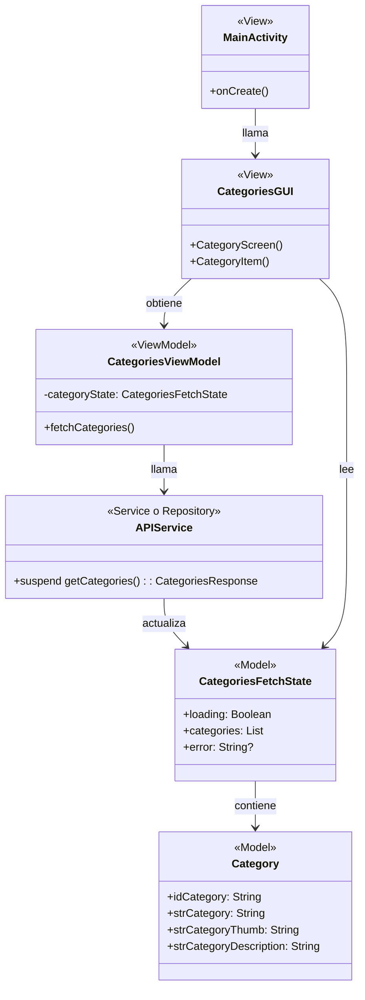
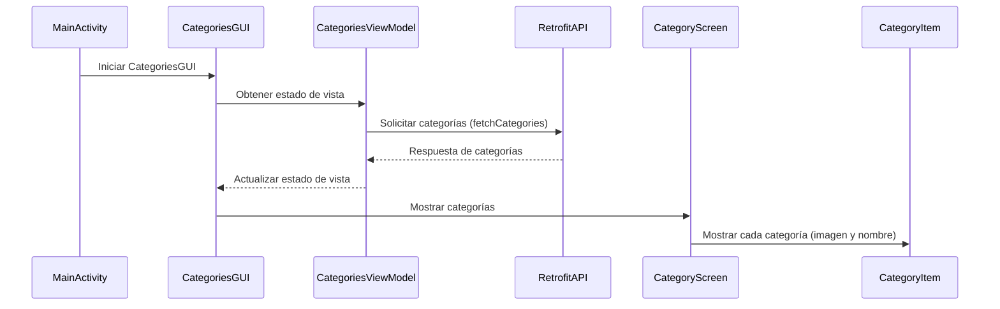
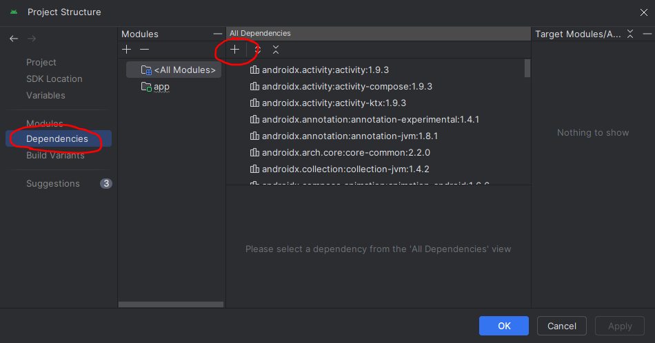
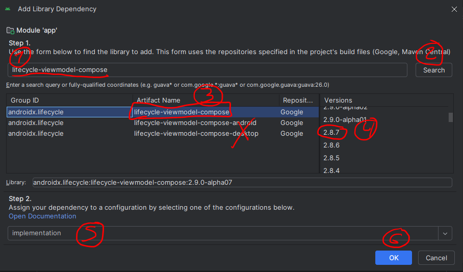
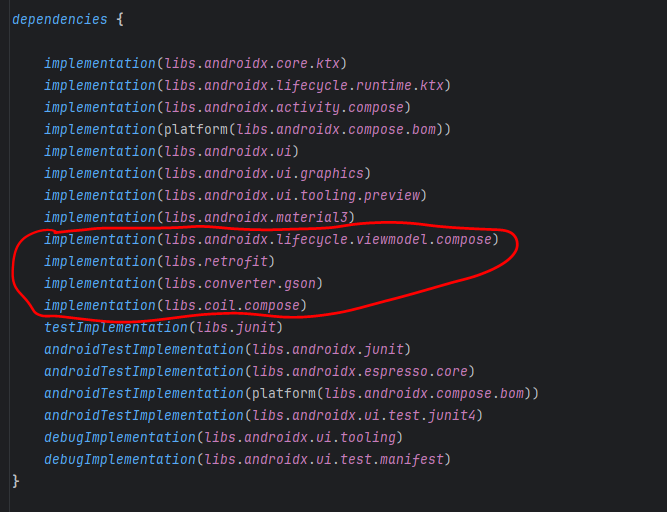
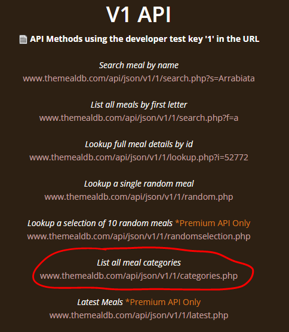
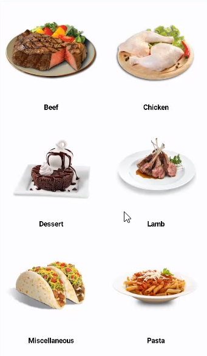

<!--
En el manual se ha usado el nombre de CategoriesFetchState en lugar de RecipeState, para que tenga más sentido semánticamente.

OJO!! Hay que cambiarlo en el código de la aplicación de Android Studio.

Comentarios a atender (Puestos en el manual como comentarios):
1º) Revisar el diagrama de clases con las clases del proyecto real.
2º) Poner el código del ViewModel completo.
3º) En el diagrama de secuencia habría que añadir CategoriesFetchState
--->


# 🌐 Aplicación de recetas de comida.

En este laboratorio, vamos a aprender a cargar datos desde internet usando una `API` externa y mostrarlos en nuestra aplicación desarrollada en Kotlin utilizando Jetpack Compose. 🚀
Nos conectaremos a una API de recetas de comida llamada [**TheMealDB**](https://www.themealdb.com/) para obtener información sobre distintas categorías de recetas y mostrarlas en nuestra aplicación.

Primero veremos una breve [Introducción a JSON](#-introducción-a-json) y posteriormente empezaremos a trabajar con el [desarrollo de la aplicación](#️-configuración-inicial-de-nuestra-app).


# 📋 Tabla de Contenidos 


- [🌐 Aplicación de recetas de comida.](#-aplicación-de-recetas-de-comida)
- [📋 Tabla de Contenidos](#-tabla-de-contenidos)
- [🌟 Introducción a JSON](#-introducción-a-json)
- [🧪 Trabajando con JSON en Kotlin](#-trabajando-con-json-en-kotlin)
  - [✍️ Creación de una clase de datos](#️-creación-de-una-clase-de-datos)
  - [🧙‍♂️ Creando instancias de la clase](#️-creando-instancias-de-la-clase)
  - [📄 Estructura de JSON](#-estructura-de-json-1)
  - [🔄 Relación entre JSON y Kotlin](#-relación-entre-json-y-kotlin)
  - [🌐 JSON para comunicación en red](#-json-para-comunicación-en-red)
  - [🔀 Estructuras anidadas](#-estructuras-anidadas)
- [🌐 Introducción al uso de la API para recetas `TheMealDB`](#-introducción-al-uso-de-la-api-para-recetas-themealdb)
  - [🔑 Configuración de la API Key](#-configuración-de-la-api-key)
  - [📜 Explorando la respuesta JSON](#-explorando-la-respuesta-json)
  - [🎲 Obtención de recetas aleatorias](#-obtención-de-recetas-aleatorias)
- [🛠️ Configuración Inicial de Nuestra App](#️-configuración-inicial-de-nuestra-app)
  - [Diagrama de clases de la aplicación 📚](#diagrama-de-clases-de-la-aplicación-)
  - [📊 Diagrama de Secuencia](#-diagrama-de-secuencia)
  - [📂 Crear un Nuevo Proyecto](#-crear-un-nuevo-proyecto)
  - [⚙️ Configuración de Dependencias](#️-configuración-de-dependencias)
- [📝 Clase de Datos: Categoría y Respuesta de Categorías](#-clase-de-datos-categoría-y-respuesta-de-categorías)
- [🌐 Creando el servicio API en Kotlin con Retrofit y funciones suspendidas](#-creando-el-servicio-api-en-kotlin-con-retrofit-y-funciones-suspendidas)
- [🍲 Creación del ViewModel para la Aplicación](#-creación-del-viewmodel-para-la-aplicación)
  - [📝 **Creación de la clase CategoriesViewModel**](#-creación-de-la-clase-categoriesviewmodel)
  - [📊 **Definición del Estado de la Receta**](#-definición-del-estado-de-la-receta)
  - [🔄 **Variables de Estado en el ViewModel**](#-variables-de-estado-en-el-viewmodel)
  - [🚀 **Función para Obtener las Categorías**](#-función-para-obtener-las-categorías)
  - [🔄 **Inicialización del ViewModel**](#-inicialización-del-viewmodel)
  - [📲 **Actualización de la Interfaz de Usuario**](#-actualización-de-la-interfaz-de-usuario)
- [📋 Pantalla de Recetas](#-pantalla-de-recetas)
- [🛠️ Pantalla de Categorías](#️-pantalla-de-categorías)
- [📄 Configuración del Android Manifest para la Aplicación](#-configuración-del-android-manifest-para-la-aplicación)
- [🌟 Resumen del completo de la aplicación](#-resumen-del-completo-de-la-aplicación)
  - [🖥️ MainActivity](#️-mainactivity)
  - [🧩 Composable `CategoriesGUI`](#-composable-categoriesgui)
  - [🗂️ ViewModel Principal: `CategoriesViewModel`](#️-viewmodel-principal-categoriesviewmodel)
  - [🌐 Servicio API con Retrofit](#-servicio-api-con-retrofit)
  - [🧱 Arquitectura de Datos: `CategoriesFetchState`](#-arquitectura-de-datos-categoriesfetchstate)
  - [🖼️ Renderizando la Pantalla de Categorías](#️-renderizando-la-pantalla-de-categorías)
  - [🔄 Flujo Completo](#-flujo-completo)
- [🧭 ¿Necesitas una brújula para encontrarte?](#-necesitas-una-brújula-para-encontrarte)

# 🌟 Introducción a JSON

JSON (JavaScript Object Notation) es un formato ligero de intercambio de datos estructurados basado en la sintaxis de objetos de JavaScript. Aunque originalmente se desarrolló para JavaScript, hoy en día se usa ampliamente en aplicaciones de todo tipo, especialmente para la transmisión de datos en aplicaciones web.

En nuestro caso, en lugar de enviar datos a una página web, vamos a cargar esos datos en nuestra aplicación móvil 📱. JSON no es un lenguaje de programación, sino un formato ligero, basado en texto, para el intercambio de datos que depende de lenguajes de programación para ser interpretado.

Puedes encontrar más documentación sobre JSON en [JSON.org](https://www.json.org/json-es.html)

### 📝 Ventajas de JSON
- **Ligero**: JSON es fácil de leer y escribir, lo que facilita el intercambio de datos.
- **Eficiencia**: En comparación con otros formatos, como XML, JSON resulta más eficiente y sencillo.
- **Legibilidad**: JSON es muy legible tanto para los humanos como para las máquinas, lo que lo hace perfecto para transmitir datos.

### 🔄 JSON vs XML
XML también es un formato eficiente para el almacenamiento y transferencia de datos, pero JSON se destaca por ser más ligero y legible. Mientras que XML utiliza etiquetas para definir cada elemento de los datos, JSON usa una estructura más sencilla basada en llaves `{}` y corchetes `[]`.

Ejemplo de una estructura JSON:

```kotlin
{
    "nombre": "Juan",
    "edad": 25,
    "hobbies": ["Leer", "Programar", "Correr"]
}
```

<details>
  <summary>¿Quieres ver como sería en XML?</summary>
<br>

```xml
<persona>
  <nombre>Juan</nombre>
  <edad>25</edad>
  <hobbies>
    <hobby>Leer</hobby>
    <hobby>Programar</hobby>
    <hobby>Correr</hobby>
  </hobbies>
</persona>

```

Y si además quieres mostrar la definición de tipos en XML (como en un esquema XSD), sería algo así:

```xml

<?xml version="1.0" encoding="UTF-8"?>
<xs:schema xmlns:xs="http://www.w3.org/2001/XMLSchema"
           elementFormDefault="qualified">

  <!-- Elemento raíz -->
  <xs:element name="persona">
    <xs:complexType>
      <xs:sequence>
        <xs:element name="nombre" type="xs:string"/>
        <xs:element name="edad" type="xs:int"/>
        <xs:element name="hobbies">
          <xs:complexType>
            <xs:sequence>
              <xs:element name="hobby" type="xs:string" maxOccurs="unbounded"/>
            </xs:sequence>
          </xs:complexType>
        </xs:element>
      </xs:sequence>
    </xs:complexType>
  </xs:element>

</xs:schema>

```

</details>
<br>

En el ejemplo anterior, tenemos un objeto que contiene propiedades como `nombre`, `edad` y `hobbies`, donde `hobbies` es una lista de valores.

### 🔑 Estructura de JSON
JSON se construye sobre dos estructuras principales:

1. **Colección de pares clave-valor**: Estos pares son similares a los objetos en JavaScript, diccionarios en Python, o `Map` en Java. Cada propiedad tiene una **clave** y un **valor** asociado.
   
   Ejemplo:
   
   ```kotlin
   {
       "ciudad": "Segovia",
       "país": "España"
   }
   ```

2. **Lista ordenada de valores**: Una lista o secuencia de valores representada con corchetes `[]`. En Kotlin, esta estructura se puede representar como una `List`.

   Ejemplo:

   ```kotlin
   ["Kotlin", "Java", "Swift"]
   ```

En JSON, los objetos se estructuran usando llaves `{}` y las listas usan corchetes `[]`. Estos elementos permiten una representación clara y organizada de los datos.

### 📋 Tipos de datos en JSON
- **Números**: `23`, `3.14`
- **Cadenas**: `"Hola Mundo"`
- **Booleanos**: `true`, `false`
- **Nulos**: `null`
- **Objetos**: `{ "clave": "valor" }`
- **Listas**: `[1, 2, 3]`

 
# 🧪 Trabajando con JSON en Kotlin

Vamos a centrarnos en cómo se estructuran los objetos JSON y cómo se relacionan con nuestras clases en Kotlin. En este caso, utilizaremos una clase de Kotlin para representar un objeto JSON.

## ✍️ Creación de una clase de datos

Para ilustrar cómo funciona JSON, vamos a crear una clase de datos sencilla llamada `Pocion`:

```kotlin
// Definimos una clase de datos
data class Pocion(
    val nombre: String,
    val efecto: String,
    val potencia: Int
)
```

La clase `Pocion` tiene tres propiedades: `nombre` (un `String`), `efecto` (otro `String`) y `potencia` (un `Int`). Estas propiedades nos permitirán definir distintos tipos de pociones.

## 🧙‍♂️ Creando instancias de la clase

Ahora vamos a crear algunas instancias de la clase `Pocion` para ilustrar cómo trabajar con listas de objetos en Kotlin. Definimos tres pociones:

```kotlin
fun main() {
    val pocionCuracion = Pocion("Poción de curación", "Restaura salud", 50)
    val pocionInvisibilidad = Pocion("Poción de invisibilidad", "Otorga invisibilidad", 40)
    val pocionFuerza = Pocion("Poción de fuerza", "Aumenta la fuerza", 60)

    val listaPociones = listOf(pocionCuracion, pocionInvisibilidad, pocionFuerza)
    println(listaPociones)
}
```

En este ejemplo, hemos creado tres pociones distintas y las hemos almacenado en una lista llamada `listaPociones`. Esta lista nos servirá para ilustrar cómo se estructuran estos datos en formato JSON.

## 📄 Estructura de JSON

Si representamos la lista de pociones de antes en un archivo JSON, el resultado se vería de la siguiente manera:

```json
[
  {
    "nombre": "Poción de curación",
    "efecto": "Restaura salud",
    "potencia": 50
  },
  {
    "nombre": "Poción de invisibilidad",
    "efecto": "Otorga invisibilidad",
    "potencia": 40
  },
  {
    "nombre": "Poción de fuerza",
    "efecto": "Aumenta la fuerza",
    "potencia": 60
  }
]
```

En JSON:
- Los corchetes `[]` indican una lista de objetos separados por una coma `,` 
- Los objetos individuales están delimitados por llaves `{}`. 
- Cada objeto tiene un conjunto de pares clave-valor que representan las propiedades de la clase `Pocion`.

Podemos usar el siguiente recurso para visualizar, validad, formatear JSON y mucho más: [JSON Formatter](https://jsonformatter.org/)

## 🔄 Relación entre JSON y Kotlin

Una vez que entendemos cómo se estructura un objeto JSON, podemos ver cómo se relaciona con nuestras clases en Kotlin. Los pares clave-valor en JSON (`"nombre": "Poción de curación"`) se corresponden con las propiedades de nuestra clase (`val nombre: String`). De esta forma, podemos convertir datos JSON en objetos Kotlin y viceversa.

Por ejemplo, para acceder al efecto de la `pocionCuracion` en el JSON, usamos la clave `"efecto"`, que nos devuelve el valor `"Restaura salud"`.

## 🌐 JSON para comunicación en red

Una de las mayores ventajas de JSON es su uso en la comunicación entre aplicaciones y servidores. Podemos enviar datos como strings JSON, lo cual hace que sea muy eficiente debido a su tamaño reducido y fácil manejo. Por ejemplo, podemos almacenar la definición de la poción en un servidor, y luego descargarla en nuestra aplicación para usarla.

Esto permite que la lógica de la aplicación resida en el dispositivo, mientras que los datos se almacenan y se gestionan en la nube. De esta forma, podemos mantener la aplicación ligera y actualizar los datos sin necesidad de modificar el código de la app.

## 🔀 Estructuras anidadas

JSON permite estructuras complejas, como listas dentro de objetos o listas de objetos dentro de otras listas. Por ejemplo, podríamos añadir una propiedad adicional a nuestra clase `Pocion` que sea una lista de usuarios permitidos:

```kotlin
data class Pocion(
    val nombre: String,
    val efecto: String,
    val potencia: Int,
    val usuariosPermitidos: List<String>
)
```

Esto nos permitiría definir, por ejemplo, que la `pocionInvisibilidad` solo puede ser usada por personajes de tipo "pícaro".

```json
{
  "nombre": "Poción de invisibilidad",
  "efecto": "Otorga invisibilidad",
  "potencia": 40,
  "usuariosPermitidos": ["Pícaro", "Mediano"]
}
```

Este ejemplo muestra cómo podemos tener listas dentro de objetos, lo cual nos permite modelar datos complejos de una manera clara y eficiente.

# 🌐 Introducción al uso de la API para recetas `TheMealDB`

¿Conoces [`TheMealDB`](https://www.themealdb.com/)? 

[Aquí tienes una breve descripción de la API.](https://www.themealdb.com/api.php)

Esta base de datos nos permite obtener recetas, listas de ingredientes, instrucciones y más, sin necesidad de crearlas por nosotros mismos. Utilizaremos una API gratuita en formato JSON llamada **MealDB** que contiene toda la información necesaria para nuestras recetas. 🚀

MealDB nos permite acceder a diferentes datos de recetas, como la imagen del plato, la lista de ingredientes, las instrucciones de cocción y demás. A lo largo de este manual, aprenderemos cómo usar esta API para integrar toda esta información en nuestra aplicación.

## 🔑 Configuración de la API Key

Para usar la API de MealDB, necesitaremos configurar nuestra propia API Key. La API Key es una forma de identificar a cada desarrollador o aplicación que quiere acceder a los datos. Esto permite que la base de datos pueda controlar el acceso a la información, limitándolo si es necesario o pidiendo que se adquiera una versión premium. Para nuestro propósito, la versión gratuita es suficiente. ✨

Podemos usar la clave de prueba proporcionada para realizar solicitudes a la API. Por ejemplo, para buscar una receta llamada "Arrabbiata", podríamos utilizar la siguiente URL:

```kotlin
val url = "https://www.themealdb.com/api/json/v1/1/search.php?s=Arrabiata"
```
> 🔎 **Nota importante:**
> En la URL anterior, el número **1** que aparece tras `/v1/` es la **API Key de prueba**. 
> https://www.themealdb.com/api/json/v1<mark>/1/</mark>search.php?s=Arrabiata
> <br>Tal como indica la documentación oficial, esta clave es pública y está pensada únicamente para pruebas. Funciona correctamente, pero si se realizan demasiadas peticiones desde la misma IP, pueden **bloquear temporalmente el acceso**.
> Es recomendable que consigas tu propia API Key personalizada.

Esta línea de código nos permitirá buscar la receta "Arrabbiata" y obtener la respuesta en formato JSON. Más adelante, veremos cómo utilizar nuestra propia API Key personalizada.

Prueba pinchando aquí para ver la respuesta JSON:

[https://www.themealdb.com/api/json/v1/1/search.php?s=Arrabiata](https://www.themealdb.com/api/json/v1/1/search.php?s=Arrabiata)

## 📜 Explorando la respuesta JSON

Al hacer una solicitud a la API, obtendremos una respuesta en formato **JSON**. Pero el formato que recibes no está estructurado para humanos, es correcto, pero es muy difícil de visualizar para una persona a simple vista.

Veremos algo así:

```
{"meals":[{"idMeal":"52771","strMeal":"Spicy Arrabiata Penne","strDrinkAlternate":null,"strCategory":"Vegetarian","strArea":"Italian","strInstructions":"Bring a large pot of water to a boil. Add kosher salt to the boiling water, then add the pasta. Cook according to the package instructions, about 9 minutes.\r\nIn a large skillet over medium-high heat, add the olive oil and heat until the oil starts to shimmer. Add the garlic and cook, stirring, until fragrant, 1 to 2 minutes. Add the chopped tomatoes, red chile flakes, Italian seasoning and salt and pepper to taste. Bring to a boil and cook for 5 minutes. Remove from the heat and add the chopped basil.\r\nDrain the pasta and add it to the sauce. Garnish with Parmigiano-Reggiano flakes and more basil and serve warm.","strMealThumb":"https:\/\/www.themealdb.com\/images\/media\/meals\/ustsqw1468250014.jpg","strTags":"Pasta,Curry","strYoutube":"https:\/\/www.youtube.com\/watch?v=1IszT_guI08","strIngredient1":"penne rigate","strIngredient2":"olive oil","strIngredient3":"garlic","strIngredient4":"chopped tomatoes","strIngredient5":"red chilli flakes","strIngredient6":"italian seasoning","strIngredient7":"basil","strIngredient8":"Parmigiano-Reggiano","strIngredient9":"","strIngredient10":"","strIngredient11":"","strIngredient12":"","strIngredient13":"","strIngredient14":"","strIngredient15":"","strIngredient16":null,"strIngredient17":null,"strIngredient18":null,"strIngredient19":null,"strIngredient20":null,"strMeasure1":"1 pound","strMeasure2":"1\/4 cup","strMeasure3":"3 cloves","strMeasure4":"1 tin ","strMeasure5":"1\/2 teaspoon","strMeasure6":"1\/2 teaspoon","strMeasure7":"6 leaves","strMeasure8":"sprinkling","strMeasure9":"","strMeasure10":"","strMeasure11":"","strMeasure12":"","strMeasure13":"","strMeasure14":"","strMeasure15":"","strMeasure16":null,"strMeasure17":null,"strMeasure18":null,"strMeasure19":null,"strMeasure20":null,"strSource":null,"strImageSource":null,"strCreativeCommonsConfirmed":null,"dateModified":null}]}
```

Lo que podemos hacer, es copiar el texto JSON y pegarlo en un visualizador de JSON en línea, como [JSON Formatter](https://jsonformatter.org/), para verlo de una forma más legible.

Este formato es muy útil para estructurar y organizar los datos de forma que podamos procesarlos fácilmente en nuestra aplicación. La respuesta JSON tendrá una estructura similar a la siguiente:

```json
{
  "meals": [
    {
      "idMeal": "52771",
      "strMeal": "Spicy Arrabiata Penne",
      "strDrinkAlternate": null,
      "strCategory": "Vegetarian",
      "strArea": "Italian",
      "strInstructions": "Bring a large pot of water to a boil. Add kosher salt to the boiling water, then add the pasta. Cook according to the package instructions, about 9 minutes.\r\nIn a large skillet over medium-high heat, add the olive oil and heat until the oil starts to shimmer. Add the garlic and cook, stirring, until fragrant, 1 to 2 minutes. Add the chopped tomatoes, red chile flakes, Italian seasoning and salt and pepper to taste. Bring to a boil and cook for 5 minutes. Remove from the heat and add the chopped basil.\r\nDrain the pasta and add it to the sauce. Garnish with Parmigiano-Reggiano flakes and more basil and serve warm.",
      "strMealThumb": "https://www.themealdb.com/images/media/meals/ustsqw1468250014.jpg",
      "strTags": "Pasta,Curry",
      "strYoutube": "https://www.youtube.com/watch?v=1IszT_guI08",
      "strIngredient1": "penne rigate",
      "strIngredient2": "olive oil",
      "strIngredient3": "garlic",
      "strIngredient4": "chopped tomatoes",
      "strIngredient5": "red chilli flakes",
      "strIngredient6": "italian seasoning",
      "strIngredient7": "basil",
      "strIngredient8": "Parmigiano-Reggiano",
      "strImageSource": null,
      "strCreativeCommonsConfirmed": null,
      "dateModified": null
    }
  ]
}

// Se han recortado varios campos para simplificar el ejemplo
```

Esta forma de visualizar los datos se llama coloquialmente "pretty" y nos permite ver la estructura de los datos de una forma más clara y organizada.

En este ejemplo, podemos ver que la respuesta contiene un objeto con una propiedad llamada **meals**, que es una lista. Dentro de esa lista, cada elemento representa una receta, incluyendo propiedades como el nombre del plato (**strMeal**), la categoría (**strCategory**), el área de origen (**strArea**), las instrucciones (**strInstructions**), y la URL de la imagen (**strMealThumb**).

### 📌 Keys importantes en la respuesta

- **idMeal**: Identificador único de la receta.
- **strMeal**: Nombre del plato.
- **strCategory**: Categoría del plato (por ejemplo, "Vegetarian").
- **strArea**: Área de origen (por ejemplo, "Italian").
- **strInstructions**: Instrucciones de preparación del plato.
- **strMealThumb**: URL de la imagen del plato. Puesdes usar esta URL para cargar la imagen en tu navegador. [Pincha aquí](https://www.themealdb.com/images/media/meals/ustsqw1468250014.jpg) para ver la imagen del plato.


## 🎲 Obtención de recetas aleatorias

Una funcionalidad interesante que nos ofrece la API es la posibilidad de obtener una receta aleatoria. Esto se puede lograr con la siguiente solicitud:


[https://www.themealdb.com/api/json/v1/1/random.php](https://www.themealdb.com/api/json/v1/1/random.php)

Esta URL nos devolverá una receta al azar cada vez que se realice la solicitud. Esta funcionalidad es útil para dar a los usuarios una opción divertida y espontánea al explorar nuevas recetas.

# 🛠️ Configuración Inicial de Nuestra App

En este apartado, vamos a establecer la configuración básica de nuestra aplicación. Veremos cómo configurar el proyecto y añadir las dependencias necesarias para poder trabajar con Jetpack Compose, ViewModel, Retrofit, y Coil.

Nuestro objetivo es crear una aplicación que tenga el siguiente aspecto:

<div align="center">
    
</div>

Como puedes ver en el gif animado:

1. La aplicación muestra un `loader` mientras se cargan los datos.
2. La aplicación accede a información de recetas desde la `API` de **MealDB**.
3. Muestra una lista de categorías de recetas.
4. Podemos movernos entre las categorías y ver las recetas disponibles.


## Diagrama de clases de la aplicación 📚

<!--

Hay que revisarlo pasando las clases al GPT para que genere un diagrama de clases que se corresponda.
Creo que está bien para que se entienda
!!! Se usó: https://chatgpt.com/c/6745b0d8-73c0-8003-9b63-1f9b9ddd911c


-->

<div align="center">



</div>


Este diagrama de clases en formato Mermaid refleja la arquitectura MVVM de la aplicación. Cada clase tiene un estereotipo que indica su rol dentro del patrón:

- **MainActivity** arranca la primera vista con **CategoriesGUI**
- **CategoriesGUI** llama a **CategoryScreen** y **CategoryItem** que son vistas (`<<View>>`).
- **CategoriesViewModel** actúa como el `ViewModel`.
- **CategoriesFetchState** y **Category** son modelos (`<<Model>>`).
- **APIService** es un servicio (`<<Service>>`) que proporciona los datos necesarios.

## 📊 Diagrama de Secuencia
Aquí presento un diagrama de secuencia para ayudar a entender el flujo de los datos

<!--
Habría que añadir el CategoriesFetchState que no aparece en el diagrama.
-->

<div align="center">



</div>


Este diagrama de secuencia muestra cómo los diferentes componentes de la aplicación interactúan entre sí, desde la inicialización de la **MainActivity** hasta la visualización de las categorías en la interfaz de usuario.


## 📂 Crear un Nuevo Proyecto

Para comenzar, crearemos un nuevo proyecto en Android Studio:

1. Selecciona **Empty Activity** como tipo de actividad.
2. Nombra tu proyecto como **"Recetas App"**.
3. Recuerda que el `namespace` debe ser: `es.uva.inf5g.psm.recetasapp` (o el que prefieras, pero el prefijo siempre de ser igual)
4. Deja los demás ajustes por defecto y haz clic en **Finish**.

## ⚙️ Configuración de Dependencias

Hasta ahora no hemos modificado las dependencias de `Gradle`. Vamos a añadir las dependencias necesarias a nuestro proyecto, y lo haremos en el archivo `build.gradle.kts`. Si te fijas, hay dos archivos `build.gradle.kts`: uno para el proyecto y otro para el módulo.

El archivo que modificaremos será `build.gradle.kts` del módulo `app`. Lo reconocerás porque Android Studio lo muestra como: `build.gradle.kts (Module: app)`.

La forma correcta de añadir las dependencias es usando los cuadros de diálogo que ofrece Android Studio; esta es la manera "segura" de hacerlo. Sin embargo, también puedes añadirlas manualmente copiando y pegando las dependencias en el archivo. Esto requiere más conocimientos y solo lo recomiendo si ya tienes experiencia o si los cuadros de diálogo de Android Studio no funcionan.

### 🗛️ Añadir las dependencias en el archivo `build.gradle.kts (Module: app)`

Para abrir el cuadro de diálogo de `Project Structure`, pulsa `Ctrl+Alt+Shift+S` o ve a `File > Project Structure`. Una vez abierto, selecciona `Dependencies`.

<div align="center">
    
</div>

Las dependencias que necesitamos para nuestro proyecto son las siguientes:

- `"androidx.lifecycle:lifecycle-viewmodel-compose:2.8.7"`
- `"com.squareup.retrofit2:retrofit:2.11.0"`
- `"com.squareup.retrofit2:converter-gson:2.11.0"`
- `"io.coil-kt:coil-compose:2.7.0"`

> **Nota importante:** Estas son las versiones de las librerías en el momento de la creación de este manual. Es muy probable que ya existan versiones más recientes. Siempre que sea posible, utiliza la versión más actualizada disponible.


Si te fijas, lo que está entre comillas es la dependencia que estamos añadiendo y, después de los dos puntos `:`, se indica la versión. Las versiones que he proporcionado son las últimas disponibles al momento de crear este manual, pero siempre puedes consultar la versión más reciente en la página oficial de cada dependencia.

A continuación, te explicaré cómo añadir la primera dependencia, pero el proceso es el mismo para todas las demás.

Debes seguir los pasos indicados en la imagen de abajo:

<div align="center">
    
</div>

1. Haz clic en el botón `+` para añadir una nueva dependencia. Elige `Library dependency`. En el buscador, busca `lifecycle-viewmodel-compose`.
2. Pulsa el botón `Search`. En el cuadro de abajo se cargarán las opciones que se correspondan con la búsqueda. Para esta búsqueda aparecerán tres opciones.
3. Elige la opción `lifecycle-viewmodel-compose`. No elijas las que tengan `-android` o `-desktop` en el nombre.
4. Selecciona la versión. Usa el cuadro de la derecha para seleccionar la versión más actual que no sea `alpha`. Las versiones `alpha` son de prueba y no recomendables para un proyecto en producción. Para esta dependencia, la versión más actual es `2.8.7` al momento de crear este manual.
5. Asegúrate de elegir la opción `implementation`.
6. Finalmente, pulsa el botón `OK` para añadir la dependencia al proyecto.

> Nota: Cada vez que añadas una dependencia, puede demorarse un tiempo, ya que se está descargando la librería y todas sus dependencias desde internet.<br>
> Recuerda que debes añadir todas las dependencias mencionadas anteriormente siguiendo los mismos pasos.

Si has seguido los pasos correctamente, deberías ver las nuevas dependencias añadidas en tu archivo `build.gradle.kts`. Debería verse algo así:

<div align="center">
    
</div>

Una vez que hayas agregado estas dependencias, el IDE debería sincronizar el proyecto. Pero Asegúrate que si no lo hace él, deberías hacer clic en **Sync Now** para sincronizar tu proyecto con las nuevas configuraciones de Gradle.

Estas dependencias nos permitirán:

- **ViewModel Compose**: Integrar el ciclo de vida del ViewModel con Jetpack Compose.
- **Retrofit**: Realizar peticiones a una API para obtener datos desde internet.
- **Gson Converter**: Convertir archivos JSON a objetos Kotlin, facilitando su manejo dentro del proyecto.
- **Coil**: Cargar imágenes desde internet de manera sencilla y eficiente.

# 📝 Clase de Datos: Categoría y Respuesta de Categorías

Ahora que tenemos todas las dependencias listas, vamos a escribir código para nuestra aplicación **Recetas App**.

### 📦 Creación de la Clase de Datos `Category`

Vamos a crear una nueva clase de datos en Kotlin, que llamaremos `Category`. Esta clase va a representar los datos de las categorías de comidas que vamos a obtener de la API.

[Si repasamos la documentación de la API](https://www.themealdb.com/api.php)

<div align="center">
    
</div>


Veremos que hay una llamada a la API que nos permite obtener una lista de todas las categorías de comidas. La URL para obtener esta información es la siguiente: 

[www.themealdb.com/api/json/v1/1/categories.php](www.themealdb.com/api/json/v1/1/categories.php)


<details>
  <summary>Si pinchamos veremos algo como esto:</summary>
<br>

```json
{"categories":[{"idCategory":"1","strCategory":"Beef","strCategoryThumb":"https:\/\/www.themealdb.com\/images\/category\/beef.png","strCategoryDescription":"Beef is the culinary name for meat from cattle, particularly skeletal muscle. Humans have been eating beef since prehistoric times.[1] Beef is a source of high-quality protein and essential nutrients.[2]"},{"idCategory":"2","strCategory":"Chicken","strCategoryThumb":"https:\/\/www.themealdb.com\/images\/category\/chicken.png","strCategoryDescription":"Chicken is a type of domesticated fowl, a subspecies of the red junglefowl. It is one of the most common and widespread domestic animals, with a total population of more than 19 billion as of 2011.[1] Humans commonly keep chickens as a source of food (consuming both their meat and eggs) and, more rarely, as pets."},{"idCategory":"3","strCategory":"Dessert","strCategoryThumb":"https:\/\/www.themealdb.com\/images\/category\/dessert.png","strCategoryDescription":"Dessert is a course that concludes a meal. The course usually consists of sweet foods, such as confections dishes or fruit, and possibly a beverage such as dessert wine or liqueur, however in the United States it may include coffee, cheeses, nuts, or other savory items regarded as a separate course elsewhere. In some parts of the world, such as much of central and western Africa, and most parts of China, there is no tradition of a dessert course to conclude a meal.\r\n\r\nThe term dessert can apply to many confections, such as biscuits, cakes, cookies, custards, gelatins, ice creams, pastries, pies, puddings, and sweet soups, and tarts. Fruit is also commonly found in dessert courses because of its naturally occurring sweetness. Some cultures sweeten foods that are more commonly savory to create desserts."},{"idCategory":"4","strCategory":"Lamb","strCategoryThumb":"https:\/\/www.themealdb.com\/images\/category\/lamb.png","strCategoryDescription":"Lamb, hogget, and mutton are the meat of domestic sheep (species Ovis aries) at different ages.\r\n\r\nA sheep in its first year is called a lamb, and its meat is also called lamb. The meat of a juvenile sheep older than one year is hogget; outside the USA this is also a term for the living animal. The meat of an adult sheep is mutton, a term only used for the meat, not the living animals. The term mutton is almost always used to refer to goat meat in the Indian subcontinent.\r\n\r\n"},{"idCategory":"5","strCategory":"Miscellaneous","strCategoryThumb":"https:\/\/www.themealdb.com\/images\/category\/miscellaneous.png","strCategoryDescription":"General foods that don't fit into another category"},{"idCategory":"6","strCategory":"Pasta","strCategoryThumb":"https:\/\/www.themealdb.com\/images\/category\/pasta.png","strCategoryDescription":"Pasta is a staple food of traditional Italian cuisine, with the first reference dating to 1154 in Sicily.\r\n\r\nAlso commonly used to refer to the variety of pasta dishes, pasta is typically a noodle made from an unleavened dough of a durum wheat flour mixed with water or eggs and formed into sheets or various shapes, then cooked by boiling or baking. As an alternative for those wanting a different taste, or who need to avoid products containing gluten, some pastas can be made using rice flour in place of wheat.[3][4] Pastas may be divided into two broad categories, dried (pasta secca) and fresh (pasta fresca)."},{"idCategory":"7","strCategory":"Pork","strCategoryThumb":"https:\/\/www.themealdb.com\/images\/category\/pork.png","strCategoryDescription":"Pork is the culinary name for meat from a domestic pig (Sus scrofa domesticus). It is the most commonly consumed meat worldwide,[1] with evidence of pig husbandry dating back to 5000 BC. Pork is eaten both freshly cooked and preserved. Curing extends the shelf life of the pork products. Ham, smoked pork, gammon, bacon and sausage are examples of preserved pork. Charcuterie is the branch of cooking devoted to prepared meat products, many from pork.\r\n\r\nPork is the most popular meat in Eastern and Southeastern Asia, and is also very common in the Western world, especially in Central Europe. It is highly prized in Asian cuisines for its fat content and pleasant texture. Consumption of pork is forbidden by Jewish and Muslim dietary law, a taboo that is deeply rooted in tradition, with several suggested possible causes. The sale of pork is limited in Israel and illegal in certain Muslim countries."},{"idCategory":"8","strCategory":"Seafood","strCategoryThumb":"https:\/\/www.themealdb.com\/images\/category\/seafood.png","strCategoryDescription":"Seafood is any form of sea life regarded as food by humans. Seafood prominently includes fish and shellfish. Shellfish include various species of molluscs, crustaceans, and echinoderms. Historically, sea mammals such as whales and dolphins have been consumed as food, though that happens to a lesser extent in modern times. Edible sea plants, such as some seaweeds and microalgae, are widely eaten as seafood around the world, especially in Asia (see the category of sea vegetables). In North America, although not generally in the United Kingdom, the term \"seafood\" is extended to fresh water organisms eaten by humans, so all edible aquatic life may be referred to as seafood. For the sake of completeness, this article includes all edible aquatic life."},{"idCategory":"9","strCategory":"Side","strCategoryThumb":"https:\/\/www.themealdb.com\/images\/category\/side.png","strCategoryDescription":"A side dish, sometimes referred to as a side order, side item, or simply a side, is a food item that accompanies the entrée or main course at a meal. Side dishes such as salad, potatoes and bread are commonly used with main courses throughout many countries of the western world. New side orders introduced within the past decade[citation needed], such as rice and couscous, have grown to be quite popular throughout Europe, especially at formal occasions (with couscous appearing more commonly at dinner parties with Middle Eastern dishes)."},{"idCategory":"10","strCategory":"Starter","strCategoryThumb":"https:\/\/www.themealdb.com\/images\/category\/starter.png","strCategoryDescription":"An entrée in modern French table service and that of much of the English-speaking world (apart from the United States and parts of Canada) is a dish served before the main course of a meal; it may be the first dish served, or it may follow a soup or other small dish or dishes. In the United States and parts of Canada, an entrée is the main dish or the only dish of a meal.\r\n\r\nHistorically, the entrée was one of the stages of the “Classical Order” of formal French table service of the 18th and 19th centuries. It formed a part of the “first service” of the meal, which consisted of potage, hors d’œuvre, and entrée (including the bouilli and relevé). The “second service” consisted of roast (rôti), salad, and entremets (the entremets sometimes being separated into a “third service” of their own). The final service consisted only of dessert.[3]:3–11 :13–25"},{"idCategory":"11","strCategory":"Vegan","strCategoryThumb":"https:\/\/www.themealdb.com\/images\/category\/vegan.png","strCategoryDescription":"Veganism is both the practice of abstaining from the use of animal products, particularly in diet, and an associated philosophy that rejects the commodity status of animals.[b] A follower of either the diet or the philosophy is known as a vegan (pronounced \/ˈviːɡən\/ VEE-gən). Distinctions are sometimes made between several categories of veganism. Dietary vegans (or strict vegetarians) refrain from consuming animal products, not only meat but also eggs, dairy products and other animal-derived substances.[c] The term ethical vegan is often applied to those who not only follow a vegan diet but extend the philosophy into other areas of their lives, and oppose the use of animals for any purpose.[d] Another term is environmental veganism, which refers to the avoidance of animal products on the premise that the harvesting or industrial farming of animals is environmentally damaging and unsustainable."},{"idCategory":"12","strCategory":"Vegetarian","strCategoryThumb":"https:\/\/www.themealdb.com\/images\/category\/vegetarian.png","strCategoryDescription":"Vegetarianism is the practice of abstaining from the consumption of meat (red meat, poultry, seafood, and the flesh of any other animal), and may also include abstention from by-products of animal slaughter.\r\n\r\nVegetarianism may be adopted for various reasons. Many people object to eating meat out of respect for sentient life. Such ethical motivations have been codified under various religious beliefs, as well as animal rights advocacy. Other motivations for vegetarianism are health-related, political, environmental, cultural, aesthetic, economic, or personal preference. There are variations of the diet as well: an ovo-lacto vegetarian diet includes both eggs and dairy products, an ovo-vegetarian diet includes eggs but not dairy products, and a lacto-vegetarian diet includes dairy products but not eggs. A vegan diet excludes all animal products, including eggs and dairy. Some vegans also avoid other animal products such as beeswax, leather or silk clothing, and goose-fat shoe polish."},{"idCategory":"13","strCategory":"Breakfast","strCategoryThumb":"https:\/\/www.themealdb.com\/images\/category\/breakfast.png","strCategoryDescription":"Breakfast is the first meal of a day. The word in English refers to breaking the fasting period of the previous night. There is a strong likelihood for one or more \"typical\", or \"traditional\", breakfast menus to exist in most places, but their composition varies widely from place to place, and has varied over time, so that globally a very wide range of preparations and ingredients are now associated with breakfast."},{"idCategory":"14","strCategory":"Goat","strCategoryThumb":"https:\/\/www.themealdb.com\/images\/category\/goat.png","strCategoryDescription":"The domestic goat or simply goat (Capra aegagrus hircus) is a subspecies of C. aegagrus domesticated from the wild goat of Southwest Asia and Eastern Europe. The goat is a member of the animal family Bovidae and the subfamily Caprinae, meaning it is closely related to the sheep. There are over 300 distinct breeds of goat. Goats are one of the oldest domesticated species of animal, and have been used for milk, meat, fur and skins across much of the world. Milk from goats is often turned into goat cheese."}]}
```	

</details>
<br>

Lo cual no es muy visible y representativo para nosotros. Por eso, vamos a formatearlo en la web propuesta. [JSON Formatter](https://jsonformatter.org/)

<details>
  <summary>Una vez formateado tendremos algo más legible:</summary>
<br>

```json
{
  "categories": [
    {
      "idCategory": "1",
      "strCategory": "Beef",
      "strCategoryThumb": "https://www.themealdb.com/images/category/beef.png",
      "strCategoryDescription": "Beef is the culinary name for meat from cattle, particularly skeletal muscle. Humans have been eating beef since prehistoric times.[1] Beef is a source of high-quality protein and essential nutrients.[2]"
    },
    {
      "idCategory": "2",
      "strCategory": "Chicken",
      "strCategoryThumb": "https://www.themealdb.com/images/category/chicken.png",
      "strCategoryDescription": "Chicken is a type of domesticated fowl, a subspecies of the red junglefowl. It is one of the most common and widespread domestic animals, with a total population of more than 19 billion as of 2011.[1] Humans commonly keep chickens as a source of food (consuming both their meat and eggs) and, more rarely, as pets."
    },
    {
      "idCategory": "3",
      "strCategory": "Dessert",
      "strCategoryThumb": "https://www.themealdb.com/images/category/dessert.png",
      "strCategoryDescription": "Dessert is a course that concludes a meal. The course usually consists of sweet foods, such as confections dishes or fruit, and possibly a beverage such as dessert wine or liqueur, however in the United States it may include coffee, cheeses, nuts, or other savory items regarded as a separate course elsewhere. In some parts of the world, such as much of central and western Africa, and most parts of China, there is no tradition of a dessert course to conclude a meal.\r\n\r\nThe term dessert can apply to many confections, such as biscuits, cakes, cookies, custards, gelatins, ice creams, pastries, pies, puddings, and sweet soups, and tarts. Fruit is also commonly found in dessert courses because of its naturally occurring sweetness. Some cultures sweeten foods that are more commonly savory to create desserts."
    },
    {
      "idCategory": "4",
      "strCategory": "Lamb",
      "strCategoryThumb": "https://www.themealdb.com/images/category/lamb.png",
      "strCategoryDescription": "Lamb, hogget, and mutton are the meat of domestic sheep (species Ovis aries) at different ages.\r\n\r\nA sheep in its first year is called a lamb, and its meat is also called lamb. The meat of a juvenile sheep older than one year is hogget; outside the USA this is also a term for the living animal. The meat of an adult sheep is mutton, a term only used for the meat, not the living animals. The term mutton is almost always used to refer to goat meat in the Indian subcontinent.\r\n\r\n"
    },
    {
      "idCategory": "5",
      "strCategory": "Miscellaneous",
      "strCategoryThumb": "https://www.themealdb.com/images/category/miscellaneous.png",
      "strCategoryDescription": "General foods that don't fit into another category"
    },
    {
      "idCategory": "6",
      "strCategory": "Pasta",
      "strCategoryThumb": "https://www.themealdb.com/images/category/pasta.png",
      "strCategoryDescription": "Pasta is a staple food of traditional Italian cuisine, with the first reference dating to 1154 in Sicily.\r\n\r\nAlso commonly used to refer to the variety of pasta dishes, pasta is typically a noodle made from an unleavened dough of a durum wheat flour mixed with water or eggs and formed into sheets or various shapes, then cooked by boiling or baking. As an alternative for those wanting a different taste, or who need to avoid products containing gluten, some pastas can be made using rice flour in place of wheat.[3][4] Pastas may be divided into two broad categories, dried (pasta secca) and fresh (pasta fresca)."
    },
    {
      "idCategory": "7",
      "strCategory": "Pork",
      "strCategoryThumb": "https://www.themealdb.com/images/category/pork.png",
      "strCategoryDescription": "Pork is the culinary name for meat from a domestic pig (Sus scrofa domesticus). It is the most commonly consumed meat worldwide,[1] with evidence of pig husbandry dating back to 5000 BC. Pork is eaten both freshly cooked and preserved. Curing extends the shelf life of the pork products. Ham, smoked pork, gammon, bacon and sausage are examples of preserved pork. Charcuterie is the branch of cooking devoted to prepared meat products, many from pork.\r\n\r\nPork is the most popular meat in Eastern and Southeastern Asia, and is also very common in the Western world, especially in Central Europe. It is highly prized in Asian cuisines for its fat content and pleasant texture. Consumption of pork is forbidden by Jewish and Muslim dietary law, a taboo that is deeply rooted in tradition, with several suggested possible causes. The sale of pork is limited in Israel and illegal in certain Muslim countries."
    },
    {
      "idCategory": "8",
      "strCategory": "Seafood",
      "strCategoryThumb": "https://www.themealdb.com/images/category/seafood.png",
      "strCategoryDescription": "Seafood is any form of sea life regarded as food by humans. Seafood prominently includes fish and shellfish. Shellfish include various species of molluscs, crustaceans, and echinoderms. Historically, sea mammals such as whales and dolphins have been consumed as food, though that happens to a lesser extent in modern times. Edible sea plants, such as some seaweeds and microalgae, are widely eaten as seafood around the world, especially in Asia (see the category of sea vegetables). In North America, although not generally in the United Kingdom, the term \"seafood\" is extended to fresh water organisms eaten by humans, so all edible aquatic life may be referred to as seafood. For the sake of completeness, this article includes all edible aquatic life."
    },
    {
      "idCategory": "9",
      "strCategory": "Side",
      "strCategoryThumb": "https://www.themealdb.com/images/category/side.png",
      "strCategoryDescription": "A side dish, sometimes referred to as a side order, side item, or simply a side, is a food item that accompanies the entrée or main course at a meal. Side dishes such as salad, potatoes and bread are commonly used with main courses throughout many countries of the western world. New side orders introduced within the past decade[citation needed], such as rice and couscous, have grown to be quite popular throughout Europe, especially at formal occasions (with couscous appearing more commonly at dinner parties with Middle Eastern dishes)."
    },
    {
      "idCategory": "10",
      "strCategory": "Starter",
      "strCategoryThumb": "https://www.themealdb.com/images/category/starter.png",
      "strCategoryDescription": "An entrée in modern French table service and that of much of the English-speaking world (apart from the United States and parts of Canada) is a dish served before the main course of a meal; it may be the first dish served, or it may follow a soup or other small dish or dishes. In the United States and parts of Canada, an entrée is the main dish or the only dish of a meal.\r\n\r\nHistorically, the entrée was one of the stages of the “Classical Order” of formal French table service of the 18th and 19th centuries. It formed a part of the “first service” of the meal, which consisted of potage, hors d’œuvre, and entrée (including the bouilli and relevé). The “second service” consisted of roast (rôti), salad, and entremets (the entremets sometimes being separated into a “third service” of their own). The final service consisted only of dessert.[3]:3–11 :13–25"
    },
    {
      "idCategory": "11",
      "strCategory": "Vegan",
      "strCategoryThumb": "https://www.themealdb.com/images/category/vegan.png",
      "strCategoryDescription": "Veganism is both the practice of abstaining from the use of animal products, particularly in diet, and an associated philosophy that rejects the commodity status of animals.[b] A follower of either the diet or the philosophy is known as a vegan (pronounced /ˈviːɡən/ VEE-gən). Distinctions are sometimes made between several categories of veganism. Dietary vegans (or strict vegetarians) refrain from consuming animal products, not only meat but also eggs, dairy products and other animal-derived substances.[c] The term ethical vegan is often applied to those who not only follow a vegan diet but extend the philosophy into other areas of their lives, and oppose the use of animals for any purpose.[d] Another term is environmental veganism, which refers to the avoidance of animal products on the premise that the harvesting or industrial farming of animals is environmentally damaging and unsustainable."
    },
    {
      "idCategory": "12",
      "strCategory": "Vegetarian",
      "strCategoryThumb": "https://www.themealdb.com/images/category/vegetarian.png",
      "strCategoryDescription": "Vegetarianism is the practice of abstaining from the consumption of meat (red meat, poultry, seafood, and the flesh of any other animal), and may also include abstention from by-products of animal slaughter.\r\n\r\nVegetarianism may be adopted for various reasons. Many people object to eating meat out of respect for sentient life. Such ethical motivations have been codified under various religious beliefs, as well as animal rights advocacy. Other motivations for vegetarianism are health-related, political, environmental, cultural, aesthetic, economic, or personal preference. There are variations of the diet as well: an ovo-lacto vegetarian diet includes both eggs and dairy products, an ovo-vegetarian diet includes eggs but not dairy products, and a lacto-vegetarian diet includes dairy products but not eggs. A vegan diet excludes all animal products, including eggs and dairy. Some vegans also avoid other animal products such as beeswax, leather or silk clothing, and goose-fat shoe polish."
    },
    {
      "idCategory": "13",
      "strCategory": "Breakfast",
      "strCategoryThumb": "https://www.themealdb.com/images/category/breakfast.png",
      "strCategoryDescription": "Breakfast is the first meal of a day. The word in English refers to breaking the fasting period of the previous night. There is a strong likelihood for one or more \"typical\", or \"traditional\", breakfast menus to exist in most places, but their composition varies widely from place to place, and has varied over time, so that globally a very wide range of preparations and ingredients are now associated with breakfast."
    },
    {
      "idCategory": "14",
      "strCategory": "Goat",
      "strCategoryThumb": "https://www.themealdb.com/images/category/goat.png",
      "strCategoryDescription": "The domestic goat or simply goat (Capra aegagrus hircus) is a subspecies of C. aegagrus domesticated from the wild goat of Southwest Asia and Eastern Europe. The goat is a member of the animal family Bovidae and the subfamily Caprinae, meaning it is closely related to the sheep. There are over 300 distinct breeds of goat. Goats are one of the oldest domesticated species of animal, and have been used for milk, meat, fur and skins across much of the world. Milk from goats is often turned into goat cheese."
    }
  ]
}
```	

</details>
<br>


 Si nos fijamos podemos abstraer la clase de datos `Category` contiene los siguientes atributos:

- **idCategory**: El ID de la categoría (de tipo `String`).
- **strCategory**: El nombre de la categoría (de tipo `String`).
- **strCategoryThumb**: La imagen o miniatura de la categoría (de tipo `String`).
- **strCategoryDescription**: La descripción de la categoría (de tipo `String`).

El código para la clase `Category` se vería así:

```kotlin
// Clase de datos que representa una categoría de comidas
data class Category(
    val idCategory: String,
    val strCategory: String,
    val strCategoryThumb: String,
    val strCategoryDescription: String
)
```

La clase `Category` tiene los mismos atributos que vamos a obtener de la API, por lo que el mapeo de los datos será sencillo.

### 📄 Clase de Datos `CategoriesResponse`

Luego, necesitamos una clase de datos adicional para representar la respuesta completa de la API. La API nos devuelve un **objeto grande** que contiene una lista de categorías.

Por lo tanto, crearemos otra clase de datos que se llamará `CategoriesResponse` y contendrá una lista de objetos `Category`:

```kotlin
// Clase de datos que representa la respuesta de la API con la lista de categorías
data class CategoriesResponse(
    val categories: List<Category>
)
```

De esta forma, la clase `CategoriesResponse` contendrá todas las categorías que obtendremos del servidor.


# 🌐 Creando el servicio API en Kotlin con Retrofit y funciones suspendidas

En esta parte de la aplicación, vamos a implementar un servicio para obtener datos de una API, utilizando `Retrofit` y funciones suspendidas (`suspend`) para hacer llamadas asíncronas. Esto nos permitirá manejar operaciones costosas en tiempo sin bloquear el hilo principal y asegurando que la interfaz del usuario (UI) se mantenga responsiva.

### ✨ Creando un archivo de servicio

Primero, crearemos un nuevo archivo llamado `APIService.kt` que contendrá la interfaz del servicio. Para crear el archivo, vamos a seguir los siguientes pasos:

1. Creamos un a interface en Kotlin llamado APIService.kt

2. Dentro de este archivo, vamos a definir una **interfaz**. Utilizaremos `interface` para definir `APIService`, que será responsable de manejar nuestras llamadas a la API.

```kotlin
interface APIService {
    @GET("categories.php")
    suspend fun getCategories(): CategoriesResponse
}
```

Para poder usar la etiqueta `@GET` debemos importar la librería de Retrofit. 

```kotlin
import retrofit2.http.GET
```

- **`@GET("categories.php")`**: Esta anotación proviene de `Retrofit` y nos permite definir el tipo de solicitud HTTP que vamos a hacer. En este caso, estamos haciendo una solicitud GET al endpoint `categories.php`.
- **`suspend fun getCategories(): CategoriesResponse`**: Usamos la palabra reservada `suspend` para definir una función asíncrona que se llama `getCategories`. Esto significa que la ejecución de esta función no bloquea el hilo principal.

Más documentación sobre [Retrofit](https://square.github.io/retrofit/)


### 🧵 ¿Qué es una función suspendida (`suspend`)?

- Una **función suspendida** no bloquea el hilo en el que se ejecuta, sino que **suspende** la ejecución de la **corrutina**.
- Cuando el resultado está listo, la **corrutina** se reanuda desde donde se detuvo.

Esto es crucial para operaciones como: 
- Solicitudes de red que podrían demorar debido a factores como la velocidad de internet o el tamaño de los datos.
- Manejo de bases de datos o archivos que pueden ser lentos de leer o escribir.
- Cualquier operación costosa que podría ralentizar la interfaz de usuario.


### 🚀 ¿Qué es exactamente una **corrutina**?

Una **corrutina** es una forma ligera y eficiente de realizar tareas asíncronas en Kotlin. A diferencia de los hilos tradicionales, las corrutinas:

* Son **muy baratas** en términos de recursos: puedes lanzar miles sin saturar la memoria.
* Se ejecutan de forma **cooperativa**, cediendo el control cuando realizan operaciones costosas.
* Permiten escribir **código asíncrono** con una sintaxis que parece código secuencial, lo que mejora mucho la legibilidad.

Kotlin incluye su propio sistema de corrutinas en la librería `kotlinx.coroutines`, lo que significa que el soporte es **nativo y optimizado**.
Una corrutina, en esencia, es un bloque de código que puede **suspenderse** y **reanudar su ejecución** sin bloquear el hilo físico donde corre.

---

### 🧩 ¿Cuál es *la* corrutina en Kotlin?

En Kotlin no existe *una sola* corrutina, sino **un mecanismo** para crearlas y gestionarlas.
Cuando hablamos de *“la corrutina”*, normalmente nos referimos a una instancia creada mediante constructores como:

* `launch { ... }`
* `async { ... }`
* `runBlocking { ... }`
* o cualquier otro *coroutine builder*.

Cada llamada a uno de estos constructores **crea una nueva corrutina**, que se ejecuta dentro de un **CoroutineScope**, gestionando cuándo se inicia, cuándo se suspende y cuándo termina.

---

### 🎭 Símil para entenderlo: *la corrutina y la función suspendida*

Imagina lo siguiente:

* Una **corrutina** es como un **empleado** trabajando en una oficina: puede avanzar en su tarea, dejarla en pausa, continuar más tarde y cambiar de actividad según sea necesario.
* Una **función suspendida** (`suspend`) es como una **tarea especial** que el empleado sabe que podría tardar un tiempo (por ejemplo, esperar una llamada importante).
  Entonces, en lugar de quedarse esperando sin hacer nada, deja esa tarea *en pausa* y se pone con otras cosas.

Cuando la llamada llega (la operación termina):

* El empleado (**la corrutina**) vuelve a la tarea donde la había dejado.
* Y continúa exactamente desde ese punto, sin perder el contexto.


### 🛠️ Configurando Retrofit

Ahora, necesitamos configurar un objeto `Retrofit` para hacer las solicitudes a la API. Este objeto actuará como el "puente" entre la aplicación y el servidor de la API.

Primero, importamos las librerías necesarias:

```kotlin
import retrofit2.Retrofit
import retrofit2.converter.gson.GsonConverterFactory
import retrofit2.http.GET
```

Luego, definimos un objeto `Retrofit` que se encargará de las peticiones a la API, eso lo haremos con un **builder**, y además indicando la base de la URL de la API, que en nuestro caso será: `https://www.themealdb.com/api/json/v1/1/`.

```kotlin
val retrofit = Retrofit.Builder()
    .baseUrl("https://www.themealdb.com/api/json/v1/1/")
    .addConverterFactory(GsonConverterFactory.create())
    .build()

val recipeService = retrofit.create(APIService::class.java)
```

- **`baseUrl("https://www.themealdb.com/api/json/v1/1/")`**: Aquí definimos la URL base que será usada para todas las solicitudes a la API. Esta URL base nos permite reutilizar el mismo objeto `Retrofit` para múltiples endpoints.
- **`addConverterFactory(GsonConverterFactory.create())`**: Utilizamos un **convertidor Gson** para convertir automáticamente las respuestas de JSON a objetos Kotlin.
- **`.build()`**: Finalmente, creamos un objeto Retrofit.
- **`val recipeService = retrofit.create(APIService::class.java)`**: Finalmente, creamos una instancia del servicio API (`APIService`) para poder hacer las solicitudes.


[Más información para la creación de una API con Retrofit](https://medium.com/@imkuldeepsinghrai/api-calls-with-retrofit-in-android-kotlin-a-comprehensive-guide-e049e19deba9)

# 🍲 Creación del ViewModel para la Aplicación 

En este apartado, vamos a configurar el ViewModel, el cual se encarga de la comunicación entre los datos y la vista principal de nuestra aplicación. Posteriormente, diseñaremos la interfaz de usuario. Por ahora, vamos a enfocarnos en configurar el ViewModel.

## 📝 **Creación de la clase CategoriesViewModel**

Primero, vamos a crear una nueva clase llamada `CategoriesViewModel`, que será nuestro ViewModel principal. 

```kotlin
class CategoriesViewModel : ViewModel() {
    // Implementación del ViewModel
}
```

El ViewModel hereda de `ViewModel` de AndroidX Lifecycle, y se encargará de manejar el estado de nuestra aplicación.

## 📊 **Definición del Estado de la Receta**

A continuación, vamos a definir una clase de datos que se encargue del estado de la receta. Necesitamos saber si hemos obtenido las recetas, en qué estado se encuentra la descarga (si estamos cargando o no), si tenemos una lista o si hubo un error.
Creamos la clase de datos `CategoriesFetchState`, la crearemos dentro de la clase `CategoriesViewModel`: 

```kotlin
data class CategoriesFetchState(
    val loading: Boolean = true,
    val categories: List<Category> = emptyList(),
    val error: String? = null
)
```

- `loading`: indica si estamos cargando los datos.
- `categories`: lista de las categorías obtenidas, que inicialmente estará vacía.
- `error`: mensaje de error, que será `null` si no hay errores.

## 🔄 **Variables de Estado en el ViewModel**

En nuestro `CategoriesViewModel`, vamos a crear un par de variables de clase llamadas `categoryState`, que será un estado mutable de `CategoriesFetchState`:

```kotlin
    private val _categoriesState = mutableStateOf(CategoriesFetchState())
    val categoriesState: State<CategoriesFetchState> = _categoriesState
```

- `_categoryState` es privado y mutable, lo cual nos permite manejar el estado de forma reactiva.
- `categoriesState` es público y nos permite exponer el estado a otras clases para que puedan acceder a él.

OJO: Debemos usar el `State` correcto, el que queremos usar es: `androidx.compose.runtime.State`


## 🚀 **Función para Obtener las Categorías**

El ViewModel se encarga de la comunicación entre los datos y la interfaz de usuario. Para ello, necesitamos una función que nos permita obtener las categorías. Crearemos la función `fetchCategories`:

```kotlin
    private fun fetchCategories() {
        viewModelScope.launch {
            try {
                val response = recipeService.getCategories()
                _categoriesState.value = _categoriesState.value.copy(
                    loading = false,
                    categories = response.categories,
                    error = null
                )
            } catch (e: Exception) {
                _categoriesState.value = _categoriesState.value.copy(
                    loading = false,
                    error = "Error obteniendo las categorías: ${e.message}"
                )
            }
        }
    }
```

- `viewModelScope.launch`: nos permite ejecutar código en una corrutina para no bloquear el hilo principal.
- Dentro del `try`, intentamos obtener las categorías desde el servicio `recipeService` y actualizar el estado.
- Si hay un error, el `catch` se encarga de capturarlo y actualizar el estado con el mensaje de error correspondiente.

## 🔄 **Inicialización del ViewModel**

Queremos que la función `fetchCategories` se llame en el momento en que se utilice el `CategoriesViewModel`. Para ello, podemos invocarla en la inicialización del ViewModel:

```kotlin
init {
    fetchCategories()
}
```

Esto garantiza que las categorías se obtengan cuando el `CategoriesViewModel` sea inicializado, y se ejecuta en segundo plano para no afectar la experiencia del usuario.


<details>
  <summary>Si quieres ir al código del ViewModel puedes hacer click aquí</summary>
<br>


```kotlin
package es.uva.inf5g.psm.recetasapp

import androidx.compose.runtime.State
import androidx.compose.runtime.mutableStateOf
import androidx.lifecycle.ViewModel
import androidx.lifecycle.viewModelScope
import kotlinx.coroutines.launch


class CategoriesViewModel : ViewModel() {

    private val _categoriesState = mutableStateOf(CategoriesFetchState())
    val categoriesState: State<CategoriesFetchState> = _categoriesState

    data class CategoriesFetchState(
        val loading: Boolean = true,
        val categories: List<Category> = emptyList(),
        val error: String? = null
    )

    init {
        fetchCategories()
    }

    private fun fetchCategories() {
        viewModelScope.launch {
            try {
                val response = recipeService.getCategories()
                _categoriesState.value = _categoriesState.value.copy(
                    loading = false,
                    categories = response.categories,
                    error = null
                )
            } catch (e: Exception) {
                _categoriesState.value = _categoriesState.value.copy(
                    loading = false,
                    error = "Error obteniendo las categorías: ${e.message}"
                )
            }
        }
    }

}
```
</details>
<br>


## 📲 **Actualización de la Interfaz de Usuario**

La variable `categoriesState` es de tipo `State<CategoriesFetchState>`, lo cual significa que nuestra interfaz de usuario estará suscrita a los cambios de esta variable. Cuando el estado cambie, la UI se actualizará de forma automática para reflejar los nuevos datos.

Esto nos permite que, una vez que hayamos obtenido la lista de categorías, se pueda mostrar en la pantalla sin necesidad de actualizaciones manuales.

# 📋 Pantalla de Recetas

Vamos a diseñar y programar la GUI de las recetas de nuestra aplicación. Ahora que ya sabemos cómo cargar datos y almacenarlos temporalmente en la memoria, es hora de diseñar la interfaz de usuario. Aquí veremos cómo mostrar esos datos en la pantalla de recetas mediante el uso de composables.

### 📄 Creando el archivo de la pantalla de recetas
Primero, crearemos un nuevo archivo Kotlin llamado `CategoriesGUI.kt` donde incluiremos todos nuestros elementos de la interfaz de usuario (composables). En este archivo, definiremos tanto la pantalla completa como los componentes individuales que la conforman.

Dentro de este archivo, agregaremos la función `CategoriesGUI`:

```kotlin
@Composable
fun CategoriesGUI(modifier: Modifier = Modifier){
    // Quizá este no es el mejor sitio para crear el ViewModel. Es un ejemplo.
    val recipeViewModel: CategoriesViewModel = viewModel()
    val viewState by recipeViewModel.categoriesState
    Box(modifier = Modifier.fillMaxSize()){
        when{
            viewState.loading ->{
                CircularProgressIndicator(modifier.align(Alignment.Center))
            }

            viewState.error != null ->{
                Text("Ocurrió un error")
            }
            else ->{
                // Mostrar las categorías
            }
        }
    }
}
```

NOTA: Es importante importar `import androidx.compose.runtime.getValue` para que funcione bien la línea `val viewState by recipeViewModel.categoriesState`


### 📦 Explicación del código
- **ViewModel**: Utilizamos `CategoriesViewModel` para obtener los datos que necesitamos mostrar en la pantalla. Esto se logra gracias a la integración del patrón MVVM (Model-View-ViewModel).
- **Box**: Dentro de la función `CategoriesGUI`, usamos un contenedor `Box` para gestionar la disposición de los elementos dentro de la pantalla.
- **CircularProgressIndicator**: Utilizamos este componente para mostrar un indicador de carga circular mientras los datos están siendo recuperados. Lo centramos en la pantalla con `Modifier.align(Alignment.Center)`.
- **Text**: En caso de que ocurra un error, mostramos un mensaje de error usando el componente `Text`.
- **DisplayCategories**: Finalmente, si no hay errores y ya no estamos cargando datos, mostramos las categorías. Pero lo veremos más adelante.


# 🛠️ Pantalla de Categorías 

Ahora vamos a implementar una nueva pantalla para mostrar las categorías en nuestra aplicación. Para ello, vamos a crear un nuevo composable encargado de mostrar una cuadrícula vertical con todas las categorías. Esta pantalla será una "Lazy Vertical Grid", que nos permitirá mostrar los elementos en formato de rejilla, facilitando el desplazamiento vertical.

### Creación del Composable `CategoryScreen` 🛃️

Primero crearemos un composable llamado `CategoryScreen`. Este composable será el responsable de recibir una lista de categorías y mostrarlas. No se preocupa de dónde vienen las categorías y su información, y eso está muy bien ya que estamos separando responsabilidades, ya que eso lo maneja nuestro `ViewModel` principal siguiendo el patrón **MVVM**

Vamos a crear una GUI para permitir la siguiente vista:

<div align="center">
    
</div>

Para conseguir la siguiente vista necesitamos el siguiente código:

```kotlin
@Composable
fun CategoryScreen(categories: List<Category>) {
    LazyVerticalGrid(
        columns = GridCells.Fixed(2), // Definimos que tenga dos columnas
        modifier = Modifier.fillMaxSize()
    ) {
        // Necesitamos una vista para cada item de la categoría.
    }
}
```

 // Necesitamos una vista para cada item de la categoría.

Aquí usamos `LazyVerticalGrid`, que nos permite mostrar los elementos en formato de rejilla. Es una versión "lazy", lo que significa que solo renderiza los elementos que son visibles en pantalla, optimizando el rendimiento.

Más documentación sobre [LazyVerticalGrid](https://developer.android.com/develop/ui/compose/lists?hl=es-419)

En este caso, hemos decidido usar dos columnas, para mostrar las categorías en una cuadrícula de dos en dos.

### Composable `CategoryItem` 🛍️

A continuación, vamos a definir cómo se ve una única categoría para se llamado dentro de `CategoryScreen`. Para ello, crearemos otro composable llamado `CategoryItem`, que recibirá un objeto `Category` y mostrará su información.

Con este composable queremos mostrar una única categoría, con su nombre y una imagen. Para que tenga el siguiente aspecto:

<div align="center">
    
</div>

Para conseguir la siguiente vista necesitamos el siguiente código:


```kotlin
@Composable
fun CategoryItem(category: Category) {
    Column(
        modifier = Modifier
            .padding(8.dp)
            .fillMaxSize(),
        horizontalAlignment = Alignment.CenterHorizontally
    ) {
        Image(
            painter = rememberAsyncImagePainter(model = category.strCategoryThumb),
            contentDescription = null,
            modifier = Modifier
                .fillMaxSize()
                .aspectRatio(1f)
        )
        Text(
            text = category.strCategory,
            color = Color.Black,
            style = TextStyle(fontWeight = FontWeight.Bold),
            modifier = Modifier.padding(top = 4.dp)
        )
    }
}
```

Este composable se encarga de mostrar la imagen y el nombre de la categoría. Para el texto, se usa `Text` con algunos estilos adicionales, como el peso de la fuente en negrita y un padding superior.

La imagen se muestra usando `Image`, y el painter lo obtenemos con `rememberAsyncImagePainter`, que nos permite cargar la imagen de forma asíncrona. Para que la imagen mantenga una proporción cuadrada, se usa `aspectRatio(1f)`.

Más documentación sobre [rememberAsyncImagePainter](https://coil-kt.github.io/coil/compose/)

### Rellenamos de contenido el LazyVerticalGrid 📦

Ahora podemos integrar el composable `CategoryItem` en `CategoryScreen` para mostrar todas las categorías en una cuadrícula vertical. Para ello, necesitamos rellenar el `LazyVerticalGrid` con los elementos de la lista de categorías.
En el composable `CategoryScreen`, agregamos la vista que acabamos de crear para cada categoría:

```kotlin
@Composable
fun CategoryScreen(categories: List<Category>) {
    LazyVerticalGrid(
        columns = GridCells.Fixed(2), // Definimos que tenga dos columnas
        modifier = Modifier.fillMaxSize()
    ) {
        items(categories) { category ->
            CategoryItem(category = category)
        }
    }
}
```

### Integración en `CategoriesGUI` 🚀

Finalmente, integramos la nueva pantalla en nuestra `CategoriesGUI`, para cuando no está cargando y no hay un error.

```kotlin
@Composable
fun CategoriesGUI(modifier: Modifier = Modifier){
    val recipeViewModel: CategoriesViewModel = viewModel()
    val viewState by recipeViewModel.categoriesState
    Box(modifier = Modifier.fillMaxSize()){
        when{
            viewState.loading ->{
                CircularProgressIndicator(modifier.align(Alignment.Center))
            }

            viewState.error != null ->{
                Text("Ocurrió un error")
            }
            else ->{
                CategoryScreen(categories = viewState.categories )
            }
        }
    }
}
```

### Llamando a `CategoriesGUI` en `MainActivity` 📲

Finalmente, llamamos a `CategoriesGUI` en nuestra `MainActivity` para mostrar la pantalla de categorías en nuestra aplicación.

Sustituimos el clásico `Greeting` por nuestro nuevo composable `CategoriesGUI`


```kotlin
class MainActivity : ComponentActivity() {
    override fun onCreate(savedInstanceState: Bundle?) {
        super.onCreate(savedInstanceState)
        enableEdgeToEdge()
        setContent {
            RecetasAppTheme {
                Scaffold(modifier = Modifier.fillMaxSize()) { innerPadding ->
                    CategoriesGUI(
                        modifier = Modifier
                            .padding(innerPadding)
                            .fillMaxSize()
                    )
                }
            }
        }
    }
}
```

### Ejecutar el código.
Si ejecutamos el código hasta ahora, veremos que la aplicación se bloquea. Esto se debe a que estamos tratando de acceder a internet sin permisos. Para solucionar esto, debemos añadir el permiso de internet en el archivo `AndroidManifest.xml`


# 📄 Configuración del Android Manifest para la Aplicación

En este apartado, vamos a explorar el archivo **AndroidManifest.xml** y configurar nuestra aplicación para que pueda cargar datos desde Internet. Este paso es esencial para que la aplicación pueda interactuar con recursos externos.

### 📂 Ubicación del Android Manifest

Dentro de tu proyecto de Android Studio, encontrarás una carpeta llamada **manifests** en la estructura del directorio de la aplicación. Dentro de esta carpeta se encuentra el archivo **AndroidManifest.xml**. Este archivo está en formato XML, que es un lenguaje utilizado para estructurar la información. En este contexto, sirve para definir las configuraciones y permisos necesarios para el funcionamiento de la aplicación.

### 🛠 Configuración de Permisos

El **AndroidManifest.xml** especifica las funcionalidades y recursos que la aplicación necesita del dispositivo. Por ejemplo, si tu aplicación necesita acceder a la cámara, deberás solicitar el permiso correspondiente en este archivo. En nuestro caso, queremos habilitar el acceso a Internet para poder cargar datos de la red.

Para ello, necesitamos agregar la siguiente línea al manifest, justo antes del empiece de la etiqueta `<application>`:

```xml
<uses-permission android:name="android.permission.INTERNET" />
```

Esta línea permite a la aplicación acceder a Internet y cargar datos desde servidores externos.

### 🌐 Uso del Permiso de Internet

Con el permiso de Internet configurado, nuestra aplicación podrá realizar llamadas de red. Es importante asegurarse de que la URL utilizada para estas llamadas sea la correcta, incluyendo el protocolo **https://** para evitar errores.

### Problemas comunes
Es posible que la aplicación no funcione correctamente incluso habiendo llegado hasta aquí y habiendo seguido todos los pasos. Errores comunes:

1º) **Problemas de conexión a Internet**: Asegúrate de que tu dispositivo esté conectado a Internet y que la conexión sea estable. Lo puedes ver en la configuración del AVD (Android Virtual Device) o en la barra de notificaciones de tu dispositivo físico.

2º) **Reconstruir el proyecto**: Si has realizado cambios en el código y la aplicación no se actualiza, prueba a reconstruir el proyecto. Puedes hacerlo desde el menú de Android Studio, seleccionando la opción **Build > Rebuild Project**.

3º) **Revisar el Logcat**: Si la aplicación se bloquea o no funciona correctamente, revisa el Logcat en Android Studio para ver si hay algún error o excepción que pueda estar causando el problema.

4º) **Revisar los permisos**: Asegúrate de que has añadido los permisos necesarios.

### 🚀 Ejecutar la Aplicación
En este proyecto hemos creado un elemento GUI que carga la información mientras se hace una llamada a la API, y posteriormente descarga las fotografías de las categorías de comidas. 
Si lo ejecutamos desde un emulador que esté conectado a internet, quizá todo sea tan rápido que no veamos actuar el `CircularProgressIndicator`.

Propongo que también simules un entorno con una red más lenta y con latencia, para que puedas ver el funcionamiento de la aplicación.

Para ello, configuraremos el AVD (Android Virtual Device) para que simule una red más lenta. Para ello, sigue los siguientes pasos:

1. Asegúrate de que el AVD está apagado.
2. Abre el Device Manager en Android Studio.
3. Selecciona el AVD que estás utilizando.
4. Pulsa los tres puntos verticales y selecciona **Edit**.
5. Elige la pestaña **Show Advanced Settings**.
6. En la sección **Network**, selecciona tanto para **Speed** y **Latency** el valor `GPRS`.
7. Pulsa **Finish** para guardar los cambios.

Prueba tu aplicación. Verás que además se simula la velocidad de la red.

NOTA: No olvides volver a cambiar la configuración de la red a su valor original para que no afecte a futuras pruebas.


# 🌟 Resumen del completo de la aplicación

En este resumen, vamos a ver el flujo completo de la aplicación.

## 🖥️ MainActivity

La **MainActivity** es el punto de entrada de nuestra aplicación. Dentro del método `onCreate`, establecemos el tema de la aplicación y mostramos el **Scaffold** que define el fondo de la pantalla. El contenido principal es la pantalla de recetas, a la cual hemos denominado `CategoriesGUI`, y que es la encargada de mostrar la información en pantalla.

## 🧩 Composable `CategoriesGUI`

Dentro del composable `CategoriesGUI`, obtenemos el `ViewModel` principal llamado **CategoriesViewModel** y el estado de la vista. Este estado nos proporciona la información sobre si los datos han sido cargados o no, permitiendo decidir qué mostrar:

- **Indicador de carga**: Si los datos no se han cargado, mostramos un indicador de progreso (un círculo que gira).
- **Mensaje de error**: Si ocurre un error, mostramos un mensaje de error.
- **Listado de categorías**: Si los datos se han cargado correctamente, mostramos el listado de categorías de recetas.

## 🗂️ ViewModel Principal: `CategoriesViewModel`

El **CategoriesViewModel** es responsable de conectar la vista con el modelo (los datos). Se encarga de obtener la información de recetas desde la API y actualizar el estado de la vista. Esto se logra mediante el uso de corrutinas y funciones suspendidas para realizar llamadas asíncronas.

En el `CategoriesViewModel`, se crea una variable `categoryState`, que mantiene el estado de las categorías. Esta variable puede estar en tres estados:

- **Cargando**: Indica que se están obteniendo los datos.
- **Con datos**: Indica que los datos han sido obtenidos correctamente y contiene la lista de categorías.
- **Con error**: Indica que ocurrió un error durante la obtención de los datos.

La función `fetchCategories` se llama cuando se carga el `CategoriesViewModel` para obtener las categorías desde la API. Esta función utiliza un bloque `try-catch` para manejar posibles errores, como la falta de conexión a Internet.

## 🌐 Servicio API con Retrofit

Para obtener los datos de las recetas, utilizamos **Retrofit**, una librería que nos permite hacer solicitudes HTTP de manera sencilla. Creamos una interfaz `APIService` que define una función `getCategories()` para obtener la lista de categorías desde la API. Esta función es de tipo `suspend`, lo que significa que es una operación asíncrona.

El objeto `Retrofit` se configura con la URL base de la API y un convertidor Gson para transformar las respuestas JSON en objetos Kotlin. Luego, creamos una instancia del servicio `recipeService` para poder hacer las solicitudes.

## 🧱 Arquitectura de Datos: `CategoriesFetchState`

La clase `CategoriesFetchState` es una clase de datos que mantiene el estado de la recuperación (`fetch`) de la API. Incluye propiedades como:

- **loading**: Un booleano que indica si los datos están siendo cargados.
- **categories**: Una lista de categorías de tipo `Category`.
- **error**: Un mensaje de error en caso de que ocurra alguno.

Esta estructura permite que el estado de la aplicación sea fácilmente manejable y reactivo, actualizando la interfaz de usuario conforme los datos cambian.

## 🖼️ Renderizando la Pantalla de Categorías

Una vez que se obtienen los datos, pasamos a la función `CategoryScreen` que utiliza una **LazyVerticalGrid** para mostrar todas las categorías en formato de cuadrícula. Cada categoría se representa mediante un composable llamado **CategoryItem**, que muestra la imagen y el nombre de la categoría.

La función `CategoryItem` utiliza `rememberAsyncImagePainter` para cargar las imágenes de manera asíncrona. Esto permite que las imágenes se carguen sin bloquear la interfaz de usuario.

## 🔄 Flujo Completo

- **MainActivity** muestra la pantalla principal de recetas (`CategoriesGUI`).
- `CategoriesGUI` obtiene el **CategoriesViewModel** y decide qué mostrar: un indicador de carga, un mensaje de error o el listado de categorías.
- **CategoriesViewModel** utiliza **Retrofit** para obtener las categorías desde la API y actualiza el estado del modelo que nos dice el estado de la recuperación (`fetch`) de la API con el modelo `CategoriesFetchState`.
- **CategoriesGUI** llama a `CategoryScreen` para mostrar las categorías en una cuadrícula.
- Cada categoría se muestra utilizando el composable `CategoryItem` con imagen y nombre.

Este flujo permite que la aplicación cargue datos de forma eficiente y actualice la interfaz de usuario de manera reactiva, asegurando una buena experiencia para el usuario final.


# 🧭 ¿Necesitas una brújula para encontrarte? 

Aquí publicaremos el código de las clases.

Aquí tienes el código de aplicación por si te pierdes.


<details>
  <summary>Modelo</summary>
<br>

```kotlin

package es.uva.inf5g.psm.recetasapp

data class Category(
    val idCategory: String,
    val strCategory: String,
    val strCategoryThumb: String,
    val strCategoryDescription: String
)


data class CategoriesResponse(
    val categories: List<Category>
)
```

</details>
<br>

<a id="viewmodel-code"></a>
<details>
  <summary>ViewModel</summary>
<br>

```kotlin

package es.uva.inf5g.psm.recetasapp

import androidx.compose.runtime.State
import androidx.compose.runtime.mutableStateOf
import androidx.lifecycle.ViewModel
import androidx.lifecycle.viewModelScope
import kotlinx.coroutines.launch


class CategoriesViewModel : ViewModel() {

    private val _categoriesState = mutableStateOf(CategoriesFetchState())
    val categoriesState: State<CategoriesFetchState> = _categoriesState

    data class CategoriesFetchState(
        val loading: Boolean = true,
        val categories: List<Category> = emptyList(),
        val error: String? = null
    )

    init {
        fetchCategories()
    }

    private fun fetchCategories() {
        viewModelScope.launch {
            try {
                val response = recipeService.getCategories()
                _categoriesState.value = _categoriesState.value.copy(
                    loading = false,
                    categories = response.categories,
                    error = null
                )
            } catch (e: Exception) {
                _categoriesState.value = _categoriesState.value.copy(
                    loading = false,
                    error = "Error obteniendo las categorías: ${e.message}"
                )
            }
        }
    }

}

```

</details>
<br>

<details>
  <summary>Servicio</summary>
<br>

```kotlin

package es.uva.inf5g.psm.recetasapp

import retrofit2.Retrofit
import retrofit2.converter.gson.GsonConverterFactory
import retrofit2.http.GET

private val retrofit = Retrofit.Builder()
    .baseUrl("https://www.themealdb.com/api/json/v1/1/")
    .addConverterFactory(GsonConverterFactory.create())
    .build()

val recipeService = retrofit.create(APIService::class.java)

interface APIService {
    @GET("categories.php")
    suspend fun getCategories():CategoriesResponse
}

```

</details>
<br>

<details>
  <summary>GUI</summary>
<br>

```kotlin

package es.uva.inf5g.psm.recetasapp

import androidx.compose.foundation.Image
import androidx.compose.foundation.layout.Box
import androidx.compose.foundation.layout.Column
import androidx.compose.foundation.layout.aspectRatio
import androidx.compose.foundation.layout.fillMaxSize
import androidx.compose.foundation.layout.padding
import androidx.compose.foundation.lazy.grid.GridCells
import androidx.compose.foundation.lazy.grid.LazyVerticalGrid
import androidx.compose.foundation.lazy.grid.items
import androidx.compose.material3.CircularProgressIndicator
import androidx.compose.material3.Text
import androidx.compose.runtime.Composable
import androidx.compose.runtime.getValue
import androidx.compose.ui.Alignment
import androidx.compose.ui.Modifier
import androidx.compose.ui.graphics.Color
import androidx.compose.ui.text.TextStyle
import androidx.compose.ui.text.font.FontWeight
import androidx.compose.ui.unit.dp
import androidx.lifecycle.viewmodel.compose.viewModel
import coil.compose.rememberAsyncImagePainter


@Composable
fun CategoriesGUI(modifier: Modifier = Modifier){
    val recipeViewModel: CategoriesViewModel = viewModel()
    val viewState by recipeViewModel.categoriesState
    Box(modifier = Modifier.fillMaxSize()){
        when{
            viewState.loading ->{
                CircularProgressIndicator(modifier.align(Alignment.Center))
            }

            viewState.error != null ->{
                Text("Ocurrió un error: $viewState.error")
            }
            else ->{
                CategoryScreen(categories = viewState.categories )
            }
        }
    }
}

@Composable
fun CategoryScreen(categories: List<Category>) {
    LazyVerticalGrid(
        columns = GridCells.Fixed(2), // Definimos que tenga dos columnas
        modifier = Modifier.fillMaxSize()
    ) {
        items(categories) { category ->
            CategoryItem(category = category)
        }
    }
}


@Composable
fun CategoryItem(category: Category) {
    Column(
        modifier = Modifier
            .padding(8.dp)
            .fillMaxSize(),
        horizontalAlignment = Alignment.CenterHorizontally
    ) {
        Image(
            painter = rememberAsyncImagePainter(model = category.strCategoryThumb),
            contentDescription = null,
            modifier = Modifier
                .fillMaxSize()
                .aspectRatio(1f)
        )
        Text(
            text = category.strCategory,
            color = Color.Black,
            style = TextStyle(fontWeight = FontWeight.Bold),
            modifier = Modifier.padding(top = 4.dp)
        )
    }
}


```

</details>
<br>

<details>
  <summary>Main Activity</summary>
<br>

```kotlin

package es.uva.inf5g.psm.recetasapp

import android.os.Bundle
import androidx.activity.ComponentActivity
import androidx.activity.compose.setContent
import androidx.activity.enableEdgeToEdge
import androidx.compose.foundation.layout.fillMaxSize
import androidx.compose.foundation.layout.padding
import androidx.compose.material3.Scaffold
import androidx.compose.ui.Modifier
import es.uva.inf5g.psm.recetasapp.ui.theme.RecetasAppTheme

class MainActivity : ComponentActivity() {
    override fun onCreate(savedInstanceState: Bundle?) {
        super.onCreate(savedInstanceState)
        enableEdgeToEdge()
        setContent {
            RecetasAppTheme {
                Scaffold(modifier = Modifier.fillMaxSize()) { innerPadding ->
                    CategoriesGUI(
                        modifier = Modifier
                            .padding(innerPadding)
                            .fillMaxSize()
                    )
                }
            }
        }
    }
}

```

</details>
<br>