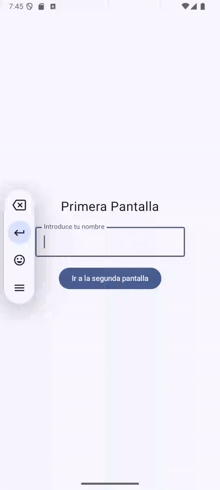

# 🚀 Implementación básica de Navegación en Jetpack Compose

En este laboratorio vamos a implementar la navegación entre pantallas en nuestra aplicación usando Jetpack Compose. 🏗️ Comenzaremos creando la primera pantalla de la app y aprenderemos a transferir información de una pantalla a otra.
  


  
En la siguiente imagen pueden ver un ejemplo del funcionamiento de la aplicación:

<div align="center">
    
</div>

Para ello vamos a crear un nuevo proyecto con una actividad vacía (Empty Activity). Llamaremos a este proyecto "Ejemplo de Navegación".

# 📋 Tabla de Contenidos 
- [🚀 Implementación básica de Navegación en Jetpack Compose](#-implementación-básica-de-navegación-en-jetpack-compose)
- [📋 Tabla de Contenidos](#-tabla-de-contenidos)
- [📱 Configuración de la Segunda Pantalla](#-configuración-de-la-segunda-pantalla)
- [🧭 Navegación en Jetpack Compose](#-navegación-en-jetpack-compose)
  - [¿Qué es un NavController?](#qué-es-un-navcontroller)
  - [Cómo funciona el NavController](#cómo-funciona-el-navcontroller)
- [📱 Pasar Datos Entre Pantallas](#-pasar-datos-entre-pantallas)
- [📦 Problema que tiene esta estrategia de navegación.](#-problema-que-tiene-esta-estrategia-de-navegación)

### 🌟 Primera Pantalla: Entrada del Usuario

El objetivo inicial es crear una pantalla donde el usuario pueda introducir su nombre, y al pulsar un botón, se navegue hacia una nueva pantalla con esa información. 

La primera pantalla la crearemos en el fichero `FirstScreen.kt` 

```kotlin
@Composable
fun FirstScreen(paddingValues: PaddingValues) {
    var name by remember { mutableStateOf("") }

    Column(
        modifier = Modifier
            .fillMaxSize()
            .padding(16.dp),
        verticalArrangement = Arrangement.Center,
        horizontalAlignment = Alignment.CenterHorizontally
    ) {
        Text(text = "Primera Pantalla", fontSize = 24.sp)
        Spacer(modifier = Modifier.height(16.dp))
        OutlinedTextField(
            value = name,
            onValueChange = { name = it },
            label = { Text("Introduce tu nombre") }
        )
        Spacer(modifier = Modifier.height(16.dp))
        Button(onClick = {
            // Aquí es donde deberíamos implementar la navegación a la segunda pantalla.
        }) {
            Text("Ir a la segunda pantalla")
        }
    }
}

// Por si quieres hacer una preview del composable
@Preview(showBackground = true)
@Composable
fun PreviewFirstScreen() {
    FirstScreen(paddingValues = PaddingValues(0.dp))
}
```

Desde el `MainActivity`, llamaremos a este composable para que se muestre en la pantalla principal de la aplicación. De la siguiente manera:

```kotlin
class MainActivity : ComponentActivity() {
    override fun onCreate(savedInstanceState: Bundle?) {
        super.onCreate(savedInstanceState)
        enableEdgeToEdge()
        setContent {
            EjNavegacionTheme {
                Scaffold(modifier = Modifier.fillMaxSize()) { innerPadding ->
                    FirstScreen(innerPadding)
                }
            }
        }
    }
}
```

> **NOTA:** Recuerda que tendrás que importar los elementos necesarios para que el código funcione correctamente. 

### 📋 Explicación de los elementos utilizados

- **OutlinedTextField**: Este campo permite al usuario introducir su nombre. Utilizamos una variable `name` para almacenar el valor introducido.
- **Button**: Al hacer clic en el botón, se navega hacia la segunda pantalla, pasando el valor del nombre como parte de la ruta.
- **remember { mutableStateOf("") }**: Se usa para almacenar y recordar el estado del nombre introducido por el usuario. Es una forma de manejar el estado en Jetpack Compose.
- **Column**: Organiza los elementos de forma vertical, centrándolos tanto horizontal como verticalmente.
- **Spacer**: Añade espacio entre los elementos para mejorar la presentación visual.

# 📱 Configuración de la Segunda Pantalla

Ahora, vamos a crear un archivo nuevo llamado `SecondScreen.kt` para la segunda pantalla. Para ello, podemos aprovechar gran parte del código de la primera pantalla copiándolo y adaptándolo. A continuación, te muestro cómo se puede ver el código de la segunda pantalla:

```kotlin
// SecondScreen.kt
@Composable
fun SecondScreen(paddingValues: PaddingValues) {
    Column(
        modifier = Modifier
            .fillMaxSize()
            .padding(16.dp),
        verticalArrangement = Arrangement.Center,
        horizontalAlignment = Alignment.CenterHorizontally
    ) {
        Text(text = "Segunda Pantalla", fontSize = 24.sp)
        Text(
            text = "Bienvenido",
            fontSize = 24.sp
        )
        Spacer(modifier = Modifier.height(16.dp))
        Button(onClick = {
            // Aquí es donde deberíamos implementar la navegación a la primera pantalla.
        }) {
            Text("Ir a la primera pantalla")
        }
    }
}

@Preview
@Composable
fun SecondScreenPreview() {
    SecondScreen(paddingValues = PaddingValues(0.dp))
}
```

Hemos realizado los siguientes cambios con respecto a la primera pantalla:
- Cambiado el nombre del composable a `SecondScreen`.
- Eliminado el campo `OutlinedTextField` que había en la primera pantalla y lo hemos sustituido por un mensaje de bienvenida.
- Ajustado el tamaño de fuente del texto a `24.sp` para hacerlo más grande.
- Modificado el botón para que su acción sea navegar de vuelta a la primera pantalla.

# 🧭 Navegación en Jetpack Compose

En este apartado configuraremos la navegación dentro de nuestra aplicación utilizando Jetpack Compose. Vamos a seguir una guía que nos muestra cómo hacerlo paso a paso. La navegación es esencial para moverse entre las diferentes pantallas de la app.

## ¿Qué es un NavController?

El `NavController` es una clase clave dentro de Jetpack Compose que facilita la navegación entre diferentes pantallas o composables en una aplicación móvil. Actúa como un controlador que gestiona la pila de navegación, permitiendo a los desarrolladores definir, controlar y ejecutar transiciones de una pantalla a otra de manera fluida. Es esencial para mantener la navegación organizada, especialmente en aplicaciones con múltiples pantallas.

## Cómo funciona el NavController

En Jetpack Compose, el `NavController` permite definir rutas o destinos para cada pantalla de la aplicación, que se conocen como `@Composable`. Este controlador sigue un enfoque basado en rutas, en donde cada pantalla se asocia a una ruta o *destino*. La navegación se lleva a cabo utilizando dichas rutas, ya sea para mover al usuario de una pantalla a otra o para regresar a una pantalla previa.

`NavController` trabaja junto con el componente `NavHost`, que define todas las rutas y destinos posibles. `NavHost` es el encargado de asociar un `NavController` a una serie de pantallas (destinos) específicas.

### ¿Qué es el BackStack?

El **BackStack** (pila de retroceso) es una estructura que mantiene un registro de las pantallas o destinos por los que el usuario ha navegado en la aplicación. Cada vez que el `NavController` realiza una transición a una nueva pantalla, la pantalla actual se guarda en el *BackStack*, lo que permite al usuario regresar a pantallas anteriores utilizando la navegación hacia atrás (como el botón de retroceso del sistema).

El `NavController` maneja automáticamente el BackStack, lo cual permite que la experiencia de usuario sea fluida y coherente. Esto significa que cada vez que el usuario presiona el botón de retroceso, el `NavController` desempila la última pantalla visitada y la muestra nuevamente, replicando la experiencia de navegación común en aplicaciones móviles.


¿Cómo se implementa la navegación en Jetpack Compose? A continuación, te muestro un esquema de los pasos que más adelante implementaremos.

1. **Agregar dependencias necesarias**

Asegúrate de tener las siguientes dependencias a `androidx.navigation:navigation-compose` para poder usar su funcionalidad en tu proyecto:

Más adelante hablaremos de las versiones y como agregarlas a tu proyecto.

2. **Crear el NavHost y NavController**

Primero, debemos crear un `NavHost` que asocie el `NavController` con las pantallas de la aplicación. 

Esa asociación se suele hacer en una función `@Composable` que actúa como la raíz de la aplicación. Aquí es donde se definen las rutas y destinos de la navegación.

3. **Definir las pantallas y las rutas**

Más adelante se definen dos composables que representan las pantallas, en nuestro caso serán `FirstScreen` y `SecondScreen`.

¿Todo listo para empezar con la implementación?
Vamos paso por paso.

### 1. Agregar dependencias 🛠️

Primero, debemos agregar las dependencias necesarias para la navegación en nuestro archivo `build.gradle` del módulo de la aplicación. 

Usaremos la siguiente dependencia, a la fecha de creación de este manual la versión es **2.8.4**, pero siempre elige la más actualizada sin llegar a ser una versión alpha:

```kotlin
androidx.navigation:navigation-compose:2.8.4
```

Después de agregar la dependencia, sincroniza el proyecto para que se reconozcan las nuevas funcionalidades.

Puedes obtener más información si visitas la [documentación oficial de Jetpack Compose Navigation](https://developer.android.com/develop/ui/compose/navigation#kts).

### 2. Configurar el NavController 🛡️

Una vez agregadas las dependencias, es necesario crear un `NavController`. El `NavController` es el componente encargado de manejar el estado y el *backstack* de las pantallas en nuestra app.

Para ello vamos a crear una nueva función `@Composable` llamada `MyApp` que contendrá el `NavHost` y las rutas de navegación, la colocamos en el archivo `MyActivity.kt`:

```kotlin
@Composable
fun MyApp() {
    val navController = rememberNavController()
    NavHost(
        navController = navController,
        // OJO! este no es el nombre del composable, es el nombre de la ruta. Lo entenderás más abajo.
        startDestination = "firstscreen"
    ) {
        composable("firstscreen") { 
            // Este es el nombre de la ruta que usamos como inicio.
            // Aquí se coloca la llamada al composable de la primera pantalla.
        
        }
        composable("secondscreen") {
            // Aquí se coloca la llamada al composable de la segunda pantalla.
        }
    }
}
```

### 3. Definir las pantallas 🗃️

Las pantallas se definen como funciones `@Composable`. A cada pantalla se le asocia una ruta dentro del `NavHost` para poder ser identificada y usada durante la navegación.

- **Pantalla Inicial (FirstScreen)**:
  
  La función `FirstScreen` recibe un parámetro `onNavigateToSecondScreen` que es una función lambda que se ejecuta cuando queremos navegar a la segunda pantalla.


    ```kotlin
    @Composable
    fun FirstScreen(onNavigateToSecondScreen: () -> Unit) {
        // Hay más código eliminado, solo marcamos la parte importante.
        Button(onClick = onNavigateToSecondScreen) {
            Text("Ir a la segunda pantalla")
        }
    }
    ```

- **Segunda Pantalla (SecondScreen)**:
  En este caso, la función `SecondScreen` recibe un parámetro `onNavigateToFirstScreen` que es una función lambda que se ejecuta cuando queremos navegar a la primera pantalla.

    ```kotlin
    @Composable
    fun SecondScreen(onNavigateToFirstScreen: () -> Unit) {
        // Hay más código eliminado, solo marcamos la parte importante.
        Button(onClick = onNavigateToFirstScreen) {
            Text("Volver a la primera pantalla")
        }
    }
    ```

### 4. Configurar el Navegador (NavHost) 🚪

El `NavHost` es el componente principal que se utiliza para definir la navegación entre las pantallas. Se le pasa un `NavController` y se define cuál es la pantalla inicial (`startDestination`). Además, se establecen los diferentes `composables` que representan cada pantalla.

- El **NavHost**:

    ```kotlin
    @Composable
    fun MyApp() {
        val navController = rememberNavController()
        NavHost(
            navController = navController,
            startDestination = "firstscreen"
        ) {
            composable("firstscreen") { 
                FirstScreen(
                    onNavigateToSecondScreen = {
                        navController.navigate("secondscreen") 
                    }
                )
            }
            composable("secondscreen") {
                SecondScreen(
                    onNavigateToFirstScreen = {
                        navController.navigate("firstscreen")
                    }
                )
            }
        }
    }
    ```

### 5. Adaptar `MainActivity` 🛋️

Ahora desde MainActivity debemos llamar a la función `MyApp` para que se muestre en la pantalla principal de la aplicación. Y para no tener problemas con el `innerPadding`, vamos a "encapsularlos" en un `Box`:

```kotlin
class MainActivity : ComponentActivity() {
    override fun onCreate(savedInstanceState: Bundle?) {
        super.onCreate(savedInstanceState)
        enableEdgeToEdge()
        setContent {
            EjNavegacionTheme {
                Scaffold(modifier = Modifier.fillMaxSize()) { innerPadding ->
                    Box(modifier = Modifier.padding(innerPadding)) {
                        MyApp() // Llamas a MyApp que gestiona el NavHost
                    }
                }
            }
        }
    }
}
```

### 6. Ejecutar la navegación y probarla 🔥

Si todo está correcto, se ejecutará tu aplicación y podrás navegar entre una pantalla a otra. Pero si te fijas no se pasaría el nombre de la persona de una pantalla a otra, eso lo veremos en el siguiente apartado.

### Reto 1: Añade una tercera pantalla

¿Serías capaz de crear una tercera pantalla?
De tal manera que el ciclo entre pantallas sea: 

`FirstScreen` -> `SecondScreen` -> `ThirdScreen` -> `FirstScreen`.

Puedes copiar la tercera pantalla de la segunda o la primera, pero cambia un poco la tercera pantalla para que se pueda leer que estás en la tercera pantalla.

¡Ánimo! 🚀

# 📱 Pasar Datos Entre Pantallas 

Las partes que tenemos que cambiar para poder pasar información de una pantalla a otra son las siguientes:

1. La pantalla que recibe la información debe tener un parámetro en su función `@Composable` que reciba la información. En nuestro caso será un `String` con el nombre.
2. Desde la pantalla que envía la información, debemos pasarla como parámetro al navegar a la siguiente pantalla. En nuestro caso, desde `FirstScreen` debemos pasar el nuevo parámetro.
3. Pero esto no es suficiente, también debemos modificar el `NavHost` para que pueda recibir el parámetro y pasarlo a la pantalla correspondiente.

Vamos a verlo paso a paso con el ejemplo de las pantallas. Yo lo tengo hecho con tres pantallas.

### 🚀 Paso a Paso para la Navegación entre Pantallas

Vamos a aprender cómo pasar datos de una pantalla a otra utilizando Kotlin y Jetpack Compose. El objetivo es pasar un nombre desde la primera pantalla hacia la segunda pantalla y luego mostrarlo.

#### 1. 📍 Definir el Parámetro en la Segunda Pantalla

En nuestra segunda pantalla, especificamos que cuando sea llamada, deberá recibir un parámetro llamado `name` de tipo `String`, además de la función lambda `onNavigateToThridScreen` (si has hecho el ejercicio o `onNavigateToFirstScreen` si no lo has hecho) que se ejecutará al navegar a la siguiente pantalla.

Además, en la segunda pantalla no vamos a decir simplemente "Bienvenido", sino que vamos a mostrar el nombre que se ha pasado como parámetro.

```kotlin
@Composable
fun SecondScreen(name: String, onNavigateToThirdScreen: () -> Unit) {
    Column(
        modifier = Modifier
            .fillMaxSize()
            .padding(16.dp),
        verticalArrangement = Arrangement.Center,
        horizontalAlignment = Alignment.CenterHorizontally
    ) {
        Text(text = "Segunda Pantalla", fontSize = 24.sp)
        Text(
            text = "Bienvenido $name",
            fontSize = 24.sp
        )
        Spacer(modifier = Modifier.height(16.dp))
        Button(onClick = onNavigateToThirdScreen) {
            Text("Ir a la tercera pantalla")
        }
    }
}

@Preview
@Composable
fun SecondScreenPreview() {
    SecondScreen(name= "Bartolo", {})
}
```

En la vista previa de la segunda pantalla, podemos pasar un valor ejemplo.


#### 2. 🖱 Navegar desde la Primera Pantalla

Para navegar a la segunda pantalla y pasar el nombre, necesitamos pasar la variable correspondiente al hacer clic en un botón, esa información la tenemos en una variable `name` con el valor ingresado por el usuario:

```kotlin
var name by remember { mutableStateOf("") }
```

En la función lambda que tenemos que pasar a FirstScreen debemos pasar el nombre que es de tipo `String`. Por lo tanto la cabecera de la función se nos queda así:
    
```kotlin
@Composable
fun FirstScreen(onNavigateToSecondScreen: (String) -> Unit) {
    ...
}
```

Y posteriormente, cuando pulsen el botón y se ejecute el evento `onClick`, pasamos el valor de la variable `name`:

```kotlin
        Button(onClick = {
            onNavigateToSecondScreen( name )
        })
```

De esta manera, estamos pasando el valor del nombre a la segunda pantalla.

#### 3. 🛠 Configurar el NavHost para la Navegación

Esta quizá sea la parte más complicada de entender, en la función `MyApp` debemos modificar las llamadas para reflejar el paso de parámetros entre pantallas.

En la actividad principal, configuramos el `NavHost` para manejar la navegación entre nuestras pantallas.

Hay que tocar en dos partes:

1. En la definición de `FirstScreen`, en el evento `onNavigateToSecondScreen` debemos pasar el nombre. Y además eso se lo debemos definir al `NavController` para que lo pueda pasar a la segunda pantalla.

De tal manera que el código se nos quedaría de la siguiente manera:

```kotlin
        composable("firstscreen") {
            FirstScreen(
                onNavigateToSecondScreen = { name ->
                    navController.navigate("secondscreen/$name")
                }
            )
        }
```

1. En la definición de `SecondScreen`, la función debe aceptar un `String` en la definición de la ruta. Y además, la función `SecondScreen` acepta un `String`, por lo tanto debemos definirlo.

    ```kotlin
    // OJO!! este código tiene un error.
        composable("secondscreen/{name}") {
            SecondScreen(name)(
                onNavigateToThirdScreen = {
                    navController.navigate("thirdscreen")
                }
            )
        }
    ```

Si te fijas, no se sabe bien que es `name`, sabemos que es lo que tenemos que pasarle a la función, pero ¿De donde lo sacamos?

- Debemos obtenerlo de los argumentos que recibe la ruta, y eso lo hacemos con el siguiente código:

    ```kotlin
    val name = it.arguments?.getString("name") ?: "sin nombre"
    ```

Este código en Kotlin realiza lo siguiente:

1. **`it.arguments?.getString("name")`**: Intenta obtener el valor del argumento `"name"` de un objeto `it` (en este caso `it` es un `NavBackStackEntry`, donde podemos mirar los parámetros, pero no vamos a entrar en ello, simplmente vamos a aprender a obtenerlos.).
   - **`arguments`**: Es un `Bundle` que contiene los argumentos, y vamos a preguntar por el que nos interesan, en este caso `"name"`.
   - **`?.`**: Utiliza el operador seguro para evitar excepciones si `arguments` es `null`. Si `arguments` es `null`, toda la expresión se vuelve `null`.

2. **`?: "sin nombre"`**: Si el valor obtenido es `null` (es decir, si no existe un argumento `"name"` o `arguments` es `null`), se usa el operador Elvis (`?:`) para asignar un valor predeterminado: `"sin nombre"`.

En resumen, `name` contendrá el valor del argumento `"name"` si está presente, y en caso contrario contendrá el valor `"sin nombre"`.

La definición del completa del `NavHost` se nos quedaría de la siguiente manera:

```kotlin
@Composable
fun MyApp() {
    val navController = rememberNavController()
    NavHost(
        navController = navController,
        startDestination = "firstscreen"
    ) {
        composable("firstscreen") {
            FirstScreen(
                onNavigateToSecondScreen = { name ->
                    navController.navigate("secondscreen/$name")
                }
            )
        }
        composable("secondscreen/{name}") {
            val name = it.arguments?.getString("name") ?: "sin nombre"
            SecondScreen(name,
                onNavigateToThirdScreen = {
                    navController.navigate("thirdscreen")
                }
            )
        }

    // Aquí el código de una tercera pantalla si la tuvieras

    }
}
```

Ir a la última sección. Problema que tiene esta estrategia de navegación.

#### 🔄 Resumen del Flujo

1. **Primera Pantalla**: Capturamos el nombre del usuario y navegamos a la segunda pantalla pasando ese nombre como parámetro.
2. **Segunda Pantalla**: Recibimos el nombre y lo mostramos en un mensaje de bienvenida.
3. **NavHost**: Configuramos las rutas de navegación, especificando que la segunda pantalla debe recibir un parámetro `name`.

Te recomiendo que revises tu código y asientes estos conceptos, ya que los vamos a utilizar siempre que queramos pasar información entre pantallas.

#### Prueba tu código.

Si lo has hecho bien, podrás pasar de la primera pantalla a la segunda pantalla y ver el nombre que has introducido en la primera pantalla. 😊

### Reto 2: Pasa tu edad a la tercera pantalla

El flujo entre pantallas que habíamos definido era:

`FirstScreen` -> `SecondScreen` -> `ThirdScreen` -> `FirstScreen`.

Y de momento los datos que pasamos son el nombre, entre `FirstScreen` a `SecondScreen`.

Pues bien, ahora queremos que en la `SecondScreen` se pregunte por la edad y se envíe, junto con el nombre, a `ThirdScreen`.

¿Serías capaz de hacerlo? 🚀

<details>
  <summary>Necesitas ayuda con el código.</summary>
<br>

#### MainActivity.kt

Omito los imports para no hacerlo tan largo.

```kotlin
class MainActivity : ComponentActivity() {
    override fun onCreate(savedInstanceState: Bundle?) {
        super.onCreate(savedInstanceState)
        enableEdgeToEdge()
        setContent {
            EjNavegacionTheme {
                Scaffold(modifier = Modifier.fillMaxSize()) { innerPadding ->
                    Box(modifier = Modifier.padding(innerPadding)) {
                        MyApp() // Llamas a MyApp que gestiona el NavHost
                    }
                }
            }
        }
    }
}


@Composable
fun MyApp() {
    val navController = rememberNavController()
    NavHost(
        navController = navController,
        startDestination = "firstscreen"
    ) {
        composable("firstscreen") {
            FirstScreen(
                onNavigateToSecondScreen = { name ->
                    navController.navigate("secondscreen/$name")
                }
            )
        }
        composable("secondscreen/{name}") {
            val receivedName  = it.arguments?.getString("name") ?: "sin nombre"
            SecondScreen(receivedName,
                onNavigateToThirdScreen = { nameToPass, age ->
                    navController.navigate("thirdscreen/$nameToPass/$age")
                }
            )
        }

        composable("thirdscreen/{name}/{age}") {
            val name = it.arguments?.getString("name") ?: "sin nombre"
            val age = it.arguments?.getString("age") ?: "0"
            ThirdScreen(name, age,
                onNavigateToFirstScreen = {
                    navController.navigate("firstscreen")
                }
            )
        }

    }
}
```

#### FirstScreen.kt

```kotlin
@Composable
fun FirstScreen(onNavigateToSecondScreen: (String) -> Unit) {
    var name by remember { mutableStateOf("") }

    Column(
        modifier = Modifier
            .fillMaxSize()
            .padding(16.dp),
        verticalArrangement = Arrangement.Center,
        horizontalAlignment = Alignment.CenterHorizontally
    ) {
        Text(text = "Primera Pantalla", fontSize = 24.sp)
        Spacer(modifier = Modifier.height(16.dp))
        OutlinedTextField(
            value = name,
            onValueChange = { name = it },
            label = { Text("Introduce tu nombre") }
        )
        Spacer(modifier = Modifier.height(16.dp))
        Button(onClick = {
            onNavigateToSecondScreen( name )
        }) {
            Text("Ir a la segunda pantalla")
        }
    }
}

@Preview(showBackground = true)
@Composable
fun PreviewFirstScreen() {
    FirstScreen {}
}
```

#### SecondScreen.kt

```kotlin
@Composable
fun SecondScreen(name: String, onNavigateToThirdScreen: (String, String) -> Unit) {
    var age by remember { mutableStateOf("") }

    Column(
        modifier = Modifier
            .fillMaxSize()
            .padding(16.dp),
        verticalArrangement = Arrangement.Center,
        horizontalAlignment = Alignment.CenterHorizontally
    ) {
        Text(text = "Segunda Pantalla", fontSize = 24.sp)
        Text(
            text = "Bienvenido $name",
            fontSize = 24.sp
        )
        Spacer(modifier = Modifier.height(16.dp))
        OutlinedTextField(
            value = age,
            onValueChange = { age = it },
            label = { Text("Introduce tu edad") }
        )
        Spacer(modifier = Modifier.height(16.dp))
        Button(onClick = {
            onNavigateToThirdScreen (name, age)
        }) {
            Text("Ir a la tercera pantalla")
        }
    }
}

@Preview(showBackground = true)
@Composable
fun SecondScreenPreview() {
    SecondScreen(name= "Bartolo", onNavigateToThirdScreen = { name, age -> })
}
```

#### ThirdScreen.kt

```kotlin
@Composable
fun ThirdScreen(name: String, age: String, onNavigateToFirstScreen: () -> Unit) {
    Column(
        modifier = Modifier
            .fillMaxSize()
            .padding(16.dp),
        verticalArrangement = Arrangement.Center,
        horizontalAlignment = Alignment.CenterHorizontally
    ) {
        Text(text = "Bienvenido a la tercera pantalla", fontSize = 24.sp)
        Text(
            text = "$name con edad $age",
            fontSize = 24.sp
        )
        Spacer(modifier = Modifier.height(16.dp))
        Button(onClick = onNavigateToFirstScreen) {
            Text("Ir a la primera pantalla")
        }
    }
}

@Preview(showBackground = true)
@Composable
fun ThirdScreenPreview() {
    ThirdScreen("Bartolo", "34") {}
}
```

</details>
<br>


# 📦 Problema que tiene esta estrategia de navegación.

Si te fijas en el código donde implementamos la navegación, hay un problema.

```kotlin
@Composable
fun MyApp() {
    val navController = rememberNavController()
    NavHost(
        navController = navController,
        startDestination = "firstscreen"
    ) {
        composable("firstscreen") {
            FirstScreen(
                onNavigateToSecondScreen = { name ->
                    navController.navigate("secondscreen/$name")
                }
            )
        }
        composable("secondscreen/{name}") {
            val name = it.arguments?.getString("name") ?: "sin nombre"
            SecondScreen(name,
                onNavigateToThirdScreen = {
                    navController.navigate("thirdscreen")
                }
            )
        }

    // Aquí el código de una tercera pantalla si la tuvieras

    }
}
```
¿Adivinas cual es el problema?

Con esta estrategia de navegación solo podemos enviar y recibir tipos primitivos, básicamente `String`, `Int`, `Boolean`, etc. Pero no podemos enviar objetos más complejos, como por ejemplo un objeto `Persona` que tenga nombre, edad, dirección, etc.

¿Se puede resolver?

Si, lo veremos en el siguiente manual. 🚀


### ¿Te has atascado? 🆘

Si ves que la cosa se complica o simplemente te has hecho un lío, ¡no te preocupes! 😅 En breve subiremos la solución!

¡Úsala con sabiduría! 🧠✨
