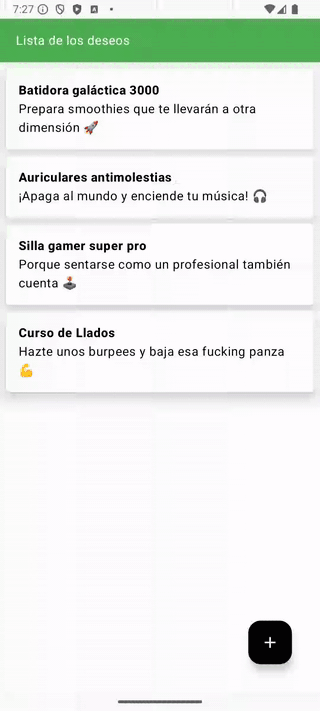
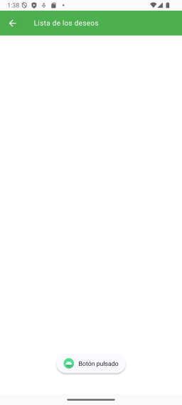
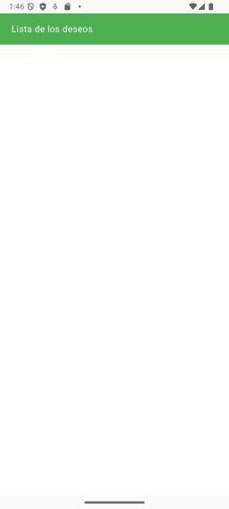
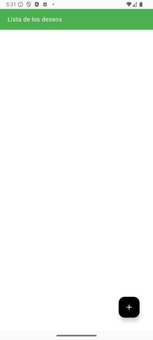
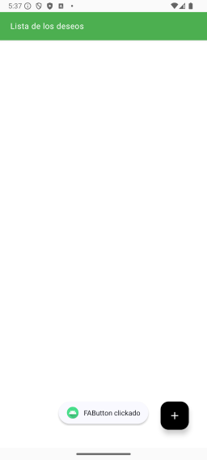
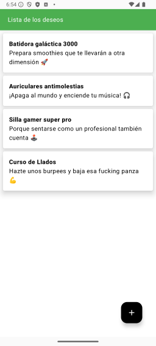
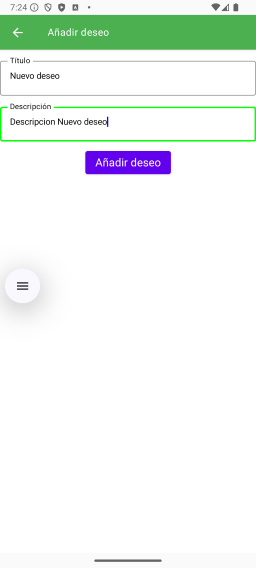

# 🚀 Aplicación de lista de deseos básica con Scaffold y Floating Action Button

En este laboratorio aprenderemos sobre el **Scaffold**, un componente composable que nos permite configurar:

- La apariencia de la barra superior (**Top Bar**).
- El uso del botón de acción flotante (**Floating Action Button**).
- Posiblemente una barra inferior (**Bottom Bar**).

Además, esta aplicación nos servirá para explorar el uso de **Room** database. 

También usaremos conceptos de otros laboratorios como por ejemplo **Navigation**.

La aplicación que vamos a desarrollar tendrá el siguiente aspecto:

<div align="center">
    
</div>

Date cuenta que lo que haremos en este laboratorio no será la versión final de la práctica, si no que va a ser una versión muy básica para que puedas entender los conceptos de Scaffold y FAB. En futuros laboratorios iremos añadiendo más funcionalidades para almacenar los deseos en una base de datos y poder navegar entre las distintas pantallas.

# 📚 Tabla de Contenidos
- [🚀 Aplicación de lista de deseos básica con Scaffold y Floating Action Button](#-aplicación-de-lista-de-deseos-básica-con-scaffold-y-floating-action-button)
- [📚 Tabla de Contenidos](#-tabla-de-contenidos)
- [Navegación con Icono Personalizado 🔎](#navegación-con-icono-personalizado-)

## Diseño de la Barra Superior con Scaffold ⚙️

En esta sección configuraremos la estructura básica de nuestra aplicación utilizando un `Scaffold`. El objetivo es diseñar una barra superior (`Top App Bar`) que permita la navegación.

### Configuración Inicial del Scaffold

El `Scaffold` es un composable que proporciona una estructura para las vistas. Permite incluir componentes como:

- Barra superior (`Top App Bar`).
- Contenido principal.
- Botón de acción flotante (`Floating Action Button`).

Vamos a crear varios ficheros con distintas vistas dentro de él:

1. **MainActiviy.kt**: [Este nos viene creado] Para la actividad principal y que llamará a HomeView.
2. **HomeView.kt**: Para las vistas principales y contendrá un scaffold. Es la vista principal de la aplicación.
3. **AppBar.kt**: Para la barra superior y que llamaremos desde homeView. Es la barra superior de la aplicación.

## Creación del **AppBar.kt**

Crearemos un fichero llamado **AppBar.kt** y agregaremos el siguiente código:

```kotlin

@Composable
fun AppBarView(
    title: String,
    onBackNavClicked: () -> Unit= {}
){  TopAppBar(
        title = {
            Text(text = title,
                color = colorResource(id = R.color.white),
                modifier = Modifier
                    .padding(start = 4.dp)
                    .heightIn(max = 24.dp))
        },
        elevation = 3.dp,
        backgroundColor = colorResource(id = R.color.app_bar_color)
    )
}

```

### Explicación del código:
### Declaración de la función `AppBarView`
- **`@Composable`**  
  - Anotación que indica que esta función es un composable, es decir, se utiliza para crear componentes de interfaz de usuario en Jetpack Compose.
  
- **`fun AppBarView(title: String, onBackNavClicked: () -> Unit = {})`**  
  - **`title: String`**: Parámetro obligatorio que define el texto del título en la barra superior.  
  - **`onBackNavClicked: () -> Unit = {}`**: Parámetro opcional que acepta una función lambda. Representa la acción al hacer clic en el botón de navegación hacia atrás. Por defecto, no hace nada.


### Cuerpo de la función
- **`TopAppBar`**  
  - Componente predefinido de Jetpack Compose que crea una barra superior.

#### **Propiedades de `TopAppBar`**
1. **`title`**  
   - Configura el contenido del título dentro de la barra superior:
     - **`Text(text = title)`**: Muestra el texto definido por el parámetro `title`.
     - **`color = colorResource(id = R.color.white)`**: Define el color del texto como blanco, utilizando un recurso de color.
     - **`modifier = Modifier.padding(start = 4.dp).heightIn(max = 24.dp)`**:  
       - **`padding(start = 4.dp)`**: Aplica un espacio de 4 dp al inicio del texto.  
       - **`heightIn(max = 24.dp)`**: Restringe la altura máxima del texto a 24 dp.

2. **`elevation = 3.dp`**  
   - Define la elevación de la barra superior para añadir una sombra sutil.

3. **`backgroundColor = colorResource(id = R.color.app_bar_color)`**  
   - Configura el color de fondo de la barra superior utilizando un recurso de color.
   - Atención!! este color debe estar definido como un recurso nuevo en el fichero `colors.xml` que se encuentra en la carpeta `res/values`. Debes añadir la siguiente línea:

    ```xml
    <color name="app_bar_color">#4CAF50</color>
    ```
    Yo he elegido ese color para mi App, pero puedes usar el que quieras.
    Puedes buscar en Google por ["color picker"](https://www.google.com/search?q=color+picker&oq=color+picker) para elegir el color que más te guste y obtener el valor en HEX.


## Creación del **HomeView.kt**

Crearemos un fichero llamado **HomeView.kt** y agregaremos el siguiente código:

```kotlin
@Composable
fun HomeView() {
    Scaffold(
        topBar = {
            AppBarView(title = "Lista de los deseos")
        },
        modifier = Modifier
            .fillMaxSize()
            .padding(WindowInsets.systemBars.asPaddingValues()) // Agregar espacio para evitar superposición
    ) {
        LazyColumn(
            modifier = Modifier
                .fillMaxSize()
                .padding(it)
        ) {
            // Contenido de la lista
        }
    }
}
```

### Explicación del código:
### Declaración de la función `HomeView`
- **`@Composable`**  
  - Indica que esta función es un composable, utilizado para definir interfaces de usuario en Jetpack Compose.

- **`fun HomeView()`**  
  - Declara una función composable sin parámetros que representa la vista principal de una pantalla.

---

### Uso de `Scaffold`
- **`Scaffold`**  
  - Componente contenedor que proporciona una estructura básica para pantallas, como barras superiores, contenido principal y elementos flotantes.

#### **Propiedades de `Scaffold`**
1. **`topBar = { AppBarView(title = "Lista de los deseos") }`**  
   - Define el contenido de la barra superior:  
     - Llama a la función `AppBarView` y establece el título como `"Lista de los deseos"`.

2. **`modifier = Modifier.fillMaxSize().padding(WindowInsets.systemBars.asPaddingValues())`**  
   - **`fillMaxSize()`**: Hace que el contenedor ocupe todo el tamaño disponible.  
   - **`padding(WindowInsets.systemBars.asPaddingValues())`**: Añade un margen para evitar que el contenido se superponga con las barras del sistema (barra de estado, barra de navegación, hora, notificaciones, etc.).

3. **`content = { LazyColumn(...) }` (Bloque del cuerpo)**  
   - Define el contenido principal de la pantalla.


### Uso de `LazyColumn`
- **`LazyColumn`**  
  - Componente que muestra una lista desplazable y eficiente. Solo renderiza los elementos visibles en pantalla.

#### **Propiedades de `LazyColumn`**
1. **`modifier = Modifier.fillMaxSize().padding(it)`**  
   - **`fillMaxSize()`**: La lista ocupa todo el tamaño disponible.  
   - **`padding(it)`**: Aplica un padding dinámico que toma en cuenta los valores proporcionados por `Scaffold` (espacios reservados, como barras de sistema o top bar).

2. **`{ // Contenido de la lista }`**  
   - Aquí se agregarán los elementos que formarán parte de la lista.


## Modificación del **MainActivity.kt**

Ya no necesitamos crear un Scaffold en el MainActivity, ya que hemos creado un Scaffold en HomeView. Por lo tanto, eliminaremos el Scaffold del MainActivity y llamaremos a HomeView.

```kotlin
class MainActivity : ComponentActivity() {
    override fun onCreate(savedInstanceState: Bundle?) {
        super.onCreate(savedInstanceState)
        enableEdgeToEdge()
        setContent {
            ListaDeDeseosTheme {
                HomeView()
            }
        }
    }
}
```

Puedes ejecutar el código, deberías ver algo como esto:

<div align="center">
    
</div>

# Navegación con Icono Personalizado 🔎

En este apartado vamos a configurar un **icono de navegación** para nuestra `TopAppBar`. Si nos fijamos el `TopAppBar` permite pasarle un `NavigationIcon` Este icono nos permitirá interactuar con la navegación en nuestra aplicación, como regresar a una pantalla anterior.

Para ello vamos a modifiar el Código de la función **AppBarView** añadiendo una variable  navigationIcon que contendrá el icono de navegación.


```kotlin

@Composable
fun AppBarView(
    title: String,
    onBackNavClicked: () -> Unit= {}
){
    // Creamos una variable con el Icono de Navegación
    val navigationIcon : (@Composable () -> Unit)? =
        {
            IconButton(onClick = { onBackNavClicked() }) {
                Icon(
                    imageVector = Icons.AutoMirrored.Filled.ArrowBack,
                    tint = Color.White,
                    contentDescription = null
                )
            }
        }
    TopAppBar(
        title = { 
        Text(text = title, 
            color = colorResource(id = R.color.white),
            modifier = Modifier
                .padding(start = 4.dp)
                .heightIn(max = 24.dp))
    },
        elevation = 3.dp,
        backgroundColor = colorResource(id = R.color.app_bar_color),
        //Aquí pasamos el icono de navegación que hemos creado arriba.
        navigationIcon = navigationIcon
    )
}
    
```


### Explicación del código:

### Declaración de la variable `navigationIcon`
- **`val navigationIcon: (@Composable () -> Unit)?`**  
  - Declara una variable de tipo función composable que puede ser **nula**.  
  - En este caso, se le asigna una función composable que genera un botón de ícono de navegación.


### Lógica del Contenido
La variable `navigationIcon` contiene una función composable que crea un botón con un ícono.  

#### **Cuerpo de la función asignada**
1. **`IconButton(onClick = { onBackNavClicked() })`**  
   - Representa un botón interactivo que ejecuta la acción `onBackNavClicked()` cuando es pulsado.  
   - **`onBackNavClicked()`**: Una función pasada como parámetro a la barra superior que se utiliza, por ejemplo, para manejar eventos de navegación hacia atrás.

2. **`Icon(...)`**  
   - Dibuja un ícono dentro del `IconButton`:
     - **`imageVector = Icons.AutoMirrored.Filled.ArrowBack`**  
       - Usa un ícono predefinido de Jetpack Compose: una flecha hacia atrás.  
       - **`AutoMirrored`**: Ajusta automáticamente la orientación del ícono para configuraciones de idioma de derecha a izquierda (RTL). En España y occidente la flecha hacia atrás se muestra a la izquierda, pero en países árabes o hebreos se muestra a la derecha.
     - **`tint = Color.White`**  
       - Aplica un color blanco al ícono.  
     - **`contentDescription = null`**  
       - Indica que no se proporciona una descripción para lectores de pantalla. Para accesibilidad, sería ideal agregar una descripción como `"Navegar hacia atrás"`.


### Llamar desde HomeView a AppBarView pasando la función de navegación

Vamos a modificar el HomeView para que llame a AppBarView pasándole la función de navegación.

```kotlin
@Composable
fun HomeView() {
    val context = LocalContext.current
    Scaffold(
        topBar = {
            AppBarView(title = "Lista de los deseos") {
                Toast.makeText(context, "Botón pulsado", Toast.LENGTH_LONG).show()
            }
        },
        modifier = Modifier
            .fillMaxSize()
            .padding(WindowInsets.systemBars.asPaddingValues()) // Agregar espacio para evitar superposición
    ) {
        LazyColumn(
            modifier = Modifier
                .fillMaxSize()
                .padding(it)
        ) {
            // Contenido de la lista
        }
    }
}
```
### Explicación del código:
### Asignación a `topBar`
- **`topBar = { ... }`**  
  - Define el contenido de la barra superior en un componente como `Scaffold`.
  - Aquí se usa la función composable `AppBarView` para personalizar esta barra.

---

### Llamada a `AppBarView`
- **`AppBarView(title = "Lista de los deseos") { ... }`**  
  - Llama a la función `AppBarView`, que configura una barra superior con:
    - **`title = "Lista de los deseos"`**  
      - El texto que se mostrará como título de la barra superior. En este caso, `"Lista de los deseos"`.

#### **Lambda del parámetro `onBackNavClicked`**
- El segundo parámetro de `AppBarView`, **`onBackNavClicked`**, es una función lambda que define la acción a ejecutar al pulsar el botón de navegación (si está presente).

---

### Acción en la Lambda
- **`Toast.makeText(context, "Botón pulsado", Toast.LENGTH_LONG).show()`**  
  - Muestra un **Toast** (mensaje emergente) cuando se pulsa el botón de navegación:
    1. **`context`**  
       - El contexto actual de la aplicación (generalmente requerido para crear un Toast).
    2. **`"Botón pulsado"`**  
       - El texto del mensaje que se mostrará al usuario.
    3. **`Toast.LENGTH_LONG`**  
       - La duración del Toast (puede ser `LENGTH_LONG` o `LENGTH_SHORT`).
    4. **`.show()`**  
       - Método que activa el Toast y lo muestra en pantalla.


Si todo ha ido bien, al ejecutar la aplicación y pulsar el botón de navegación, deberías ver un mensaje emergente que indica que el botón ha sido pulsado. Como en la siguiente foto:

<div align="center">
    
</div>


## 🛠️ Funcionalidad del Botón Atrás

En este paso, implementaremos la funcionalidad para que el icono del botón atrás sea visible solo cuando sea necesario. No tiene sentido poder pinchar en el botón atrás si estamos en la pantalla principal de la aplicación. ¿Verdad?

### 🎯 Lógica del Botón Atrás

Queremos que el botón atrás solo se muestre si el título de la vista actual **no contiene** la palabra "wishlist". Si estamos en la vista principal ("wishlist"), no queremos que el botón atrás aparezca. Para lograrlo, utilizamos la función `contains` y una lógica booleana invertida.

A continuación se muestra cómo implementar esta lógica en la función `AppBarView`, añadiendo un if.

```kotlin
@Composable
fun AppBarView(
    title: String,
    onBackNavClicked: () -> Unit= {}
){
    val navigationIcon : (@Composable () -> Unit)? =
        if(!title.contains("Lista de los deseos")){
            {
                IconButton(onClick = { onBackNavClicked() }) {
                    Icon(
                        imageVector = Icons.AutoMirrored.Filled.ArrowBack,
                        tint = Color.White,
                        contentDescription = null
                    )
                }
            }
        }else{
            null
        }
        // Resto del código
}
```

OJO!! Estamos buscando por la cadena "Lista de los deseos", ya que es el título que hemos puesto en la vista principal. Si has puesto otro título, deberás cambiar la cadena.

### 📝 Explicación del Código

1. **`title.contains("Lista de los deseos")`:** Verifica si el título contiene la palabra "wishlist".
2. **`!` (exclamación):** Invierte el resultado booleano de la función `contains`. Esto significa que el botón atrás solo se mostrará cuando el título **no** contenga "wishlist".
3. **Bloque `IconButton`:** Se ejecuta cuando la condición anterior es verdadera, es decir, cuando no estamos en la vista principal.
4. **Bloque `else`:** Devuelve `null` para no renderizar el botón atrás si estamos en la vista principal.

### 🖼️ Resultado Visual

- **En la vista principal ("wishlist"):** El botón atrás no se muestra.
- **En otras vistas:** El botón atrás aparece y permite al usuario regresar a la pantalla anterior.

La aplicación tendrá el siguiente aspecto:
<div align="center">
    
</div>

Puede parecer que nos hemos quedado igual, pero si cambias el título de la vista principal a "Lista de los deseos" verás que no aparece el botón de navegación, pero ya aparecerá cuando estemos en otra pantalla.


## 🔧 Implementación del FAB

En este apartado vamos a implementar el **floating action button** o **FAB** en nuestra aplicación. Este botón aparecerá en la parte inferior de la pantalla y permitirá a los usuarios añadir nuevos elementos a la lista de deseos.

1. **Localización del FAB en el código**:
   - Dentro del componente `Scaffold` que tenemos definido en  `HomeView.kt`, que gestiona la estructura de la pantalla. Podemos definir otro componente que sera`floatingActionButton` y viene despues del `topBar`.

2. **Definición del FAB**:
   - Usaremos el composable predeterminado `FloatingActionButton`.


### Ejemplo de Código

```kotlin
@Composable
fun HomeView() {
    val context = LocalContext.current
    Scaffold(
        topBar = {
            AppBarView(title = "Lista de los deseos") {
                Toast.makeText(context, "Botón pulsado", Toast.LENGTH_LONG).show()
            }
        },
        modifier = Modifier
            .fillMaxSize()
            .padding(WindowInsets.systemBars.asPaddingValues()), // Agregar espacio para evitar superposición
        floatingActionButton = {
            FloatingActionButton(
                modifier = Modifier.padding(all = 20.dp),
                contentColor = Color.White,
                containerColor = Color.Black,
                onClick = {
                    // TODO Implementar ir a la pantalla para añadir elementos
                }) {
                Icon(imageVector = Icons.Default.Add, contentDescription = null)
            }
        }
    ){
        // Resto del código
    }
```


### 📝 Explicación del Código
### 🛠 Declaración del `floatingActionButton`
- **`floatingActionButton = { ... }`**  
  - Define el contenido del botón flotante (Floating Action Button, FAB) que aparecerá en la pantalla.  
  - El FAB es un elemento común en aplicaciones Android para acciones principales.

---

### Detalles del Componente `FloatingActionButton`
- **`FloatingActionButton(...) { ... }`**  
  - Es un composable predefinido en Jetpack Compose para crear un botón flotante con diseño Material.

#### **Propiedades de `FloatingActionButton`**
1. **`modifier = Modifier.padding(all = 20.dp)`**  
   - Aplica un espacio de **20 dp** alrededor del botón flotante para separarlo de los bordes.

2. **`contentColor = Color.White`**  
   - Especifica el color del contenido dentro del FAB (por ejemplo, íconos o texto).

3. **`containerColor = Color.Black`**  
   - Define el color de fondo del botón flotante (en este caso, negro).

4. **`onClick = { ... }`**  
   - Define la acción que se ejecutará al pulsar el FAB:
     - En el código actual, no hacemos nada, lo dejamos para más adelante.


Con el FAB, la aplicación tendrá el siguiente aspecto:
<div align="center">
    
</div>

Nos daremos cuenta que si pulsamos el botón del FAB no se produce ninguna acción, de momento vamos a mostrar una tostada. En el envento `onClick` del FAB pondremos el siguiente código:


```kotlin
onClick = {
    Toast.makeText(context, "FAButton clickado", Toast.LENGTH_LONG).show()
    // TODO Implementar ir a la pantalla para añadir elementos
}
```

Ahora si pulsamos el FAB, veremos los siguiente:
<div align="center">
    
</div>

## Creación de los `WishItems` y un `Wish` 🎉

### 1. Definición de una `Data Class Wish`

Lo primero que haremos es crear una clase de datos (`data class`) que represente la estructura de un "Wish" (deseo). Esto nos permitirá definir las propiedades que cada "wish" debe tener. Además, esta clase será clave para la futura persistencia de datos en la base de datos.

Te propongo que crees un nuevo paquete llamado `data` y dentro de él un fichero `Data Class` llamado `Wish` con el siguiente código. Te propongo hacer esto para tener todo más organizado y porque en un futuro vamos a necesitar más clases para la gestión de los datos y así tenerlo todo en un mismo sitio.

#### Código Kotlin:

```kotlin
data class Wish(
    val id: Long = 0L,
    val title: String = "",
    val description: String = ""
)
```

**Propiedades de `Wish`:**
- `id`: Un identificador único de tipo `Long` con un valor predeterminado de `0`. `0L` significa que es un 0 en Long.
- `title`: Título del "wish", de tipo `String`.
- `description`: Descripción del "wish", también de tipo `String`.


### 2. Creación de una función @Composabel `WishItem` 🎨

Vamos a crear una función `@Composable` que será una vista de un deseo, que representa cómo se verá cada objeto `Wish` en la interfaz de usuario. Para esto, utilizaremos un `@Composable`.
Te propongo que este nuevo componente lo crees dentro del fichero `HomeView.kt` para tener todo el código relacionado con la vista principal en un mismo sitio.


```kotlin
@Composable
fun WishItem(wish: Wish, onClick: () -> Unit) {
    Card(
        modifier = Modifier
            .fillMaxWidth()
            .padding(top = 8.dp, start = 8.dp, end = 8.dp)
            .clickable { onClick() },
        elevation = 10.dp,
        backgroundColor = Color.White
    ) {
        Column(modifier = Modifier.padding(16.dp)) {
            Text(
                text = wish.title,
                fontWeight = FontWeight.ExtraBold
            )
            Text(text = wish.description)
        }
    }
}
```
**Parámetros**
- `wish`: Un objeto de tipo `Wish` que contiene la información del deseo.
- `onClick`: Una función lambda que se ejecutará al hacer clic en el `WishItem`.

**Elementos del Código:**
- **`Card`**: Un contenedor visual con estilo, que permite agregar elevación y color de fondo. Y que vamos a utilizar para guardar la información de cada deseo. Es una versión más avanzada y visual que un `Box`. Y que nos permitirá hacer swipe, por ejemplo.
  - `modifier`: Define el tamaño y espaciado del card.
  - `clickable`: Habilita eventos de clic, ejecutando la función `onClick` pasada como parámetro.
  - `elevation`: Agrega profundidad visual.
  - `backgroundColor`: Define el color de fondo, en este caso, blanco.
- **`Column`**: Organiza los elementos internos verticalmente.
  - `padding`: Agrega espacio interno entre el contenido y los bordes.
- **`Text`**: Muestra el título **extra bold** eso es especialmente negrita
- **`Text`**: Otro para la descripción del deseo.

---

### 3. Comportamiento del Evento `onClick` 🔍

El evento `onClick` permite realizar una acción cuando se selecciona un "wish item". Esto podría ser navegar a una pantalla de detalles o edición. Aunque la implementación exacta de la navegación se abordará más adelante, el componente ya incluye este comportamiento.

#### Código Kotlin:

```kotlin
Card(
    modifier = Modifier.clickable { onClick() }
)
```

**Nota:** La función `onClick` es pasada como parámetro al composable `WishItem`, permitiendo que sea completamente reutilizable.


### 4. Vista Preliminar del "Wish Item"

Para verificar el funcionamiento del componente, podemos usar datos ficticios en una vista previa.


```kotlin
@Preview(showBackground = true)
@Composable
fun WishItemPreview() {
    val sampleWish = Wish(
        id = 1L,
        title = "Aprobar esta asignatura 🎓",
        description = "¡Por favor, Kotlin, haz tu magia! 🚀"
    )
    WishItem(wish = sampleWish, onClick = { /* Acción simulada */ })
}
```


### 5. Añadiendo Datos Dummy sobre `Wish`

Vamos a crear unos datos dummy para probar nuestro `WishItem`. Para ello, vamos a crear un objeto con una lista de `Wish` en el fichero `Wish.kt`. Te propongo el siguiente código pero puedes poner los deseos que quieras.

```kotlin	
object DummyWish {
    val wishList = listOf(
        Wish(
            title = "Batidora galáctica 3000",
            description = "Prepara smoothies que te llevarán a otra dimensión 🚀"
        ),
        Wish(
            title = "Auriculares antimolestias",
            description = "¡Apaga al mundo y enciende tu música! 🎧"
        ),
        Wish(
            title = "Silla gamer super pro",
            description = "Porque sentarse como un profesional también cuenta 🕹️"
        ),
        Wish(
            title = "Curso de Llados",
            description = "Hazte unos burpees y baja esa fucking panza 💪"
        )
    )
}
```

Ahora queremos que cada uno de estos elementos se muestre en la `LazyColumn` que tiene la función `HomeView`.


En la función `HomeView` vamos a añadir en el `LazyColumn` que contendrá todos los `WishItem` que hemos creado. 

```kotlin
LazyColumn(
    modifier = Modifier
        .fillMaxSize()
        .padding(it)
) {
    // Contenido de la lista
    items(DummyWish.wishList){
        wish -> WishItem(wish = wish){

    }
    }
}
```

OJO!! recuerda que tienes que importar el objeto `import androidx.compose.foundation.lazy.items` para que funcione.

Si ejecutas la aplicación deberías ver algo como esto:
<div align="center">
    
</div>


## Diseño e implementación de la Navegación 🌐

### Clase `Screen` para Gestionar las Pantallas

Primero, necesitamos crear una clase para manejar las diferentes pantallas de nuestra aplicación. Esta clase se encargará de contener las rutas de cada pantalla. Como siempre la llamaremos `Screen` y la crearemos en un nuevo fichero llamado `Screen.kt`.

```kotlin
sealed class Screen(val route: String) {
    object HomeScreen : Screen("home_screen")
    object AddScreen : Screen("add_screen")
}
```

- **`sealed class`**: Asegura que nadie más pueda heredar de esta clase.
- **`HomeScreen` y `AddScreen`**: Representan las rutas para la pantalla principal y la pantalla de agregar/editar respectivamente. En realidad la pantalla `AddScreen` servirá para editar además de añadir.

### Creación del ViewModel

El `ViewModel` sirve como intermediario entre la interfaz de usuario y los datos. Creamos un archivo para esto llamado `WishViewModel.kt` y añadimos el siguiente código:

```kotlin
class WishViewModel : ViewModel() {
    // Se ampliará más adelante.
}
```

Por ahora, el ViewModel solo hereda de la clase `ViewModel` y está vacío, lo hiremos rellenando.

### Configuración del Navegador

A continuación, configuramos la navegación con un archivo llamado `Navigation`. Este archivo contendrá el NavHost y el NavController:

```kotlin
@Composable
fun Navigation(
    viewModel: WishViewModel = viewModel(),
    navController: NavHostController = rememberNavController(),
) {
    NavHost(
        navController = navController,
        startDestination = Screen.HomeScreen.route
    ) {
        composable(Screen.HomeScreen.route) {
            HomeView()
        }
    }
}
```
OJO!! Para poder usar `viewModel()` debes importar `import androidx.lifecycle.viewmodel.compose.viewModel` 

**Parámetros**
- `viewModel`: Un objeto de tipo `WishViewModel` que se utiliza para gestionar los datos.
- `navController`: Un objeto de tipo `NavHostController` que se encarga de la navegación entre pantallas.

**Elementos del Código**
1. **`NavHost`**: Define las rutas disponibles en la aplicación.
2. **`startDestination`**: Especifica la pantalla inicial.
3. **`composable`**: Asocia una ruta a un composable. De momento solo tenemos una vista, la `HomeView`.


### Actualización del MainActivity

Finalmente, modificamos el `MainActivity` para utilizar la navegación creada. Sustituimos la función que llamamos `HomeView()` por la función `Navigation()`.

Ejecutamos la aplicación para verificar que la navegación funcione correctamente. Aunque la funcionalidad está en una fase inicial, la aplicación debería cargar la pantalla principal definida.

## 📱 Vista de Edición y Creación de un `Wish`

Vamos a crear la pantalla utilizada para crear y editar elementos. Es la misma pantalla, pero dependiendo de si entramos a añadir o a modificar un `Wish` mostrará un texto distinto: "Añadir deseo" o "Actualizar deseo".

La vista tendrá el siguiente aspecto:
<div align="center">
    
</div>

## ✨ Creación de la Vista de Edición/Añadir un `Wish`

1. **Creación del archivo Kotlin**:
   - Vamos a crear un fichero llamado `AddEditDetailView.kt`.
   - Este archivo contiene una función composable llamada `AddEditDetailView`.

```kotlin
@Composable
fun AddEditDetailView(
    id: Long,
    viewModel: WishViewModel,
    navController: NavController
) {
    Scaffold(
        topBar = {
            AppBarView(
                title = if (id != 0L) {
                    // Meter aquí un texto es algo muy feo y sucio, lo mejor es ponerlo en un recurso de strings, lo explicamos más abajo.
                    stringResource(id = R.string.update_wish)
                } else {
                    stringResource(id = R.string.add_wish)
                }
            )
        },
        modifier = Modifier
            .fillMaxSize()
            .padding(WindowInsets.systemBars.asPaddingValues()),        
        content = {
            Column(
                modifier = Modifier
                    .padding(it)
                    .wrapContentSize(),
                horizontalAlignment = Alignment.CenterHorizontally,
                verticalArrangement = Arrangement.Center
            ) {
                Spacer(modifier = Modifier.height(10.dp))
                // Elementos adicionales se añadirán más adelante
            }
        }
    )
}
```

2. **Parámetros de la función**:
   - `id`: Determina si la pantalla se usa para crear o editar.
   - `viewModel`: Proporciona los datos y las acciones de la vista.
   - `navController`: Permite la navegación entre pantallas.

---

## 🛠️ Configuración del AppBar

Se reutiliza el `AppBar` ya existente para mostrar un título y un botón de retroceso:

- El título varía según el contexto:
  - "Actualizar deseo" (`update wish`) si se está editando.
  - "Añadir deseo" (`add wish`) si se está creando.

- Los textos se gestionan mediante recursos de strings. Y eso nos lo podemos encontrar en el fichero `res/values/strings.xml`. Es muy útil hacer esto si tenemos una app en varios idiomas. 

```xml
<!-- res/values/strings.xml -->
<string name="update_wish">Actualizar deseo</string>
<string name="add_wish">Añadir deseo</string>
```

## ✍️ Creando una vista para editar/añadir un deseo

Vamos a crear una función `@Composable` nueva que nos permita implementar la parte de la captura de texto del título y la descripción del `Wish`. Para ello vamos a crear una nueva función llamada `WishTextField` dentro del fichero `AddEditDetailView.kt`.


```kotlin
@Composable
fun WishTextField(
    label: String,
    value: String,
    onValueChange: (String) -> Unit
) {
    OutlinedTextField(
        value = value,
        onValueChange = onValueChange,
        label = {
            Text(text = label, color = Color.Black)
        },
        modifier = Modifier.fillMaxWidth(),
        keyboardOptions = KeyboardOptions(keyboardType = KeyboardType.Text),
        //Aquí puedes definir los colores del campo de texto a tu gusto
        colors = TextFieldDefaults.outlinedTextFieldColors(
            textColor = Color.Black, // Color del texto
            cursorColor = Color.Blue, // Color del cursor
            focusedBorderColor = Color.Green, // Color del borde con foco
            unfocusedBorderColor = Color.Gray, // Color del borde sin foco
            focusedLabelColor = Color.Green, // Color del label cuando está enfocado
            unfocusedLabelColor = Color.Gray // Color del label cuando no está enfocado
        )
    )
}
```

OJO!! Es posible que tengas problemas com `Material3` te recomiendo que para esta vista uses `Material` añadiendo en las importaciones las siguientes líneas, con el comentario incluido
    
```kotlin
//noinspection UsingMaterialAndMaterial3Libraries
import androidx.compose.material.*
```

**Parámetros:**
- **Label**: El texto que describe el campo.
- **Value**: El contenido del campo de texto.
- **onValueChange**: Un listener para manejar los cambios del valor.


---

## 🔧 Personalización del Campo de Texto

En Jetpack Compose, puedes personalizar muchos aspectos del campo de texto, como:

- **KeyboardOptions**: Define el tipo de teclado que se muestra al interactuar con el campo. Por ejemplo:

```kotlin
keyboardOptions = KeyboardOptions(keyboardType = KeyboardType.Text)
```

  Algunos valores comunes de `KeyboardType` incluyen:
  - `KeyboardType.Text`
  - `KeyboardType.Email`
  - `KeyboardType.Number`
Esto nos permite abrir un teclado distinto según las necesidades. 

- **Colores**: Utilizamos `TextFieldDefaults.outlinedTextFieldColors` para especificar:
  - El color del texto.
  - El color del borde cuando el campo está enfocado o no enfocado.
  - El color del cursor.

---

## 🌈 Vista Previa

Para visualizar nuestro campo de texto, creamos una función de previsualización:

```kotlin
@Preview(showBackground = true)
@Composable
fun WishTextFieldPreview() {
    WishTextField(
        label = "Un texto",
        value = "Otro texto",
        onValueChange = {}
    )
}
```

Esta función nos permite ver cómo se verá el componente en la interfaz.


## 🚀 Problemas y Soluciones

- **Error con Material3**: Si obtienes errores al usar `OutlinedTextField`, verifica que estés importando la versión correcta:

  ```kotlin
  import androidx.compose.material.OutlinedTextField
  import androidx.compose.material.TextFieldDefaults
  ```

- Si usas Material3 y encuentras problemas, intenta cambiar a la versión de Material clásica.

## 📱 Preparar ViewModel para la Vista de Detalles

En este apartado vamos a preparar el **ViewModel** para que podamos utilizarlo en nuestra pantalla de detalles.

Lo completaremos en los siguientes laboratorios cuando usemos la base de datos para almacenar los deseos.

### ✍️ Configuración inicial del ViewModel

El **ViewModel** necesitará manejar un repositorio de deseos (*wish repository*), el cual será responsable de almacenar, cargar, editar y gestionar los datos. Por ahora, configuraremos estados básicos. 


```kotlin
class WishViewModel : ViewModel() {

    var wishTitleState by mutableStateOf("")

    var wishDescriptionState by mutableStateOf("")

    fun onWishTitleChanged(newString: String) {
        wishTitleState = newString
    }

    fun onWishDescriptionChanged(newString: String) {
        wishDescriptionState = newString
    }
}
```

### Explicación:
1. **`wishTitleState` y `wishDescriptionState`**:
   - Son variables de estado mutables para manejar los títulos y descripciones de los deseos.
2. **Funciones `onWishTitleChanged` y `onWishDescriptionChanged`**:
   - Estas funciones actualizan los estados respectivos cuando se realizan cambios en la interfaz.

---

## 🖋️ Uso del ViewModel en la Vista de Detalles

Vamos a utilizar este **ViewModel** dentro de nuestra pantalla de detalles para gestionar los campos de texto dinámicamente.

### Código:

```kotlin
@Composable
@Composable
fun AddEditDetailView(
    id: Long,
    viewModel: WishViewModel,
    navController: NavController
)
    // Todo el código anterior
        Spacer(modifier = Modifier.height(10.dp))

        WishTextField(
            label = "Título",
            value = viewModel.wishTitleState,
            onValueChange = { 
                viewModel.onWishTitleChanged(it) 
                }
        )

        Spacer(modifier = Modifier.height(10.dp))

        WishTextField(
            label = "Descripción",
            value = viewModel.wishDescriptionState,
            onValueChange = { 
                viewModel.onWishDescriptionChanged(it) 
                }
        )

        Spacer(modifier = Modifier.height(10.dp))

        Button(
            onClick = {
                if (viewModel.wishTitleState.isNotEmpty() &&
                 viewModel.wishDescriptionState.isNotEmpty()) {
                    // TODO: Actualizar el deseo o Añadir el deseo

                } else {
                    // TODO: Avisar de error, ya que hay que poner valores al deseo.
                }
            }
        ) {
            Text(
                text = if (id != 0L) stringResource(id = R.string.update_wish) else stringResource(id = R.string.add_wish),
                style = TextStyle(
                    fontSize = 18.sp // Cambiado de dp a sp
                )
            )
        }
    
}
```

### Explicación:
1. **`WishTextField`**:
   - Campo de entrada personalizado para el título y la descripción.
   - Actualiza dinámicamente el estado del ViewModel al cambiar su valor.
2. **`Button`**:
   - Comprueba si los campos de entrada no están vacíos antes de permitir la acción de agregar o actualizar el deseo.
   - Aún falta implementar las funciones para interactuar con la base de datos (se realizará en futuros pasos).

## 📌 Registro de Pantallas en la Navegación

Debemos actulizar la `fun Navigation(...)` para que además de tener la pantalla principal, tenga la pantalla de detalles.

Registramos un nuevo composable (`AddEditDetailView`) en nuestra navegación:

```kotlin
composable(Screen.AddScreen.route){
    AddEditDetailView(
        id = 0L,
        viewModel = viewModel,
        navController = navController
    )
}
```


## 🏠 Modificaciones en `fun HomeView`

Lo primero que necesitamos es modificar la función `HomeView` para que reciba como parámetros el `NavController` y el `ViewModel`. 

```kotlin

@Composable
fun HomeView(
    navController: NavController,
    viewModel: WishViewModel
) {
// Resto del código
}

```


Segundo cuando nos pulsen el FAB, queremos que nos lleve a la pantalla de detalles. Para ello, modificamos el `onClick` del `FloatingActionButton` para que navegue a la pantalla de detalles. En el evento `onClick` del FAB, añadimos la siguiente línea:

```kotlin
onClick = {
    navController.navigate(Screen.AddScreen.route)
}
```

En este caso:
- El botón usa `navController.navigate` para moverse a la ruta de la nueva pantalla.
- Y le decimos con la clase sellada `Screen` nuestro destino.

OJO!! esto no sería lo correcto, lo ideal es lo que vimos en el laboratorio anterior, que sería pasarle una función lambda que se encargue de la navegación. Pero para simplificarlo lo hemos hecho así.

¿Te atreves a cambiarlo en tu código?

## Modificar en la navegación la llamada a `HomeView`

En el fichero `Navigation.kt` vamos a modificar la llamada a `HomeView` para que envíe dos parámetros que acabamos de requerir el `NavController` y el `ViewModel`.

El composable de navegación quedaría así:

```kotlin
        composable(Screen.HomeScreen.route) {
            HomeView(navController, viewModel)
        }
```


¿Dónde obtenemos el `navController` y el `viewModel`? - Si te fijas se lo podemos pasar a la función `Navigation` como parámetros y si no los recibe, los crea con `rememberNavController()` y `viewModel()` respectivamente.

Si te fijas desde el `MainActivity` llamamos a `Navigation` y no le pasamos nada. Podríamos hacer para crear el `NavController` y el `ViewModel` en el `MainActivity` y pasárselos a `Navigation` como parámetros. 


## 🚦 Prueba de Navegación

Una vez que todo esté configurado, verifica si la navegación funciona correctamente:

1. Ejecuta la aplicación.
2. En la pantalla principal, haz clic en el botón flotante.
3. Deberías ser redirigido a la pantalla de agregar detalles.
4. Comprueba que el botón de ir hacia atrás no funciona, ni tampoco el botón "Añadir deseo" lo corregiremos en el el siguiente punto.

## ✨ Implementación del Botón de Retroceso ✨

En este apartado vamos a implementar la funcionalidad del botón de retroceso (“back button”) para nuestra aplicación.

Para gestionar la navegación, utilizaremos el `NavController`, el cual nos permite implementar acciones de navegación dentro de las vistas.

### Diseño del Botón de Retroceso

Si te acuerdas, en el fichero `AppBar.kt` en la función `AppBarView` tenemos definido lo que hacer cuando se pulsa el botón de retroceso con una función lambda.

```kotlin
IconButton(onClick = { onBackNavClicked() }) {
    Icon(
        imageVector = Icons.AutoMirrored.Filled.ArrowBack,
        tint = Color.White,
        contentDescription = null
    )
}
```
Ahora tenemos que ver donde llamamos a `AppBarView` y pasarle la función lambda que se encargará de la navegación hacia atrás. Vemos que lo podemos usar en dos sitios: en `HomeView` y en `AddEditDetailView`.

En la HomeView, no tiene sentido, no se puede retroceder más, y de hecho no se pinta el botón de retroceso. 

Pero en la vista de detalles, si que tiene sentido, ya que si estamos editando un `Wish` y pulsamos el botón de retroceso, deberíamos volver a la pantalla principal. 

Dentro de la vista `AddEditDetailView`, tenemos el siguiente código:

```kotlin
@Composable
fun AddEditDetailView(
    id: Long,
    viewModel: WishViewModel,
    navController: NavController
) {
    Scaffold(
        topBar = {
            AppBarView(
                title = if (id != 0L) {
                    // Meter aquí un texto es algo muy feo y sucio, lo mejor es ponerlo en un recurso de strings, lo explicamos más abajo.
                    stringResource(id = R.string.update_wish)
                } else {
                    stringResource(id = R.string.add_wish)
                }
            ) { navController.navigateUp() }
        },

        // Resto del código
```

Aquí es donde llamamos a `AppBarView` y le pasamos el título y la función lambda que se ejecutará cuando se pulse el botón de retroceso.

Si te fijas le pasamos la llamada a `navController.navigateUp()`. Esta función se encarga de navegar hacia atrás en la pila de tareas. Puede que el nombre `.navigateUp()` no sea muy intuitivo, pero recuerda que estamos hablando de un backstack.


## 🎨 Prueba del Botón de Retroceso
Para probar esta funcionalidad:
1. Crea un nuevo elemento en la aplicación.
2. Pulsa el botón de retroceso desde la vista de edición de detalles.

Al pulsar el botón, deberías ser redirigido a la vista principal (“Home View”). Este comportamiento confirma que el botón está funcionando correctamente.

## Finalización

Esta será el final de este laboratorio y nos servirá como "armazón" para el siguiente laboratorio donde implementaremos la base de datos para almacenar los deseos usando `ROOM`.

## Código por si te has perdido.

<details>
  <summary>Pincha para ver el código.</summary>
<br>

### `Wish.kt`

```kotlin
package es.uva.inf5g.psm.listadedeseos.data

data class Wish(
    val id: Long = 0L,
    val title: String = "",
    val description: String = ""
)


object DummyWish {
    val wishList = listOf(
        Wish(
            title = "Batidora galáctica 3000",
            description = "Prepara smoothies que te llevarán a otra dimensión 🚀"
        ),
        Wish(
            title = "Auriculares antimolestias",
            description = "¡Apaga al mundo y enciende tu música! 🎧"
        ),
        Wish(
            title = "Silla gamer super pro",
            description = "Porque sentarse como un profesional también cuenta 🕹️"
        ),
        Wish(
            title = "Curso de Llados",
            description = "Hazte unos burpees y baja esa fucking panza 💪"
        )
    )
}
```

### `AddEditDetailView.kt`

```kotlin
package es.uva.inf5g.psm.listadedeseos

import androidx.compose.foundation.layout.Arrangement
import androidx.compose.foundation.layout.Column
import androidx.compose.foundation.layout.Spacer
import androidx.compose.foundation.layout.WindowInsets
import androidx.compose.foundation.layout.asPaddingValues
import androidx.compose.foundation.layout.fillMaxSize
import androidx.compose.foundation.layout.fillMaxWidth
import androidx.compose.foundation.layout.height
import androidx.compose.foundation.layout.padding
import androidx.compose.foundation.layout.systemBars
import androidx.compose.foundation.layout.wrapContentSize
import androidx.compose.foundation.text.KeyboardOptions
//noinspection UsingMaterialAndMaterial3Libraries
import androidx.compose.material.*
import androidx.compose.runtime.Composable
import androidx.compose.ui.Alignment
import androidx.compose.ui.Modifier
import androidx.compose.ui.graphics.Color
import androidx.compose.ui.res.stringResource
import androidx.compose.ui.text.TextStyle
import androidx.compose.ui.text.input.KeyboardType
import androidx.compose.ui.tooling.preview.Preview
import androidx.compose.ui.unit.dp
import androidx.compose.ui.unit.sp
import androidx.navigation.NavController

@Composable
fun AddEditDetailView(
    id: Long,
    viewModel: WishViewModel,
    navController: NavController
) {
    Scaffold(
        topBar = {
            AppBarView(
                title = if (id != 0L) {
                    stringResource(id = R.string.update_wish)
                } else {
                    stringResource(id = R.string.add_wish)
                }
            ) { navController.navigateUp() }
        },
        modifier = Modifier
            .fillMaxSize()
            .padding(WindowInsets.systemBars.asPaddingValues()),
        content = {
            Column(
                modifier = Modifier
                    .padding(it)
                    .wrapContentSize(),
                horizontalAlignment = Alignment.CenterHorizontally,
                verticalArrangement = Arrangement.Center
            ) {
                Spacer(modifier = Modifier.height(10.dp))

                WishTextField(
                    label = "Título",
                    value = viewModel.wishTitleState,
                    onValueChange = {
                        viewModel.onWishTitleChanged(it)
                    }
                )

                Spacer(modifier = Modifier.height(10.dp))

                WishTextField(
                    label = "Descripción",
                    value = viewModel.wishDescriptionState,
                    onValueChange = {
                        viewModel.onWishDescriptionChanged(it)
                    }
                )

                Spacer(modifier = Modifier.height(10.dp))

                Button(
                    onClick = {
                        if (viewModel.wishTitleState.isNotEmpty() &&
                        viewModel.wishDescriptionState.isNotEmpty()) {
                            // TODO: Actualizar el deseo o Añadir el deseo

                        } else {
                            // TODO: Avisar de error, ya que hay que poner valores al deseo.
                        }
                    }
                ) {
                    Text(
                        text = if (id != 0L) stringResource(id = R.string.update_wish) else stringResource(
                            id = R.string.add_wish
                        ),
                        style = TextStyle(
                            fontSize = 18.sp // Cambiado de dp a sp
                        )
                    )
                }
            }
        }
    )
}

@Composable
fun WishTextField(
    label: String,
    value: String,
    onValueChange: (String) -> Unit
) {
    OutlinedTextField(
        value = value,
        onValueChange = onValueChange,
        label = {
            Text(text = label, color = Color.Black)
        },
        modifier = Modifier.fillMaxWidth(),
        keyboardOptions = KeyboardOptions(keyboardType = KeyboardType.Text),
        //Aquí puedes definir los colores del campo de texto a tu gusto
        colors = TextFieldDefaults.outlinedTextFieldColors(
            textColor = Color.Black, // Color del texto
            cursorColor = Color.Blue, // Color del cursor
            focusedBorderColor = Color.Green, // Color del borde con foco
            unfocusedBorderColor = Color.Gray, // Color del borde sin foco
            focusedLabelColor = Color.Green, // Color del label cuando está enfocado
            unfocusedLabelColor = Color.Gray // Color del label cuando no está enfocado
        )
    )
}

@Preview(showBackground = true)
@Composable
fun WishTextFieldPreview() {
    WishTextField(
        label = "Título",
        value = "Escribe aquí el título del deseo",
        onValueChange = {}
    )
}
```

### `AppBar.kt`

```kotlin
package es.uva.inf5g.psm.listadedeseos

import androidx.compose.foundation.layout.heightIn
import androidx.compose.foundation.layout.padding
//noinspection UsingMaterialAndMaterial3Libraries
import androidx.compose.material.Icon
//noinspection UsingMaterialAndMaterial3Libraries
import androidx.compose.material.IconButton
//noinspection UsingMaterialAndMaterial3Libraries
import androidx.compose.material.TopAppBar
import androidx.compose.material.icons.Icons
import androidx.compose.material.icons.automirrored.filled.ArrowBack
import androidx.compose.material3.Text
import androidx.compose.runtime.Composable
import androidx.compose.ui.Modifier
import androidx.compose.ui.graphics.Color
import androidx.compose.ui.res.colorResource
import androidx.compose.ui.unit.dp

@Composable
fun AppBarView(
    title: String,
    onBackNavClicked: () -> Unit= {}
){
    val navigationIcon : (@Composable () -> Unit)? =
        if(!title.contains("Lista de los deseos")){
            {
                IconButton(onClick = { onBackNavClicked() }) {
                    Icon(
                        imageVector = Icons.AutoMirrored.Filled.ArrowBack,
                        tint = Color.White,
                        contentDescription = null
                    )
                }
            }
        }else{
            null
        }

    TopAppBar(
        title = {
            Text(text = title,
                color = colorResource(id = R.color.white),
                modifier = Modifier
                    .padding(start = 4.dp)
                    .heightIn(max = 24.dp))
        },
        elevation = 3.dp,
        backgroundColor = colorResource(id = R.color.app_bar_color),
        //Aquí pasamos el icono de navegación que hemos creado arriba.
        navigationIcon = navigationIcon
    )
}
```

### `HomeView.kt`

```kotlin
package es.uva.inf5g.psm.listadedeseos

import android.widget.Toast
import androidx.compose.foundation.clickable
import androidx.compose.foundation.layout.Column
import androidx.compose.foundation.layout.WindowInsets
import androidx.compose.foundation.layout.asPaddingValues
import androidx.compose.foundation.layout.fillMaxSize
import androidx.compose.foundation.layout.fillMaxWidth
import androidx.compose.foundation.layout.padding
import androidx.compose.foundation.layout.systemBars
import androidx.compose.foundation.lazy.LazyColumn
import androidx.compose.foundation.lazy.items
//noinspection UsingMaterialAndMaterial3Libraries
import androidx.compose.material.Card
//noinspection UsingMaterialAndMaterial3Libraries
import androidx.compose.material.Scaffold
import androidx.compose.material.icons.Icons
import androidx.compose.material.icons.filled.Add
import androidx.compose.material3.FloatingActionButton
import androidx.compose.material3.Icon
import androidx.compose.material3.Text
import androidx.compose.runtime.Composable
import androidx.compose.ui.Modifier
import androidx.compose.ui.graphics.Color
import androidx.compose.ui.platform.LocalContext
import androidx.compose.ui.text.font.FontWeight
import androidx.compose.ui.tooling.preview.Preview
import androidx.compose.ui.unit.dp
import androidx.navigation.NavController
import es.uva.inf5g.psm.listadedeseos.data.DummyWish
import es.uva.inf5g.psm.listadedeseos.data.Wish

@Composable
fun HomeView(
    navController: NavController,
    viewModel: WishViewModel
) {
    val context = LocalContext.current
    Scaffold(
        topBar = {
            AppBarView(title = "Lista de los deseos") {
                Toast.makeText(context, "Botón pulsado", Toast.LENGTH_LONG).show()
            }
        },
        modifier = Modifier
            .fillMaxSize()
            .padding(WindowInsets.systemBars.asPaddingValues()), // Agregar espacio para evitar superposición
        floatingActionButton = {
            FloatingActionButton(
                modifier = Modifier.padding(all = 20.dp),
                contentColor = Color.White,
                containerColor = Color.Black,
                onClick = {
                    navController.navigate(Screen.AddScreen.route)
                }) {
                Icon(imageVector = Icons.Default.Add, contentDescription = null)
            }
        }
    ) {
        LazyColumn(
            modifier = Modifier
                .fillMaxSize()
                .padding(it)
        ) {
            // Contenido de la lista
            items(DummyWish.wishList){
                wish -> WishItem(wish = wish){

            }
            }
        }
    }
}

@Composable
fun WishItem(wish: Wish, onClick: () -> Unit) {
    Card(
        modifier = Modifier
            .fillMaxWidth()
            .padding(top = 8.dp, start = 8.dp, end = 8.dp)
            .clickable { onClick() },
        elevation = 10.dp,
        backgroundColor = Color.White
    ) {
        Column(modifier = Modifier.padding(16.dp)) {
            Text(
                text = wish.title,
                fontWeight = FontWeight.ExtraBold
            )
            Text(text = wish.description)
        }
    }
}

@Preview(showBackground = true)
@Composable
fun WishItemPreview() {
    val sampleWish = Wish(
        id = 1L,
        title = "Aprobar esta asignatura 🎓",
        description = "¡Por favor, Kotlin, haz tu magia! 🚀"
    )
    WishItem(wish = sampleWish, onClick = { /* Acción simulada */ })
}
```

### `MainActivity.kt`

```kotlin
package es.uva.inf5g.psm.listadedeseos

import android.os.Bundle
import androidx.activity.ComponentActivity
import androidx.activity.compose.setContent
import androidx.activity.enableEdgeToEdge
import es.uva.inf5g.psm.listadedeseos.ui.theme.ListaDeDeseosTheme

class MainActivity : ComponentActivity() {
    override fun onCreate(savedInstanceState: Bundle?) {
        super.onCreate(savedInstanceState)
        enableEdgeToEdge()
        setContent {
            ListaDeDeseosTheme {
                Navigation()
            }
        }
    }
}
```

### `Navigation.kt`

```kotlin
package es.uva.inf5g.psm.listadedeseos

import androidx.compose.runtime.Composable
import androidx.navigation.NavHostController
import androidx.navigation.compose.NavHost
import androidx.navigation.compose.composable
import androidx.navigation.compose.rememberNavController
import androidx.lifecycle.viewmodel.compose.viewModel

@Composable
fun Navigation(
    viewModel: WishViewModel = viewModel(),
    navController: NavHostController = rememberNavController(),
) {
    NavHost(
        navController = navController,
        startDestination = Screen.HomeScreen.route
    ) {
        composable(Screen.HomeScreen.route) {
            HomeView(navController, viewModel)
        }
        composable(Screen.AddScreen.route){
            AddEditDetailView(
                id = 0L,
                viewModel = viewModel,
                navController = navController
            )
        }
    }
}
```

### `Screen.kt`

```kotlin
package es.uva.inf5g.psm.listadedeseos

sealed class Screen(val route: String) {
    data object HomeScreen : Screen("home_screen")
    data object AddScreen : Screen("add_screen")
}

```

### `WishViewModel.kt`

```kotlin
package es.uva.inf5g.psm.listadedeseos

import androidx.compose.runtime.getValue
import androidx.compose.runtime.mutableStateOf
import androidx.compose.runtime.setValue
import androidx.lifecycle.ViewModel

class WishViewModel : ViewModel() {

    var wishTitleState by mutableStateOf("")

    var wishDescriptionState by mutableStateOf("")

    fun onWishTitleChanged(newString: String) {
        wishTitleState = newString
    }

    fun onWishDescriptionChanged(newString: String) {
        wishDescriptionState = newString
    }
}
```

</details>
<br>
