# 🥘 Subiendo la Aplicación de Recetas a Firebase

Vamos a partir de la aplicación de recetas del laboratorio anterior y vamos a añadir la lógica necesaria para poder **subir a la nube** nuestras propias recetas personalizadas. ☁️👨‍🍳

> **Nota:** No pasa nada si tu aplicación no trae correctamente las categorías de la API en este punto. La nueva lógica no depende de esos objetos, aunque sí se apoya en la estructura existente (gestión de vistas, `ViewModel`, GUI…).

# 📋 Tabla de Contenidos
- [🥘 Subiendo la Aplicación de Recetas a Firebase](#-subiendo-la-aplicación-de-recetas-a-firebase)
- [📋 Tabla de Contenidos](#-tabla-de-contenidos)
- [🆕 Crear una Receta Personalizada](#-crear-una-receta-personalizada)
  - [Configuración de la Navegación](#configuración-de-la-navegación)
  - [Diseñando la Pantalla de Nueva Receta](#diseñando-la-pantalla-de-nueva-receta)
- [🔥 Configuración de Firebase](#-configuración-de-firebase)
  - [Crear el Proyecto](#crear-el-proyecto)
  - [Conectar la App Android](#conectar-la-app-android)
  - [Configurar Firestore Database](#configurar-firestore-database)
- [☁️ Implementando la Lógica de Firebase](#-implementando-la-lógica-de-firebase)
  - [Repositorio y ViewModel](#repositorio-y-viewmodel)
  - [Conectando la Vista](#conectando-la-vista)
- [📥 Fetch de las Recetas](#-fetch-de-las-recetas)

# 🆕 Crear una Receta Personalizada

Para gestionar la lógica de escritura de una nueva receta necesitaremos una vista nueva donde introducir todos los campos. Una solución elegante es crear una **Bottom Navigation Bar** donde elijamos si ver las recetas de la API o crear nuestra propia receta.

## Configuración de la Navegación

Primero vamos a añadir un menú de navegación en la parte inferior de la pantalla.

### 1. Actualizar `Screen.kt`

Añadimos la nueva ruta:

```kotlin
object NewRecipe : Screen("newRecipe")
```

### 2. Crear `NewRecipeScreen.kt`

Creamos el archivo y ponemos un contenido temporal:

```kotlin
@Composable
fun NewRecipeScreen() {
    Box(
        modifier = Modifier.fillMaxSize(),
        contentAlignment = Alignment.Center
    ) {
        Text("Work in progress")
    }
}
```

### 3. Actualizar `RecipeApp.kt`

Necesitamos crear la barra de navegación y configurar el `Scaffold`.

Definimos la barra de navegación:

```kotlin
@Composable
fun BottomNavBar(navController: NavHostController) {
    NavigationBar {
        NavigationBarItem(
            selected = false,
            onClick = { navController.navigate(Screen.Categories.route) },
            label = { Text("Home") },
            icon = { Icon(Icons.Default.Home, contentDescription = null) }
        )

        NavigationBarItem(
            selected = false,
            onClick = { navController.navigate(Screen.Work.route) },
            label = { Text("Work") },
            icon = { Icon(Icons.Default.Build, contentDescription = null) }
        )
    }
}
```

Ahora realizamos los cambios en la estructura principal de `RecipeApp`:

1.  Englobamos la lógica dentro de un `Scaffold` para inyectar la `BottomNavBar`.
2.  Añadimos el nuevo `composable` al `NavHost`.
3.  Actualizamos la lógica de la barra.

```kotlin
Scaffold(
    bottomBar = { BottomNavBar(navController) }
) { innerPadding -> 
    NavHost(
        // ...
        modifier = Modifier.padding(innerPadding)
    ){...}
}
```

Añadimos la ruta de la nueva pantalla:

```kotlin
composable(route = Screen.NewRecipe.route) {
    NewRecipeScreen()
}
```

Y actualizamos la `BottomNavBar` con las rutas correctas:

```kotlin
@Composable
fun BottomNavBar(navController: NavHostController) {
    NavigationBar {
        NavigationBarItem(
            selected = false,
            onClick = { navController.navigate(Screen.CategoriesGUI.route) },
            label = { Text("Home") },
            icon = { Icon(Icons.Default.Home, contentDescription = null) }
        )

        NavigationBarItem(
            selected = false,
            onClick = { navController.navigate(Screen.NewRecipe.route) },
            label = { Text("WorkInProgress") },
            icon = { Icon(Icons.Default.Build, contentDescription = null) }
        )
    }
}
```

<details>
<summary>👀 Ver resultado final de RecipeApp.kt</summary>
<br>

```kotlin
@Composable
fun RecipeApp(navController: NavHostController) {
    val recipeViewModel: CategoriesVM = viewModel()
    val viewState by recipeViewModel.categoriesState

    Scaffold(
        bottomBar = { BottomNavBar(navController) }
    ) { innerPadding ->
        NavHost(
            navController = navController,
            startDestination = Screen.CategoriesGUI.route,
            modifier = Modifier.padding(innerPadding)
        ) {
            composable(route = Screen.CategoriesGUI.route) {
                CategoriesView(
                    viewState = viewState,
                    navigateToDetail = { category ->
                        navController.currentBackStackEntry
                            ?.savedStateHandle
                            ?.set("cat", category)

                        navController.navigate(Screen.CategoryDetailScreen.route)
                    }
                )
            }

            composable(route = Screen.CategoryDetailScreen.route) {
                val category = navController.previousBackStackEntry
                    ?.savedStateHandle
                    ?.get<Category>("cat") ?: Category("", "", "", "")

                CategoryCategoryDetailScreen(category = category)
            }

            composable(route = Screen.NewRecipe.route) {
                NewRecipeScreen()
            }
        }
    }
}

@Composable
fun BottomNavBar(navController: NavHostController) {
    NavigationBar {
        NavigationBarItem(
            selected = false,
            onClick = { navController.navigate(Screen.CategoriesGUI.route) },
            label = { Text("Home") },
            icon = { Icon(Icons.Default.Home, contentDescription = null) }
        )

        NavigationBarItem(
            selected = false,
            onClick = { navController.navigate(Screen.NewRecipe.route) },
            label = { Text("Nueva receta") },
            icon = { Icon(Icons.Default.Build, contentDescription = null) }
        )
    }
}
```
</details>

Deberías ver algo así, pudiendo navegar entre "Home" y "Nueva receta":

<p align="center">
  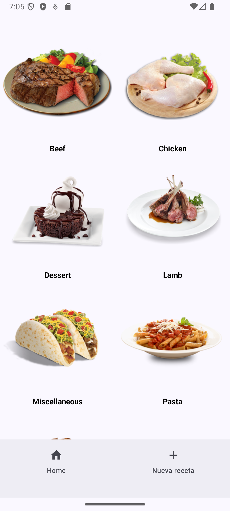
  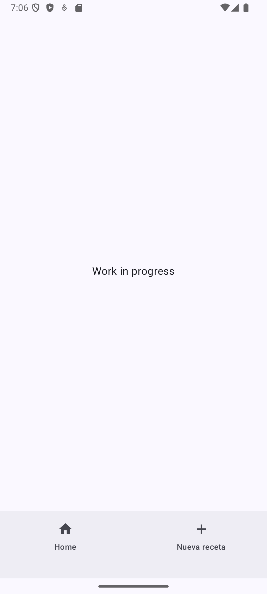
</p>

## Diseñando la Pantalla de Nueva Receta

Vamos a crear una ventana para subir una nueva receta. Ignoraremos la foto por ahora (ya que requiere Cloud Storage) y nos centraremos en:

-   Nombre (`String`)
-   Ingredientes (`List<String>`)
-   Descripción (`String`)
-   Precio (`Double`) - *¡Campo extra!*
-   CreatedOn (`Timestamp`) - *Se añade al subir*

Primero, definimos nuestro modelo de datos:

```kotlin
data class PersonalList(
    val nombre: String = "",
    val ingredientes: List<String> = emptyList(),
    val description: String = "",
    val precio: Double = 0.0
)
```

> **Nota:** El campo `createdOn` no hace falta en el modelo local, lo añadiremos al subir el objeto a Firestore.

Ahora, implementamos la interfaz. Aquí tienes un diseño moderno generado con ayuda de IA:

<p align="center">
  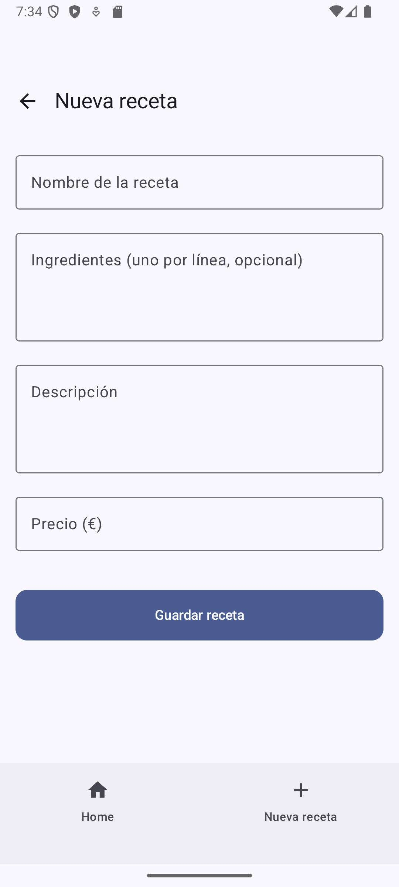
</p>

<details>
<summary>📝 Ver código completo de NewRecipeScreen.kt</summary>
<br>

```kotlin
@OptIn(ExperimentalMaterial3Api::class)
@Composable
fun NewRecipeScreen(
    uploadToFirebase: (PersonalList) -> Unit,
    onBack: (() -> Unit)? = null
) {
    var nombre by remember { mutableStateOf("") }
    var ingredientesText by remember { mutableStateOf("") }
    var descripcion by remember { mutableStateOf("") }
    var precioText by remember { mutableStateOf("") }

    var errorMessage by remember { mutableStateOf<String?>(null) }

    Scaffold(
        topBar = {
            TopAppBar(
                title = { Text("Nueva receta") },
                navigationIcon = {
                    if (onBack != null) {
                        IconButton(onClick = onBack) {
                            Icon(
                                imageVector = Icons.AutoMirrored.Filled.ArrowBack,
                                contentDescription = "Volver"
                            )
                        }
                    }
                }
            )
        }
    ) { paddingValues ->
        Column(
            modifier = Modifier
                .padding(paddingValues)
                .padding(16.dp)
                .fillMaxSize()
                .verticalScroll(rememberScrollState()),
            verticalArrangement = Arrangement.spacedBy(16.dp)
        ) {

            // Nombre
            OutlinedTextField(
                value = nombre,
                onValueChange = { nombre = it },
                label = { Text("Nombre de la receta") },
                singleLine = true,
                modifier = Modifier.fillMaxWidth()
            )

            // Ingredientes (opcional)
            OutlinedTextField(
                value = ingredientesText,
                onValueChange = { ingredientesText = it },
                label = { Text("Ingredientes (uno por línea, opcional)") },
                placeholder = { Text("Ej.:\n200g pasta\nTomate\nQueso rallado") },
                modifier = Modifier
                    .fillMaxWidth()
                    .heightIn(min = 120.dp),
                maxLines = 6
            )

            // Descripción
            OutlinedTextField(
                value = descripcion,
                onValueChange = { descripcion = it },
                label = { Text("Descripción") },
                modifier = Modifier
                    .fillMaxWidth()
                    .heightIn(min = 120.dp),
                maxLines = 6
            )

            // Precio
            OutlinedTextField(
                value = precioText,
                onValueChange = { nuevo ->
                    // Sólo permitimos números y un punto/coma decimal
                    if (nuevo.isEmpty() || nuevo.matches(Regex("""\d*([.,]\d*)?"""))) {
                        precioText = nuevo.replace(',', '.') // normalizamos a punto
                    }
                },
                label = { Text("Precio (€)") },
                singleLine = true,
                keyboardOptions = KeyboardOptions(keyboardType = KeyboardType.Number),
                modifier = Modifier.fillMaxWidth()
            )

            if (errorMessage != null) {
                Text(
                    text = errorMessage!!,
                    color = MaterialTheme.colorScheme.error,
                    style = MaterialTheme.typography.bodyMedium
                )
            }

            Spacer(modifier = Modifier.height(8.dp))

            Button(
                onClick = {
                    // Validación
                    if (nombre.isBlank() || descripcion.isBlank() || precioText.isBlank()) {
                        errorMessage =
                            "Nombre, descripción y precio son obligatorios."
                        return@Button
                    }

                    val precio = precioText.toDoubleOrNull()
                    if (precio == null) {
                        errorMessage = "Introduce un precio numérico válido."
                        return@Button
                    }

                    val ingredientesList = ingredientesText
                        .lines()
                        .map { it.trim() }
                        .filter { it.isNotEmpty() }

                    val nuevaReceta = PersonalList(
                        nombre = nombre.trim(),
                        ingredientes = ingredientesList,
                        description = descripcion.trim(),
                        precio = precio
                    )

                    errorMessage = null
                    uploadToFirebase(nuevaReceta)
                },
                modifier = Modifier
                    .fillMaxWidth()
                    .height(52.dp),
                shape = MaterialTheme.shapes.medium
            ) {
                Text("Guardar receta")
            }
        }
    }
}
```
</details>

# 🔥 Configuración de Firebase

Crear un proyecto en Firebase y conectarlo es un proceso delicado. Un pequeño error en el paquete o en los archivos de configuración puede dar dolores de cabeza. ¡Vamos paso a paso!

### Crear el Proyecto

1.  Ve a [Firebase Console](https://firebase.google.com).
2.  Haz clic en **"Crear un proyecto"** (o "Get started").
3.  Ponle un nombre, por ejemplo: **FireStove**.

<p align="center">
  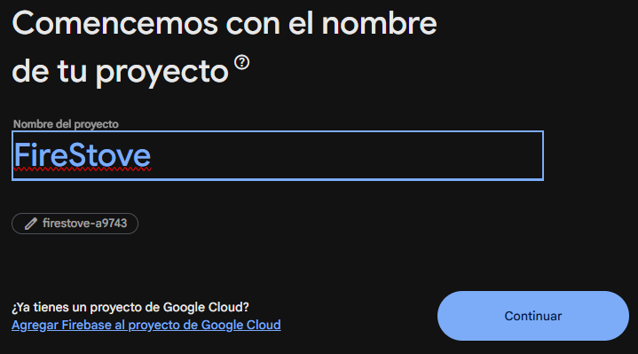
</p>

### Conectar la App Android

Ahora añadiremos la app al proyecto:

1.  Haz clic en el icono de **Android**.

<p align="center">
  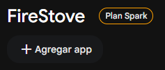
  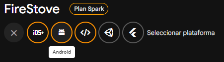
</p>

2.  Introduce el **nombre del paquete** de tu app.

<p align="center">
  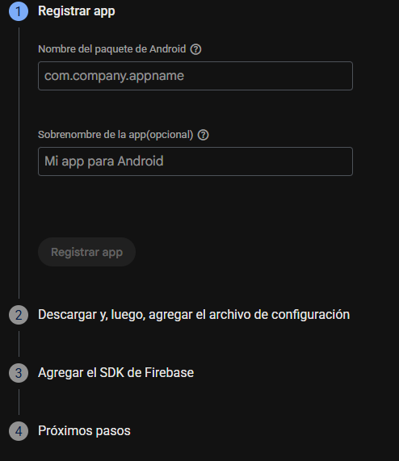
</p>

> 💡 Lo puedes encontrar en la parte superior de tus archivos Kotlin (`package com.example...`) o en el `build.gradle.kts (Module: app)`.

<p align="center">
  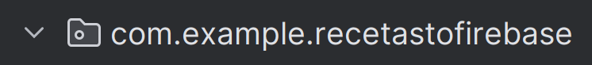
</p>

3.  Descarga el archivo `google-services.json` y muévelo a la carpeta **raíz de tu módulo `app`**.

<p align="center">
  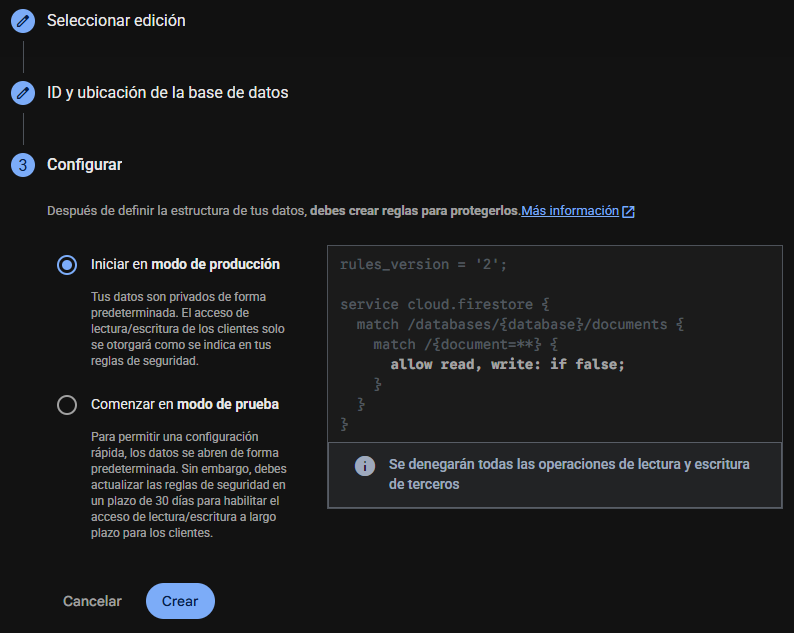
</p>

4.  Añade las dependencias que indica Firebase en tus archivos `build.gradle`.

> **⚠️ IMPORTANTE:** Además de las que dice Firebase, necesitamos la de **Firestore**. Añade esta línea en tu `build.gradle.kts (Module: app)`:

```kotlin
implementation ("com.google.firebase:firebase-firestore")
```

Dale a **Sync Now**. ✅

### Configurar Firestore Database

En la consola de Firebase:

1.  Ve a **Compilación** -> **Firestore Database**.
2.  Haz clic en **Crear base de datos**.

<p align="center">
  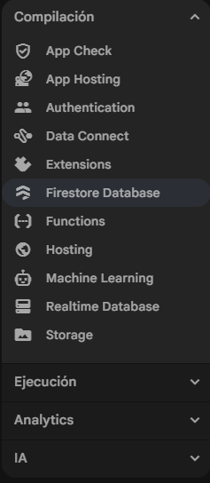
  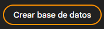
</p>

3.  Elige **Edición Standard** y ubicación **europe-southwest1 (Madrid)**.

<p align="center">
  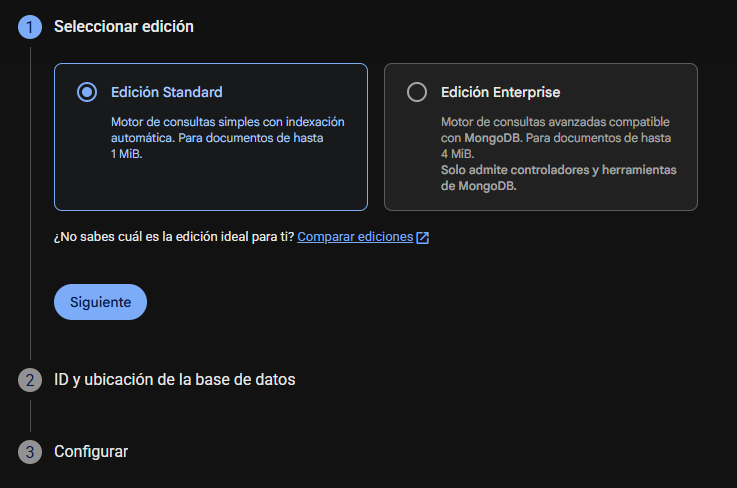
</p>

4.  Configura las reglas. Inicialmente, cambia `false` por `true` para permitir lectura y escritura **públicas** (solo para desarrollo).

<p align="center">
  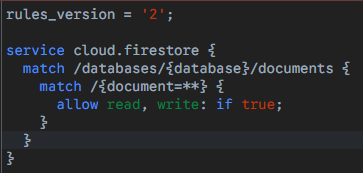
</p>

> ⚠️ Verás una advertencia de seguridad. Es normal en desarrollo, pero en producción deberás restringirlas.

# ☁️ Implementando la Lógica de Firebase

### Repositorio y ViewModel

Creamos `RecipesRepository.kt` para gestionar la comunicación con Firestore:

```kotlin
object RecipesRepository {

    private val db = Firebase.firestore
    private val recipesCollection = db.collection("recipes")

    // Implementaremos esta función después
    fun uploadRecipe(
        recipe: PersonalList,
        onResult: (Boolean, String?) -> Unit
    ) {
        // TODO: implementar subida a Firestore
    }
}
```

Y el `RecipesViewModel`:

```kotlin
class RecipesViewModel : ViewModel() {

    fun uploadToFirebase(
        recipe: PersonalList,
        onResult: (Boolean, String?) -> Unit
    ) {
        // Aquí solo delegaremos al repositorio
        RecipesRepository.uploadRecipe(recipe, onResult)
    }
}
```

### Conectando la Vista

En `RecipeApp.kt`, conectamos la pantalla con el ViewModel:

```kotlin
composable(route = Screen.NewRecipe.route) {
    NewRecipeScreen(
        uploadToFirebase = {receta ->
            recipesVM.uploadToFirebase(receta){ ok, errormsg ->
                if (ok) {
                    Toast.makeText(
                        context,
                        "Receta guardada correctamente",
                        Toast.LENGTH_SHORT
                    ).show()
                } else {
                    Toast.makeText(
                        context,
                        errormsg ?: "Error al guardar la receta",
                        Toast.LENGTH_SHORT
                    ).show()
                }
            }
        },
        onBack = { navController.popBackStack() }
    )
}
```

Finalmente, inicializamos Firebase en el `MainActivity`, antes de `setContent`:

```kotlin
FirebaseApp.initializeApp(this)
```

¡Listo! Si añades una receta, deberías verla aparecer en la consola de Firebase:

<p align="center">
  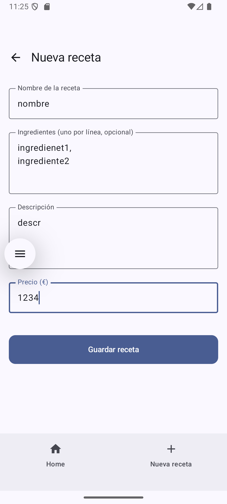
</p>
<p align="center">
  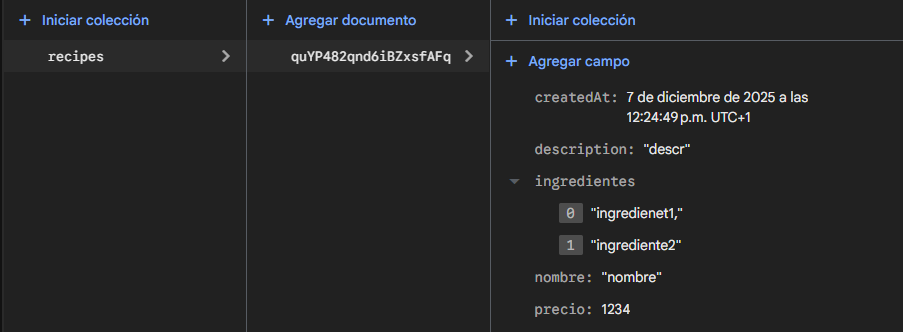
</p>

# 📥 Fetch de las Recetas

Para terminar, vamos a leer las recetas desde la nube.

Actualizamos `RecipesRepository` con la función `getRecipes`:

```kotlin
fun getRecipes(
    onResult: (List<PersonalList>) -> Unit,
    onError: (Exception) -> Unit
) {
    recipesCollection
        .get()
        .addOnSuccessListener { snapshot ->
            val list = snapshot.documents.mapNotNull { doc ->
                doc.toObject(PersonalList::class.java)
            }
            onResult(list)
        }
        .addOnFailureListener { e ->
            onError(e)
        }
}
```

Creamos la pantalla `MyRecipesScreen` para mostrar la lista:

```kotlin
@Composable
fun MyRecipesScreen() {
    var recipes by remember { mutableStateOf<List<PersonalList>>(emptyList()) }
    var isLoading by remember { mutableStateOf(true) }
    var error by remember { mutableStateOf<String?>(null) }

    LaunchedEffect(Unit) {
        RecipesRepository.getRecipes(
            onResult = {
                recipes = it
                isLoading = false
            },
            onError = {
                error = it.message
                isLoading = false
            }
        )
    }

    when {
        isLoading -> Box(
            modifier = Modifier.fillMaxSize(),
            contentAlignment = Alignment.Center
        ) {
            CircularProgressIndicator()
        }

        error != null -> Box(
            modifier = Modifier.fillMaxSize(),
            contentAlignment = Alignment.Center
        ) {
            Text("Error al cargar recetas: $error")
        }

        recipes.isEmpty() -> Box(
            modifier = Modifier.fillMaxSize(),
            contentAlignment = Alignment.Center
        ) {
            Text("Todavía no has creado ninguna receta")
        }

        else -> LazyColumn(
            modifier = Modifier
                .fillMaxSize()
                .padding(16.dp)
        ) {
            items(recipes) { recipe ->
                Column(modifier = Modifier.padding(vertical = 8.dp)) {
                    Text(recipe.nombre)
                    Text(recipe.description)
                    Text("Ingredientes: ${recipe.ingredientes.joinToString()}")
                    Text("Precio: ${recipe.precio} €")
                }
            }
        }
    }
}
```

Por último, añadimos la ruta y el botón en la barra de navegación (puedes reemplazar el botón de "Work" o añadir uno nuevo):

```kotlin
data object MyRecipes : Screen("myRecipes")

// NavHost en RecipeApp
composable(Screen.MyRecipes.route) {
    MyRecipesScreen()
}

// Nuevo botón en BottomNavBar
NavigationBarItem(
    selected = false,
    onClick = { navController.navigate(Screen.MyRecipes.route) },
    label = { Text("Mis recetas") },
    icon = { Icon(Icons.AutoMirrored.Filled.List, contentDescription = null) }
)
```

¡Y con esto podrás ver tus recetas subidas! 🎉

<p align="center">
  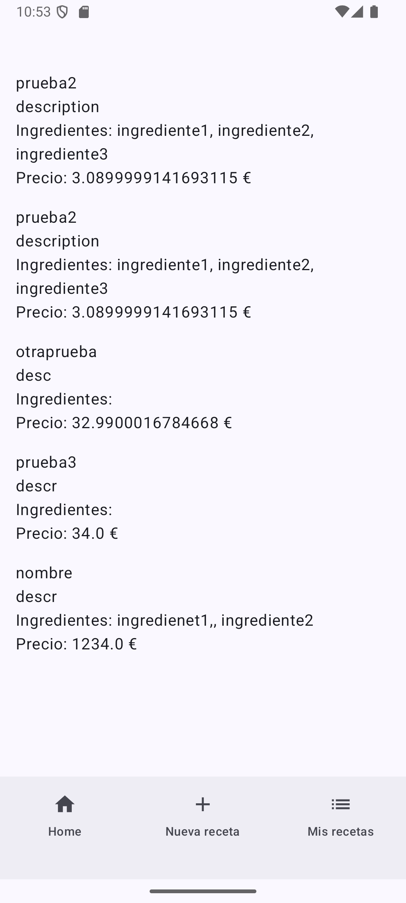
</p>
